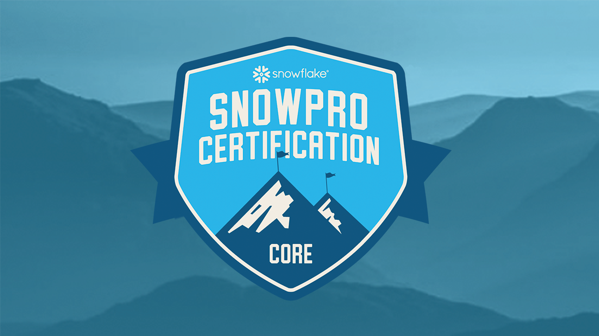

# Snowflake-SnowPro

## My Study Notes

This is a collection of my study notes for the Snowflake SnowPro Core certification.

## What is the SnowPro® Core Certification?

The SnowPro Core Certification demonstrates an individual's knowledge to apply specific core expertise implementing and migrating to Snowflake. A SnowPro Core Certified individual has a thorough understanding of the Snowflake's Platform, and has the knowledge necessary to design, develop, and manage secure, scalable Snowflake solutions to drive business objectives.

## SNOWPRO® CORE CERTIFICATION OVERVIEW

The SnowPro® Core Certification is designed for individuals who would like to demonstrate their knowledge of the Snowflake Data Cloud.

The candidate has a thorough knowledge of:

<ul>
<li>Data Loading and Transformation in Snowflake.</li>
<li>Virtual Warehouse Performance and Concurrency</li>
<li>DDL and DML Queries</li>
<li>Using Semi-Structured and Unstructured Data</li>
<li>Cloning and Time Travel</li>
<li>Data Sharing</li>
<li>Snowflake Account Structure and Management</li>
</ul>

## SNOWPRO® CORE CANDIDATE

6 months + of practical experience with Snowflake.

## EXAM FORMAT

### Exam Version: COF-C02

Total Number of Questions: 100

Question Types: Multiple Select, Multiple Choice

Time Limit: 115 minutes

Languages: English & Japanese

Registration fee: $175 USD

Passing Score: 750 + Scaled Scoring from 0 - 1000

Unscored Content: Exams may include unscored items to gather statistical information for future use. These items are not identified on the form and do not impact your score, and additional time is factored into account for this content.

Prerequisites: No prerequisites
Delivery Options:

1. Online Proctoring
2. Onsite Testing Centers

## EXAM DOMAIN BREAKDOWN

This exam guide includes test domains, weightings, and objectives. It is not a comprehensive listing of all the content that will be presented on this examination. The table below lists the main content domains and their weightings.

| Domain Domain                                    | Weightings on Exams |
| ------------------------------------------------ | ------------------- |
| 1.0 Snowflake Data Cloud Features & Architecture | 25%                 |
| 2.0 Account Access and Security                  | 20%                 |
| 3.0 Performance Concepts                         | 15%                 |
| 4.0 Data Loading and Unloading                   | 10%                 |
| 5.0 Data Transformations                         | 20%                 |
| 6.0 Data Protection and Data Sharing             | 10%                 |

## EXAM TOPICS

To view exam domain, objectives and subobjectives, download the [SnowPro Core Exam Study Guide](https://learn.snowflake.com/courses/course-v1:snowflake+SPSG-CORE+B/about).

## ALL THE CHAPTERS FROM THE COURSE

So, how should you start once you have decided to study for this certification? In the following links, you’ll be able to find all the information regarding Snowflake to prepare you for the exam.

1. [Snowflake Introduction](./introduction.md)
2. [Snowflake Architecture](./architecture.md)
3. [Snowflake Pricing](./pricing.md)
4. [Snowflake Micro-partition](./micro-partitions.md)
5. [Snowflake Clustering](./clustering.md)
6. [Snowflake Tables & Views](./tables-views.md)
7. [Snowflake Stage & Storage Integration](./stages-storage-integration.md)
8. [Snowflake Data Loading, COPY INTO & SnowPipe Commands](./data-loading.md)
9. [Snowflake PUT & GET Commands](./put-get-commands.md)
10. [Snowflake Data Warehouses](./data-warehouses.md)
11. [Resource Monitors](./resource-monitors.md)
12. [Snowflake Caches and Query Performance](./caches.md)
13. [Time Travel, Fail-Safe & Zero-Copy Cloning](./storage-features.md)
14. [Roles in Snowflake](./snowflake-roles.md)
15. [Snowflake Data Sharing](./data-sharing.md)
16. [Stored Procedures & User Defined Functions](./stored-procedures-and-udfs.md)
17. [Tasks & Transactions](./tasks-transactions.md)
18. [Snowflake Streams](./streams.md)
19. [Other Snowflake Objects: File Formats & Sequences](./file-formats-sequences.md)
20. [Snowflake Ecosystem, Compliance, Data Marketplace & Security](./ecosystem.md)
21. [Summary & Tips for the Exam](./certification-summary.md)
22. [Snowflake SnowPro Core Practice Exam (Part 1)](./practice-exam-p1.md)
23. [Snowflake SnowPro Core Practice Exam (Part 2)](./practice-exam-p2.md)
