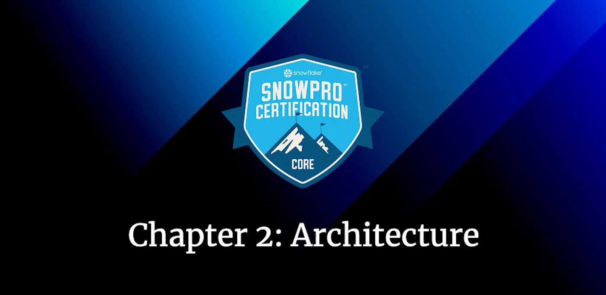
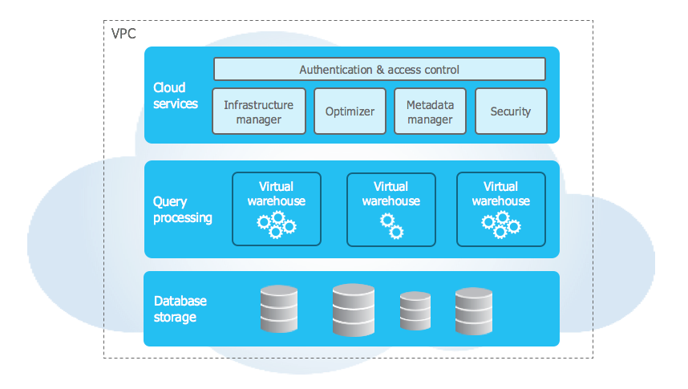
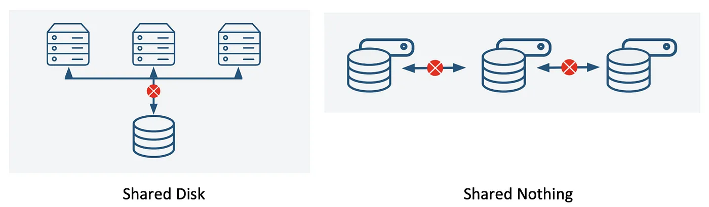
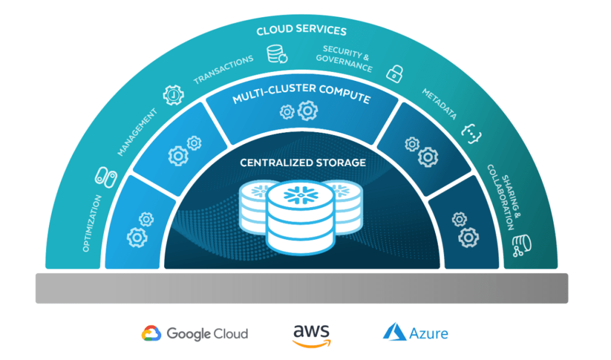
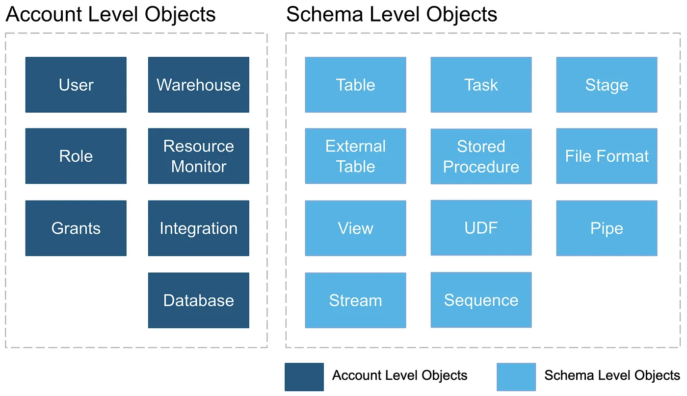

# Road to Snowflake SnowPro Core Certification: Snowflake Architecture

## Second Chapter: Snowflake Architecture

This chapter will study in detail the architecture that Snowflake uses to provide this amazing service, apart from typical exam questions to prepare you for the Snowflake SnowPro Core Certification Exam. These are the key concepts that we are going to study:

Shared-Disk & Shared-Nothing
Snowflake Layers
Snowflake Objects
Typical Exam Questions about Snowflake Architecture

> _Remember that all the chapters from the course can be found [in the following link](./course-links.md)._

---

## Snowflake Architecture

Snowflake’s unique architecture consists of three key layers:

<ul>
<li>Database Storage</li>
<li>Query Processing</li>
<li>Cloud Services</li>
</ul>

### Database Storage

When data is loaded into Snowflake, Snowflake reorganizes that data into its internal optimized, compressed, columnar format. Snowflake stores this optimized data in cloud storage.

Snowflake manages all aspects of how this data is stored — the organization, file size, structure, compression, metadata, statistics, and other aspects of data storage are handled by Snowflake. The data objects stored by Snowflake are not directly visible nor accessible by customers; they are only accessible through SQL query operations run using Snowflake.

### Query Processing

Query execution is performed in the processing layer. Snowflake processes queries using “virtual warehouses”. Each virtual warehouse is an MPP compute cluster composed of multiple compute nodes allocated by Snowflake from a cloud provider.

Each virtual warehouse is an independent compute cluster that does not share compute resources with other virtual warehouses. As a result, each virtual warehouse has no impact on the performance of other virtual warehouses.

For more information, see [Virtual Warehouses](https://docs.snowflake.com/en/user-guide/warehouses).

### Cloud Services

The cloud services layer is a collection of services that coordinate activities across Snowflake. These services tie together all of the different components of Snowflake in order to process user requests, from login to query dispatch. The cloud services layer also runs on compute instances provisioned by Snowflake from the cloud provider.

Services managed in this layer include:

<ul>
<li>Authentication</li>
<li>Infrastructure management</li>
<li>Metadata management</li>
<li>Query parsing and optimization</li>
<li>Access control</li>
</ul>

---

## SHARED-DISK & SHARED-NOTHING

Snowflake's architecture is a **hybrid of traditional shared-disk and shared-nothing** database architectures. This is of utmost importance; <b>IT ALWAYS APPEARS IN THE EXAM</b>.

<ul>
<li><b>Similar to shared-disk architectures</b> → Snowflake uses a <b>central data repository</b> for persisted data <b>accessible from all compute nodes in the platform</b>.</li>
<li><b>Similar to shared-nothing architectures</b> → Snowflake processes queries using virtual warehouses where each node in the cluster stores a portion of the entire data set locally.</li>
</ul>

<figure>
  
  <figcaption align = "center">Shared Disk & Shared Nothing Architectures.
</figcaption>
</figure>

This approach offers the data management simplicity of a shared-disk architecture but with the performance and scale-out benefits of a shared-nothing architecture.

---

## SNOWFLAKE LAYERS

Snowflake's unique architecture consists of three essential layers, all of them with High Availability. <b>The price is also charged separately for each layer</b>.
Let's see them:

<ol>
<li><b>Centralized Storage</b> → When data is loaded into Snowflake, Snowflake reorganizes that data into its internal optimized, compressed, columnar format in this layer. Snowflake manages all aspects of how this data is stored.</li>

<li><b>Compute</b> → Query execution is performed using virtual warehouses in the compute/processing layer. Each virtual warehouse is an MPP compute cluster composed of multiple compute nodes allocated by Snowflake from a cloud provider.</li>

<li><b>Cloud Services</b> → Collection of services that coordinate activities across Snowflake. It includes:
  <ul>
  <li>Authentication.</li>
  <li>Infrastructure management.</li>
  <li>Metadata management.</li>
  <li>Query parsing and optimization.</li>
  <li>Access control.</li>
  </ul>
</li>
<li><b>Cloud Agnostic Layer</b> → We could also talk about the fourth layer, also known as the Cloud Agnostic Layer. It is used only the first time when we choose a provider.</li>
</ol>

<figure>
  
  <figcaption align = "center">Snowflake Layers.
</figcaption>
</figure>

---

## SNOWFLAKE OBJECTS

This section will review some of the most important objects in the Snowflake system. We will see them in detail later in this course; this is just a brief explanation:

<ul>
<li><b>Account</b> → The account's name must be unique within an organization, regardless of which Snowflake Region the account is in. An account could be, for example, "<i>tn10000.eu-west-1.snowflakecomputing.com</i>", although you can ask for a <b>vanity address to convert the identifier into your company's name</b>, for example, "<i>fullcertified.eu-west-1.snowflakecomputing.com</i>".</li>
<li><b>Warehouse</b> → Warehouses are the compute part of the Snowflake engine. They are a set of virtual machines provided at the runtime to help execute a given query.</li>
<li><b>Database → Logical collection of Schemas</b>. Like any other Database that we already know. It's a logical container for storing other objects, such as Tables and Views, organized in user-defined Schemas.</li>
<li><b>Schema → Logical collection of objects</b> that provides a good facility for managing objects and their respective accesses. One schema belongs to a single Database. <b>When a database is created, two schemas are created with it: the Public schema</b>, which stores by default any object created without specifying any schema, <b>and the Information_Schema</b>, which stores the metadata information.</li>
</ul>

<b>Among other objects that we will see later in the course, Schemas contain the following objects:</b>

<ul>
<li><b>Tables</b> → Database objects that contain all the data in a database.</li>
<li><b>Views</b> → Virtual table whose contents are defined by a query. We can perform a query and save the result in a view.</li>
<li><b>Stages</b> → Stage is the location of data files in cloud storage.</li>
<li><b>File Formats</b> → Pre-defined format structure that describes a set of staged data to access or load into Snowflake tables for CSV, JSON, AVRO, ORC, PARQUET, and XML input types.</li>
<li><b>Sequences</b> → You can generate unique numbers with sequences. They are like counters.</li>
<li><b>Pipes</b> → Special and unique type of object in Snowflake which enables the automatic loading of data from files as soon as they are available in a Stage.</li>
<li><b>Stored Procedures & User-Defined Functions (UDF)</b> → They let you extend the system to perform operations in SQL and JavaScript.</li>
</ul>
<b>Objects can be at the Account level or the Schema level</b>. I attach the existing types in this image, just in case they appear in the exam. What is the difference? The difference is where you store the objects. For example, if we create a new Role, it doesn't belong to a specific Schema; they are created for the entire account. On the other hand, when we create a table, they are stored inside a Schema. It's a straightforward and logical question that can appear in the SnowPro exam.

<figure>
  
  <figcaption align = "center">Snowflake objects are divided by Account or Schema Level.</figcaption>
</figure>

---

## TYPICAL EXAM QUESTIONS ABOUT SNOWFLAKE ARCHITECTURE

<b>The three main layers of Snowflake are…</b>

<ol>
<li>Extraction, Ingestion, Load</li>
<li>Database Storage, Compute & Cloud Services</li>
<li>Database, Virtual Warehouse, Data Experience</li>
</ol>

<b>Solution: 2.</b>

---

<b>Select the term that is associated with the compute layer:</b>

<ol>
<li>Query optimization</li>
<li>Query planning</li>
<li>Query processing</li>
</ol>

<b>Solution: 3</b>. You can find the name of the layers in different ways, like Query Processing for the Compute Layer.

---

<b>Which of the following services are provided by the Cloud Services Layer?</b>

<ol>
<li>Metadata Management</li>
<li>Authentication</li>
<li>Storage</li>
<li>Infrastructure Management</li>
<li>Query Execution</li>
</ol>

<b>Solution: 1, 2, 4.</b>

---

<b>What statement is true about Snowflake's unique architecture?</b>

<ol>
<li>One Node Shared Data</li>
<li>Multi-Cluster Shared Data</li>
<li>One Node Private Data</li>
</ol>

<b>Solution: 2.</b>

---

<b>What is the storage hierarchy in Snowflake?</b>

<ol>
<li>Account → DB → Schemas → Objects</li>
<li>Account → Schemas → DB → Objects</li>
<li>Account → DB → Objects → Schemas</li>
</ol>

<b>Solution: 1.</b>

---

<b>Can two Virtual Warehouses access the same data simultaneously without any contention issues?</b>

<ol>
<li>True</li>
<li>False</li>
</ol>

<b>Solution: 1.</b> We haven't seen this topic in-depth, but this is the main reason for the "Shared Data" concept. All the data is in the same place, and the Virtual Warehouse has access.

---

<b>Are the interactions with data initialized through the services layer?</b>

<ol>
<li>True</li>
<li>False</li>
</ol>

<b>Solution: 1.</b> Cloud services tie together all of the different components of Snowflake to process user requests, from login to query dispatch.

---

<b>In which layer of Snowflake architecture is stored all security-related information?</b>

<ol>
<li>Storage</li>
<li>Compute</li>
<li>Cloud Services</li>
<li>All of the above</li>
</ol>

<b>Solution: 3.</b>

---

<b>Can the table functions in INFORMATION_SCHEMA be used to return account-level usage and historical information for storage, warehouses, user logins, and queries?</b>

<ol>
<li>True</li>
<li>False</li>
</ol>
<b>Solution: 1.</b>
