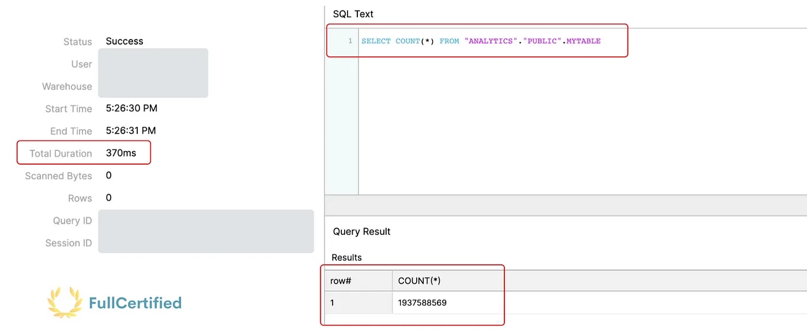
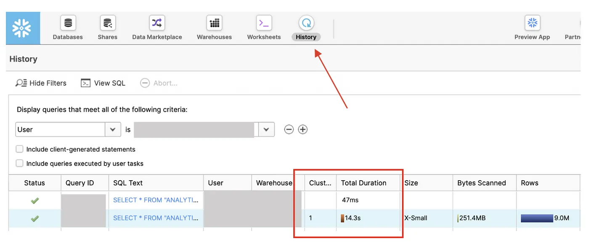
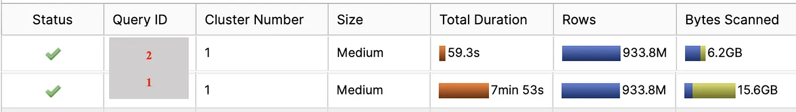
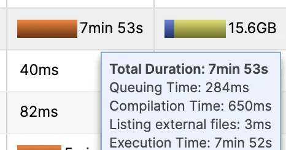
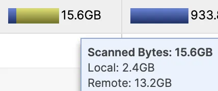
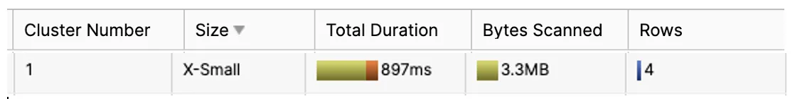
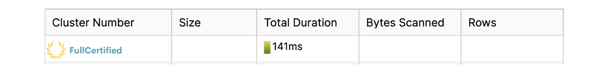
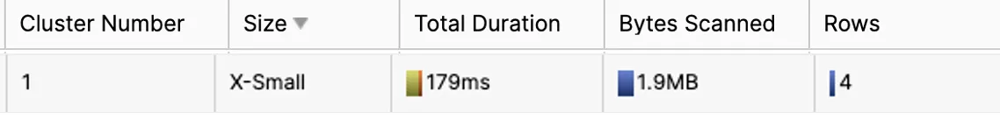
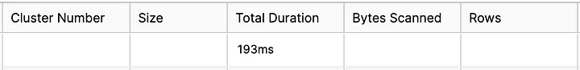

# Road to Snowflake SnowPro Core Certification: Cache & Query Performance

## Twelfth Chapter: Cache and Query Performance

<b>One of the most important concepts is the cache to improve the speed of our queries in Snowflake and optimize costs.</b> In this chapter, we will study the existing ones (Metadata, Query Result, and Warehouse cache) and some tips to improve Snowflake’s performance.

#### Table of Contents

1. [Metadata Cache](#metadata-cache)
2. [Query Result Cache](#query-result-cache)
3. [Warehouse Cache](#warehouse-cache)
4. [Complete example of the Snowflake caches](#complete-example-with-all-the-snowflake-cache-types)
5. [How to improve Snowflake performance](#how-to-improve-snowflake-performance)
6. [Typical exam questions on Snowflake caches](#typical-exam-questions)

> _Remember that all the chapters from the course can be found [in the following link](./course-links.md)._

---

## METADATA CACHE

Metadata caching is maintained in Global Service Layer and <b>contains Objects Information & Statistics</b>. As we mentioned [in the chapter about micro-partitions](./micro-partitions.md), Snowflake automatically stores different types of metadata to improve the compiling time and query optimization. This metadata information lasts for 64 days. This cache <b>will help us perform operations like MIN, MAX, COUNT… Snowflake will NOT use the warehouses in these cases</b>, so we don’t spend computing credits.

Remember that we also studied that you cannot copy the same file into Snowflake using the COPY INTO command unless you specify the option FORCE=TRUE during 64 days? Now you understand who is in charge of that.

Just as an example, we can have a 30TB table with 931 million rows and get the COUNT of all the values from the table in microseconds without performing anything:

---

## QUERY RESULT CACHE

Have you ever tried to execute the same query twice, and the second time is way faster? Let’s take a look at this example. We will run the same query twice, the second time after 7 hours.

`SELECT *
FROM ANALYTICS.PUBLIC.MYTABLE
ORDER BY DATE DESC`

If we go to the History tab in the Snowflake UI, we can see the results of our queries, apart from filtering by different parameters, like the user in this case. As we can see at the bottom of this picture, Snowflake spent 14.3 seconds to perform the query the first time, whereas the second time, it spent 47ms.

How is this possible? This is because of the Query Result Cache. <b>This cache stores the results of our queries for 24 hours, so as long as we perform the same query and the data hasn’t changed in the Storage layer, it will return the same result without using the warehouse.</b> So again, we don’t consume compute credits to perform the same query whenever we want.

You cannot see the results from other people in the History tab, but Snowflake stores the result so that if different people (with the same role) perform the same query, they will also use this cache.

You can disable the Query Result cache with the following command:

`ALTER SESSION SET USE_CACHED_RESULT = FALSE`

---

## WAREHOUSE CACHE

Every warehouse has attached SSD storage. So, while the data warehouse runs, the table fetched in the query will remain. When the warehouse is suspended, the information will be lost. Let’s see an example. In this case, we will perform a similar query, just changing the columns to show.

<ul>
<li><b>1st query</b>, we fetch all the columns from <i>MyTable</i>:</li>
</ul>

`SELECT *
FROM ANALYTICS.PUBLIC.MYTABLE
ORDER BY DATE DESC`

<ul>
<li><b>2nd query</b>, we fetch the columns “Date” and “Score” from <i>MyTable</i>:</li>
</ul>

`SELECT DATE, SCORE
FROM ANALYTICS.PUBLIC.MYTABLE
ORDER BY DATE DESC`

Why isn’t the second query re-used from the Query Result Cache? Because it’s NOT the same query, we are selecting fewer columns. But let’s take a look at the History tab:

<ul>
<li><b>Total duration →</b> As we can see, the first query spent 7.53 minutes fetching all the data, as it’s a big table with 933 million rows. The second case spends way less time as almost everything was re-used from the Warehouse cache. <b>Different times are involved in getting the Total duration, like the Compilation Time, Queuing Time, and Execution Time.</b></li>
</ul>

Bytes Scanned → We can also see that the number of Bytes Scanned was 15.6GB, and there are two colors. The blue one means the data is re-used from the warehouse, whereas the yellow one is fetched from the Storage layer. Almost everything was taken from the Storage layer in the first query, whereas in the second case, almost everything was re-used from the warehouse. The bytes scanned size is also lower because fewer columns were fetched.

---

## COMPLETE EXAMPLE WITH ALL THE SNOWFLAKE CACHE TYPES

Let’s take one last example to see how it works. Let’s go query by query:

<ul>
<li><b>First query:</b> There is no information in the cache, so everything comes from the Long Term Storage (Storage Layer). We can see that with the Bytes Scanned row, as it’s completely yellow.</li>
</ul>

`SELECT *
FROM ANALYTICS.PUBLIC.MYTABLE`

<ul>
<li><b>Second query:</b> We perform the same query. As less than 24 hours have been spent, this information is in the Query Result Cache, so we can see that we didn’t scan bytes, and the duration is eight times lower than before.</li>
</ul>

`SELECT *
FROM ANALYTICS.PUBLIC.MYTABLE`

<ul>
<li><b>Third query:</b> We access the same table but do not run the same query. We need the column “<i>MADEBY</i>”. We will not be able to fetch the information from the Query Result Cache, so we will fetch it from the Warehouse Cache. For that reason, the Bytes Scanned parameter is not empty like before.</li>
</ul>

`SELECT MADEBY
FROM ANALYTICS.PUBLIC.MYTABLE`

<ul>
<li><b>Fourth query:</b> We want to know the number of rows in “<i>MYTABLE</i>”. This information is stored in the Metadata Caché, so we won’t use any warehouse; having a tiny duration, and no Bytes Scanned.</li>
</ul>

`SELECT COUNT(*)
FROM ANALYTICS.PUBLIC.MYTABLE`

---

## HOW TO IMPROVE SNOWFLAKE PERFORMANCE

After understanding all the types of cache we have in Snowflake and how the warehouses work, I will give you some tips that will help us consume fewer credits and increase the performance of the queries.

<ol>
<li>Use dedicated Virtual Warehouses → It’s good to have a Virtual Warehouse for each type of task. For example, a Virtual Warehouse for BI tasks, another for Data Science… The results can be re-used easily as the users will perform similar queries.</li>
<li>Scale UP/DOWN for workloads that are known → If we know that Mondays at 10 a.m., the number of queries increases by x2, or we need to do a report that requires a lot of Snowflake power, we should scale up.</li>
<li>Multi-Warehouses for unknown workloads → Sometimes, the number of users increases without knowing that. For that reason, we can set up multi-warehouses.</li>
<li>Try to maximize the use of the cache.</li>
<li>Cluster keys → Use them in big tables to improve their performance, especially in columns that you use to filter (WHERE, JOINS…).</li>
</ol>

If you follow these tips, you’ll see the results soon.

## TYPICAL EXAM QUESTIONS

<b>What are the different caching mechanisms available in Snowflake?</b>

<ol>
<li>Metadata cache</li>
<li>Query result cache</li>
<li>Index cache</li>
<li>Table cache</li>
<li>Warehouse cache</li>
</ol>

<b>Solution: 1, 2, 5</b>

---

<b>A query executed a couple of hours ago, which took more than 5 minutes to run, is executed again, and it returned the results in less than a second. What might have happened?</b>

<ol>
<li>Snowflake used the persisted query results from the metadata cache</li>
<li>Snowflake used the persisted query results from the query result cache</li>
<li>Snowflake used the persisted query results from the warehouse cache</li>
<li>A new Snowflake version has been released in the last two hours, improving the speed of the service</li>
</ol>

<b>Solution: 2</b>

---

<b>Are Snowflake caches automatically invalidated if the underlying data changes?</b>

<ol>
<li>True</li>
<li>False</li>

</ol>

<b>Solution: 1.</b> If the data in the Storage Layer changes, the caches are automatically invalidated.

---

<b>What command will you execute if you want to disable the query cache?</b>

<ol>
<li>ALTER SESSION SET USE_CACHED_RESULT = TRUE</li>
<li>ALTER SESSION SET USE_CACHED_RESULT = FALSE</li>
<li>ALTER SESSION SET USE_CACHED_RESULT = ON</li>
<li>ALTER SESSION SET USE_CACHED_RESULT = OFF</li>

</ol>

<b>Solution: 2</b>

---

<b>Which type of data incur Snowflake storage cost?</b>

<ol>
<li>Data Stored in permanent tables.</li>
<li>Data Stored in temporal tables.</li>
<li>Cache results.</li>
<li>Data retained for Fail-Safe & Time-Travel.</li>
</ol>

<b>Solution: 1, 2, 4.</b> This question is essential and has already appeared in the [Snowflake pricing chapter](./pricing.md), but we must know that cache results <b>do NOT incur Storage costs</b>.

---

<b>Which cache runs for 24 hours?</b>

<ol>
<li>Metadata cache</li>
<li>Results cache</li>
<li>Warehouse cache</li>
</ol>

<b>Solution: 2.</b> Query Result cache is also known as Results Cache.

---

<b>May the warehouse cache be reset if a running warehouse is suspended and resumes?</b>

<ol>
<li>True</li>
<li>False</li>
</ol>

<b>Solution: 1</b>

---

<b>Does the warehouse cache size change with the warehouse size?</b>

<ol>
<li>True</li>
<li>False</li>
</ol>

<b>Solution: 1.</b> The larger the warehouse is ( the more servers it has), the larger the warehouse cache size is.

---

<b>To improve the performance, which of the below techniques can be used in Snowflake?</b>

<ol>
<li>Cluster Keys</li>
<li>Multi-Warehouses</li>
<li>Maximize the cache use</li>
<li>Increasing the Warehouse Size</li>
<li>Dedicated Warehouses</li>
</ol>

<b>Solution: 1, 2, 3, 4, 5</b>
