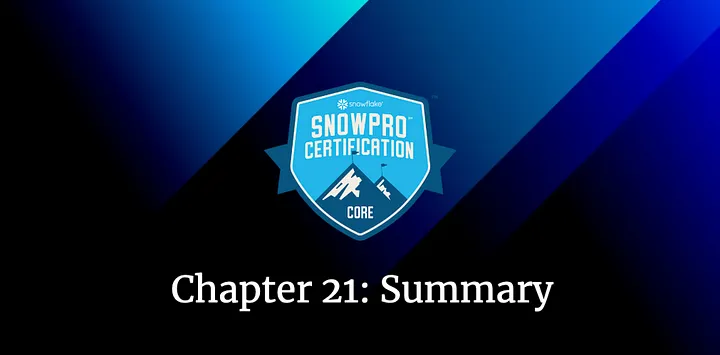

bd# Snowflake SnowPro Core Certification Summary

## Chapter 21: Snowflake SnowPro Course Summary

After several months, we reached the last chapter of the Snowflake SnowPro Core Certification course. All the theory has already been explained. Although it has been an intense journey, I hope it has been rewarding and allows you to achieve your goal of passing the exam and learning about this magnificent technology. I also hope you enjoyed reading it as much as I enjoyed writing it.

In this last chapter, I will summarize some of the concepts we’ve seen during the course, to have them detailed and organized. Let’s go with it!

> _Remember that all the chapters from the course can be found [in the following link](./course-links.md)._

---

## SNOWFLAKE SUMMARY

### Snowflake Architecture

<ul>
<li><b>DDL →</b> Data Definition Language. It refers to the commands to interact with Tables, Schemas, etc. → Create, Drop, Alter…</li>
<li><b>DML →</b> Data Manipulation Language. → Insert, Update, Delete…</li>
<li><b>Snowflake editions →</b> Standard, Enterprise, Business Critical.</li>
<li><b>Cloud Providers →</b> AWS, Azure, GCP.</li>
<li><b>Snowflake CLI Client →</b> SnowSQL.</li>
<li><b>Snowflake layers →</b> Centralized Storage, Compute data, Cloud Services & Cloud Agnostic Layer.</li>
</ul>

.")

<i>Chapters explaining these concepts:</i>

1. [Snowflake Introduction](./introduction.md)
2. [Snowflake Architecture](./architecture.md)
3. [Snowflake Pricing](./pricing.md)

---

### Micro-partitions & Clustering keys

<ul>
<li><b>Storage of micro-partitions →</b> Between 50 and 500MB of uncompressed data</b> organized in a columnar way.</li>
<li><b>Metadata in micro-partitions →</b> Range of values for each column, number of distinct values, and other properties for optimization.</li>
<li><b>Commands to get the Clustering Depth →</b> SYSTEM$CLUSTERING_DEPTH, SYSTEM$CLUSTERING_INFORMATION.</li>
<li><b>Indicators to determine if you need to define clustering keys →</b> Queries are running slow & Large clustering depth.</li>
</ul>

<i>Chapters explaining these concepts:</i>

1. [Snowflake Micro-partitions](./micro-partitions.md)
2. [Snowflake Clustering](./clustering.md)

---

### Tables

.")

### Views

<ul>
<li><b>Can we define clustering keys in materialized views?</b> → Yes.</li>
<li><b>Materialized views limitations</b> → Time Travel // Current_Time.</li>
</ul>

.")

<i>Chapters explaining these concepts:</i>

1. [Snowflake Tables & Views](./tables-views.md)

---

### Stages

<ul>
<li><b>Types of stages</b> → External & Internal</li>
<li><b>Types of internal stages</b> → User, Table, named internal</li>
<li><b>Identifier of user stage</b> → “@~”</li>
<li><b>Identifier of table stage</b> → “@%”</li>
<li><b>Stage metadata</b> → METADATA$FILENAME & METADATA$FILE_ROW_NUMBER</li>
</ul>

<i>Chapters explaining these concepts:</i>

1. [Snowflake Stages & Storage](./stages-storage-integration.md)

---

### COPY Command

<ul>
<li><b>In which stages does it work?</b> → In all of them.</li>
<li><b>What command does it execute in case of failure?</b> → ABORT_STATEMENT.</li>
<li><b>Maximum file size using the Snowflake UI</b> → 50 MB. If you want to COPY bigger files, you should use SnowSQL.</li>
<li><b>Command to ignore the Metadata Cache</b> → FORCE = TRUE.</li>
<li><b>Metadata cache duration</b> → 64 days.</li>
</ul>

### SnowPipe

<ul>
<li><b>What command does it execute in case of failure?</b> → SKIP_FILE.</li>
<b>Metadata cache duration</b> → 14 days.</li>
<li><b>Can SnowPipe use Resource monitors?</b> → No.</li>
</ul>

<i>Chapters explaining these concepts:</i>

1. [Snowflake Data Loading](./data-loading.md)

---

### PUT & GET

<ul>
<li>In which stages do they work? → Only internal stages.</li>
<li>Executable from the Snowflake UI? → No</li>
</ul>

<i>Chapters explaining these concepts:</i>

1. [Snowflake PUT & GET](./put-get-commands.md)

---

### Warehouses

<ul>
<li>Params that you can configure → Auto suspend & Auto Resume & Maximum / Minimum Clusters & Scaling Policy & Size & Name.</li>
<li>Minimum edition for Multi-cluster warehouses → Enterprise.</li>
<li>Multi-warehouse modes → Maximized & Auto Scale.</li>
<li>Scaling policy → Standard & Economy.</li>
</ul>

<i>Chapters explaining these concepts:</i>

1. [Snowflake Data Warehouses](./data-warehouses.md)

---

### Resource Monitors

<ul>
<li>Params → Credit Quota, Monitor Level, Schedule & Actions.</li>
<li>Types of actions → Notify, Notify & Suspend, Notify & Suspend Immediately.</li>
</ul>

<i>Chapters explaining these concepts:</i>

1. [Snowflake Resource Monitors](./resource-monitors.md)

---

### Cache

<ul>
<li>Types → Metadata, Query Result, Warehouse.
For how long does the metadata cache store the results? → 64 days.</li>
<li>For how long does the query result cache store the results? → One day.</li>
<li>For how long does the warehouse cache store the results? → Until the warehouse is disconnected.</li>
</ul>

<i>Chapters explaining these concepts:</i>

1. [Snowflake Cache & Query](./caches.md)

---

### Storage Features

<ul>
<li>Time travel data retention period by default → One day. We can extend it to 90 days, but it’s one day by default.</li>
<li>Time Travel for transients and temporary tables → One day.</li>
<li>Time travel for permanent tables → Until 90 days.</li>
<li>Snowflake edition to extend time travel until 90 days → Enterprise</li>
<li>How to recover data using fail-safe → Contacting Snowflake support.</li>
<li>Layer in charge of performing the zero-copy clone → Cloud Services Layer.</li>
<li>Can I clone an external table? → No.</li>
</ul>

<i>Chapters explaining these concepts:</i>

1. [Snowflake Time Travel, Fail-Safe & Zero-Copy Cloning](./storage-features.md)

---

### Roles

<ul>
<li><b>Approaches for the access management</b> → DAC & RBAC.</li>
<li><b>Key concepts</b> → User, Role, Securable Object, Privilege</li>
<li><b>Default Roles</b> → ACCOUNTADMIN, SECURITYADMIN, SYSADMIN, USERADMIN & PUBLIC</li>
</ul>

<i>Chapters explaining these concepts:</i>

1. [Snowflake Roles](./snowflake-roles.md)

---

### Shares

<ul>
<li><b>Types of shares</b> → Inbound & Outbound.
Role that can create shares</b> → ACCOUNTADMIN.</li>
<li><b>Can you Clone the objects from an inbound Share?</b> → No.</li>
<li><b>Can you do Time Travel in objects from a Share?</b> → No.</li>
<li><b>Can you share an inbound share to a different account?</b> → No.</li>
<li><b>GRANT USAGE ON <db> TO <share></b> → Assign privileges to a share.</li>
</ul>

<i>Chapters explaining these concepts:</i>

1. [Snowflake Data Sharing](./data-sharing.md)

---

### Stored Procedures & UDFs

<i>Chapters explaining these concepts:</i>

1. [Snowflake Stored Procedures & UDFs](./stored-procedures-and-udfs.md)

---

### Tasks

<ul>
<li><b>Maximum number of children tasks</b> → 100. A task can only have 100 children.
<li><b>Maximum number of a tree of tasks</b> → 1000.</li>
</ul>

### Transactions

<ul>
<li><b>Number of hours in which Snowflake would abort a transaction if it goes to the detached state</b> → 4 hours.</li>
</ul>

<i>Chapters explaining these concepts:</i>

1. [Snowflake Tasks & Transactions](./tasks-transactions.md)

---

### Streams

<ul>
<li><b>Different types of streams</b> → Standard, append-only & insert-only streams.</li>
<li><b>Columns from a stream</b> → METADATA$ACTION, METADATA$ISUPDATE, METADATA$ROW_ID.</li>
<li><b>Can we create streams from external tables?</b> → Yes. Insert-only streams.</li>
<li><b>Can we create streams from views?</b> → As a new feature of March 2022, Streams are supported in views and secure views!</li>
</ul>

<i>Chapters explaining these concepts:</i>

1. [Snowflake Streams](./streams.md)

---

### File Formats

<ul>
<li><b>Structured Data formats</b> → CSV.</li>
<li><b>Semi-Structured Data formats</b> → JSON, Parquet, XML, Avro, ORC.</li>
<li><b>Data type to store semi-structured data as arrays or objects</b> → Variant.</li>
<li><b>Limit size of a variant data type</b> → 16 MB.</li>
<li><b>How are no-native values from a variant being stored?</b> → As Strings.</li>
</ul>

### Sequences

<ul>
<li><b>Function to generate a set of distinct values</b> → nextval.</li>
</ul>

<i>Chapters explaining these concepts:</i>

1. [Snowflake File Formats & Sequences](./file-formats-sequences.md)

---

### Ecosystem, Compliance, Data Marketplace & Security

<ul>
<li><b>Types of partner connect in Snowflake</b> → Technology & Solution partners.</li>
<li><b>Categories to classify Snowflake partners</b> → Data Integration, ML & Data Science, Security & Governance, Business Intelligence, SQL Editors, and Programming Interfaces.</li>
<li><b>Snowflake is compliant with…</b> → HITRUST / HIPAA, ISO/IEC 27001, FedRAMP Moderate, PCI-DSS, SOC 2 Type II, SOC 1 Type II and GxP.</li>
<li><b>Data Marketplace listings</b> → Standard Data Listing and Personalized Data Listing.</li>
<li><b>Security features that Snowflake provides</b> → Dynamic Data Masking and External Tokenization.</li>
</ul>

<i>Chapters explaining these concepts:</i>

1. [Snowflake Ecosystem](./ecosystem.md)

---

### Grants and other useful commands

<ul>
<li>SHOW GRANTS OF ROLE <role> → See a role's users.</li>
<li>SHOW GRANTS TO ROLE <role> → See a role's privileges.</li>
<li><b>Necessary grants to clone a table</b> → SELECT.</li>
<li><b>Necessary grants to clone a pipe/stream/task</b> → OWNERSHIP.</li>
<li><b>Necessary grants to clone other objects</b> → USAGE.</li>
<li><b>Necessary grants to see the TASK_HISTORY</b> → ACCOUNTADMIN OR OWNERSHIP on a task OR MONITOR_EXECUTION.</li>
</ul>
