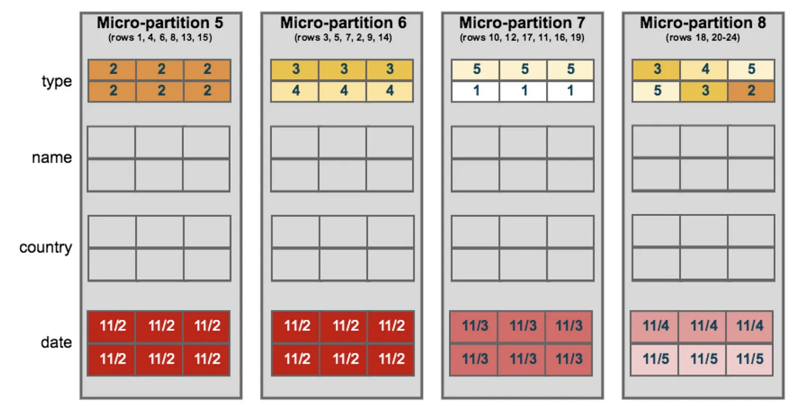
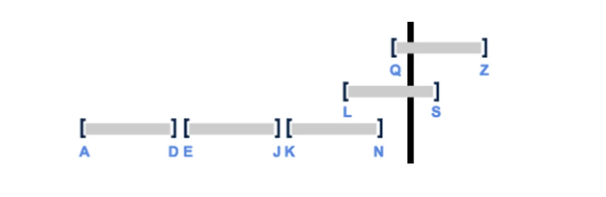
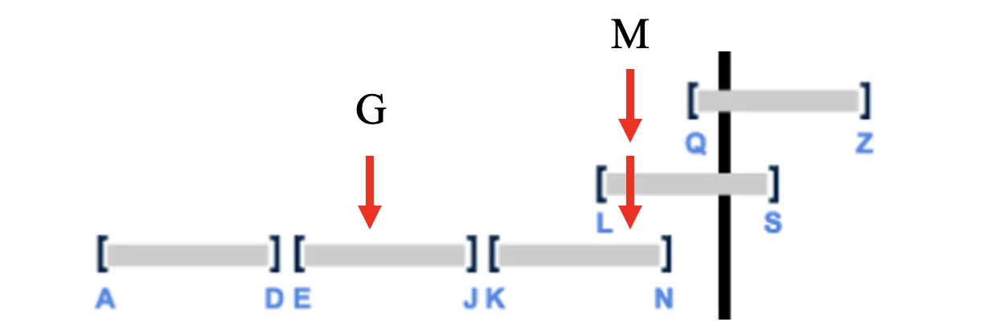
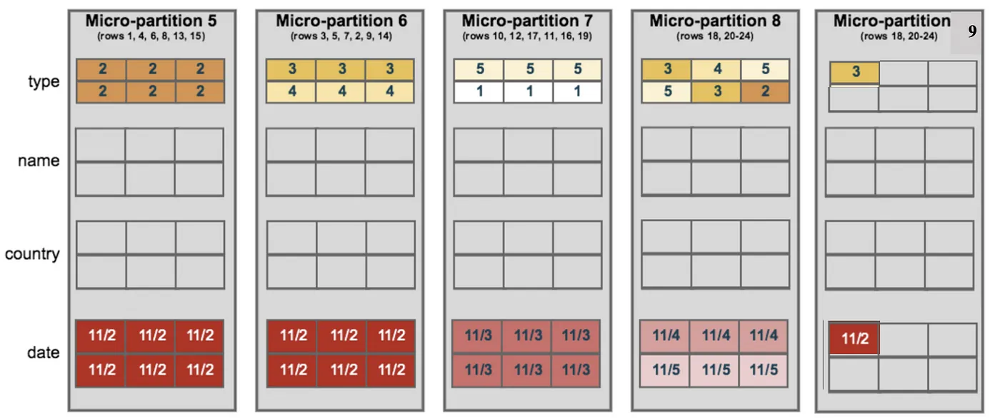
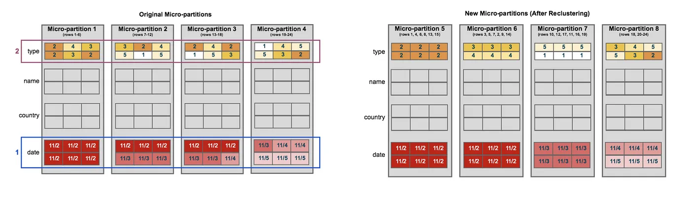

# Road to Snowflake SnowPro Core Certification: Clustering

## Fifth Chapter: Clustering

Road to Snowflake SnowPro Core Certification: Clustering
Fifth Chapter: Clustering
In this chapter, we will look at one of the most critical concepts for optimizing tables in Snowflake, Clustering. We will discuss the following points.

<ol>
<li><a href="#data-clustering">Data Clustering</a></li>
<li><a href="#clustering-depth">Clustering Depth</a></li>
<li><a href="#cluster-keys">Cluster Keys</a></li>
<li><a href="#reclustering">Re-clustering</a></li>
<li><a href="#typical-exam-questions-about-clustering">Typical Exam Questions about Clustering
</a></li>
</ol>

> _Remember that all the chapters from the course can be found [in the following link](./course-links.md)._

## DATA CLUSTERING

Typically, data stored in tables is sorted along natural dimensions, for example, by date. This process is called clustering, and data that is not sorted/clustered may hurt queries performance, particularly on huge tables, as Snowflake will have to analyze more micro-partitions to give a query result. Let’s look at the following example, where the micro-partitions are ordered by date. In this case, if we had to query for the date <i>11/2</i>, Snowflake wouldn’t scan the last two micro-partitions, improving the performance of the query.

<figure>
  
  <figcaption align = "center">Clustering example (via docs.snowflake.com).
</figcaption>
</figure>

In Snowflake, clustering metadata is collected and recorded for each micro-partition. <b>Snowflake then leverages this clustering information to avoid unnecessary scanning of micro-partitions during querying</b>, significantly accelerating the performance of queries that reference these columns.

<b>Clustering metadata that is collected for the micro-partitions in a table:</b>

<ul>
<li>The number of micro-partitions that comprise the table.</li>
<li>The number of micro-partitions containing values that overlap with each other.</li>
<li>The depth of the overlapping micro-partitions.</li>
</ul>

---

## CLUSTERING DEPTH

The clustering depth <b>measures the average depth of the overlapping micro-partitions</b> for specified columns in a table (1 or greater). <b>The smaller the cluster depth is, the better clustered the table is.</b> A table without partitions would have a cluster depth of 0, although this is not possible as a table will contain at least one micro-partition (but this can appear as an exam question). You can use the following commands to get the Cluster Depth:

<ul>
<li><b>SYSTEM$CLUSTERING_DEPTH</b></li>
<li><b>SYSTEM$CLUSTERING_INFORMATION</b></li>
</ul>
Let’s take a look at an example to understand the cluster keys. Let’s imagine that we have the following table that is partitioned as follows:

<figure>
  
  <figcaption align = "center">Clustering Depth Example.
</figcaption>
</figure>

<ol>
<li>The first partition contains data from A to D.</li>
<li>The second partition contains data from E to J.</li>
<li>The third partition contains data from K to N.</li>
<li>The fourth partition contains data from L to S.</li>
<li>The fifth partition contains data from Q to Z.</li>
</ol>

It would be straightforward to search for a value that starts with the letter G. Snowflake would only have to go to the second partition and return the values, as there are no overlapping micro-partitions. But what would happen if we searched for a value that starts with the letter M? In this case, Snowflake is accessing the third and fourth micro-partitions.

<figure>
  
  <figcaption align = "center">Clustering Depth looking for the G and the M letters.
</figcaption>
</figure>

Thus, we could say from this example:

<ol>
<li>There are three overlapping micro-partitions.</li>
<li><b>The clustering depth is 2.</b> Why? Because if you look for data, it will check in two micro-partitions, as we saw before.</li>
</ol>

As we can see, <b>a higher clustering depth would indicate that Snowflake checks a lot of micro-partitions, making the query slower.</b>

---

## CLUSTER KEYS

Clustering keys are a subset of columns or expressions on a table designated to co-locate the data in the same micro-partitions. This is useful for <b>huge tables</b> where the ordering was not ideal or extensive insert operations have caused the table’s natural clustering to degrade. Cluster Keys are <b>placed on columns usually used in the WHERE / JOINS / ORDER BY…</b> commands. As we said before, they can also be a subset of expressions on a table. Imagine you filter the table by month; you can use TO_MONTH to create a cluster key.

Some general indicators that can help determine whether to define a clustering key for a table include:

<ul>
<li>Queries on the table are running slower than expected or have noticeably degraded over time.</li>
<li>The clustering depth for the table is large.</li>
</ul>

---

## RECLUSTERING

From time to time, as DML operations (INSERT, UPDATE, DELETE, MERGE, COPY) are performed on a clustered table, the data in the table might become less clustered. Let’s imagine we have the table of the previous example and we want to add another row with the “<i>11/2</i>” date, but the micro-partitions 5 & 6 are full of data. It will go to the micro-partition 9 for example. Or what if we modify a value from the micro-partition 5 from “<i>11/2</i>” to “<i>11/4</i>”? It will make the table less clustered. If we wanted to look for the “<i>11/2</i>” value, we would have to access three micro-partitions instead of just two like before:

<figure>
  
  <figcaption align = "center">How micro-partitions can be less clustered.
</figcaption>
</figure>

To solve that, <b>Snowflake provides periodic & automatic re-clustering to maintain optimal clustering</b>. This re-clustering operation consumes both credits and storage, and for this reason, the more frequently a table changes, the more expensive it will be to keep it clustered. Therefore, <b>clustering is generally more cost-effective for tables that are queried often and do not change frequently</b>.

In the following example, we can see how re-clustering works. Date and Type are defined as the clustering key. <b>When the table is re-clustered, new micro-partitions (5–8) are created, and the old ones will be marked as deleted.</b> We had to access three partitions if we needed to do a query with a filter with <i>Type = 2 and Date = 11/2</i>. After re-clustering, we would only need to access one micro-partition.

<figure>
  
  <figcaption align = "center">Re-clustering example (via docs.snowflake.com).
</figcaption>
</figure>

---

## TYPICAL EXAM QUESTIONS ABOUT CLUSTERING

<b>What techniques would you consider to improve the performance of a query that takes a lot of time to return any result?</b>

<ol>
<li>Define partition keys</li>
<li>Create cluster keys & turn auto clustering on the table</li>
<li>Create an index on the search result</li>
</ol>

<b>Solution: 2.</b>

---

<b>Which of the following clustering metadata for the micro-partitions is maintained by Snowflake in a table?</b>

<ol>
<li>The number of micro-partitions that comprise the table.</li>
<li>The number of micro-partitions containing values that overlap with each other.</li>
<li>The depth of the overlapping micro-partitions.</li>
<li>None of the above.</li>
</ol>

<b>Solution: 1, 2, 3.</b>

---

<b>Which of the below will you consider while choosing a cluster key</b>

<ol>
<li>Columns that are typically used in the selective filters.</li>
<li>Columns are frequently used in join predicates.</li>
<li>Columns with extremely high cardinality.</li>
<li>Columns with extremely low cardinality.</li>
</ol>

<b>Solution: 1, 2.</b> A column with very low cardinality (e.g., a column indicating only whether a person is male or female) might yield minimal pruning. At the other extreme, a column with very high cardinality (e.g., a column containing UUID or nanosecond timestamp values) is also typically not a good candidate to use directly as a clustering key.

---

<b>Does re-clustering in Snowflake require manual configuration?</b>

<ol>
<li>True</li>
<li>False</li>
</ol>

<b>Solution: 2.</b>

---

<b>Is re-clustering in Snowflake only triggered if the table would benefit from the operation?</b>

<ol>
<li>True</li>
<li>False</li>
</ol>

<b>Solution: 1.</b>

---

<b>What can you easily check to see if a large table will benefit from explicitly defining a clustering key?</b>

<ol>
<li>Clustering depth</li>
<li>Clustering ratio</li>
<li>Values in a table</li>
</ol>

<b>Solution: 1.</b>

---

<b>Which system functions are available in Snowflake to view/monitor the clustering metadata for a table?</b>

<ol>
<li>SYSTEM$CLUSTERING_DEPTH</li>
<li>SYSTEM$CLUSTERING_INFORMATION</li>
<li>SYSTEM$CLUSTERING_METADATA</li>
</ol>

<b>Solution: 1, 2.</b>

---

<b>Is clustering generally more cost-effective for frequently queried tables and do not change often?</b>

<ol>
<li>True</li>
<li>False</li>
</ol>

<b>Solution: 1.</b> The more frequently a table changes, the more expensive it will be to keep it clustered.

---

<b>Which of the below columns is usually a good choice for clustering keys?</b>

<ol>
<li>UUID column from a Customer in a 10TB table.</li>
<li>Gender male/female in a 20TB table.</li>
<li>Timestamp in a 10TB table.</li>
<li>Store_id in a 2TB table.</li>
</ol>

<b>Solution: 4.</b> It cannot have extremely high and low cardinality. UUID and timestamp have extremely high cardinality, as there will be a lot of customers/timestamps. Gender low cardinality. Store_id looks like the most convenient option.
