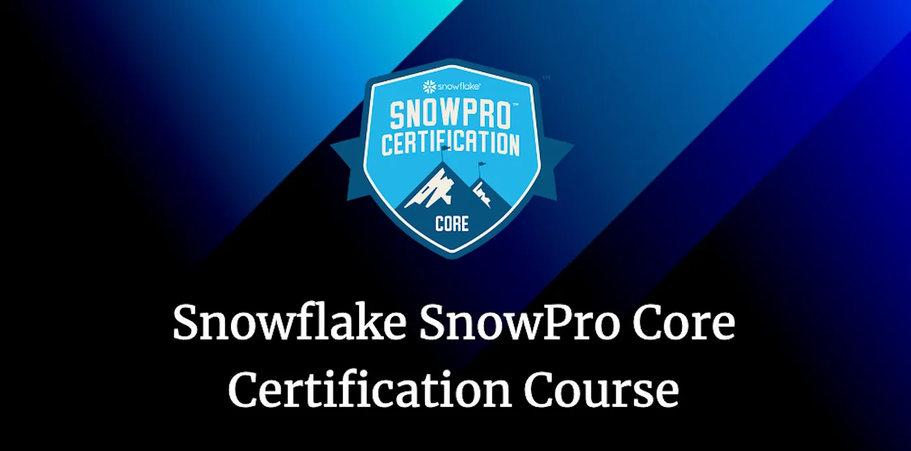
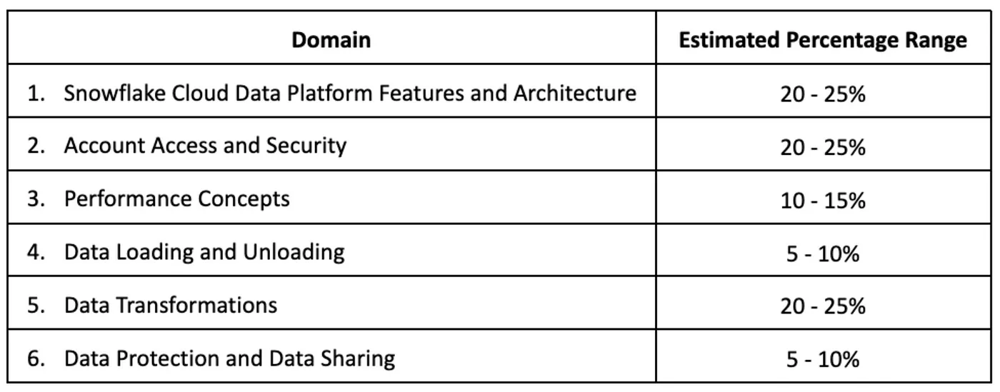

# Road to Snowflake SnowPro Core Certification: Complete Course

## Interested in getting certified in the Snowflake SnowPro Core Certification? Keep reading

Hello everyone. This course was created by [Gonzalo Fernadez Plaza](https://plazagonzalo.medium.com) to help everyone trying to study for the Snowflake SnowPro Core Certification Exam or everybody trying to learn how to use Snowflake and discover all its power. It was originally published on [Medium](https://medium.com/) but I have curated and updated it here on Github for my reference.

---

**This course is adapted to the new COF-C02 new version of the SnowPro Core Certification Exam**, released in early September 2022. It is divided into chapters with detailed content on each Snowflake functionality, cheat sheets, diagrams, and more. At the end of each chapter, I will also solve the typical exam questions to prepare you for the exam.

The SnowPro Core Certification demonstrates an individual’s knowledge to apply core expertise in implementing and migrating to Snowflake. It is also necessary to go further with the SnowPro Advanced Certifications, a **prerequisite for all advanced exams**. This course covers Snowflake architectural principles and best practices, always focusing on the questions you will face in the exam. **The exam costs $175, and you need to get a passing score of 750 on a scaled score from 0–1000**. The following picture shows the estimated percentage range of each exam part updated to the new COF-C02 model (you can find more information at https://www.snowflake.com/certifications/).

<figure>
  
  <figcaption align = "center">Estimated Percentage Domain Ranges updated to the COF-C02 exam.
</figcaption>
</figure>

Snowflake was recognized as a **Leader by Gartner, positioned for the third consecutive year in the Magic Quadrant Report**. It demonstrates Snowflake’s strong momentum, providing the best environment for data with near-infinite resources and computing power, all **at a fraction of the cost of other solutions**.

---

## ALL THE CHAPTERS FROM THE COURSE

So, how should you start once you have decided to study for this certification? In the following links, you’ll be able to find all the information regarding Snowflake to prepare you for the exam.

1. [Snowflake Introduction](./introduction.md)
2. [Snowflake Architecture](./architecture.md)
3. [Snowflake Pricing](./pricing.md)
4. [Snowflake Micro-partition](./micro-partitions.md)
5. [Snowflake Clustering](./clustering.md)
6. [Snowflake Tables & Views](./tables-views.md)
7. [Snowflake Stage & Storage Integration](./stages-storage-integration.md)
8. [Snowflake Data Loading, COPY INTO & SnowPipe Commands](./data-loading.md)
9. [Snowflake PUT & GET Commands](./put-get-commands.md)
10. [Snowflake Data Warehouses](./data-warehouses.md)
11. [Resource Monitors](./resource-monitors.md)
12. [Snowflake Caches and Query Performance](./caches.md)
13. [Time Travel, Fail-Safe & Zero-Copy Cloning](./storage-features.md)
14. [Roles in Snowflake](./snowflake-roles.md)
15. [Snowflake Data Sharing](./data-sharing.md)
16. [Stored Procedures & User Defined Functions](./stored-procedures-and-udfs.md)
17. [Tasks & Transactions](./tasks-transactions.md)
18. [Snowflake Streams](./streams.md)
19. [Other Snowflake Objects: File Formats & Sequences](./file-formats-sequences.md)
20. [Snowflake Ecosystem, Compliance, Data Marketplace & Security](./ecosystem.md)
21. [Summary & Tips for the Exam](./certification-summary.md)
22. [Snowflake SnowPro Core Practice Exam (Part 1)](./practice-exam-p1.md)
23. [Snowflake SnowPro Core Practice Exam (Part 2)](./practice-exam-p2.md)
