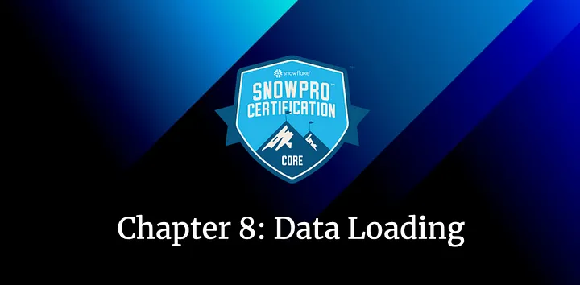
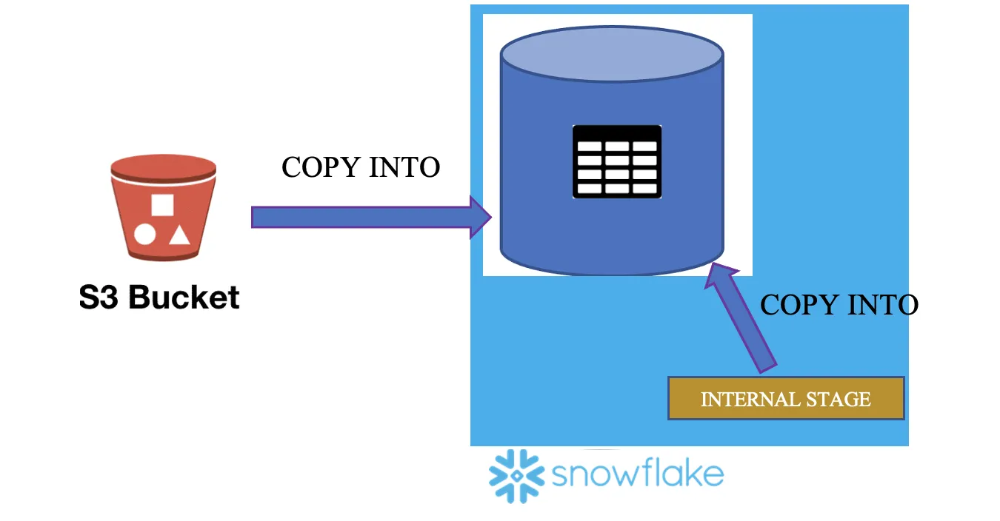
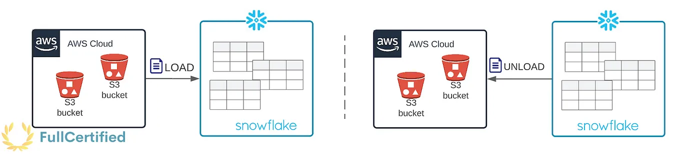
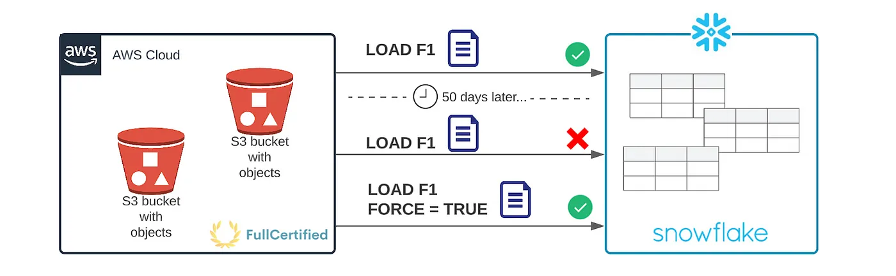
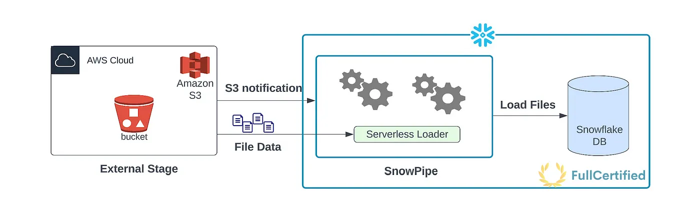

# Road to Snowflake SnowPro Core Certification: Data Loading

## Eighth Chapter: Data Loading

Hello everybody. In this chapter, we are going to study the different ways to COPY data into Snowflake tables, either using bulk load or continuous load with Snowpipe:

#### Table of Contents

1. [Data Loading](#data-loading)
2. [Bulk load using COPY INTO](#bulk-load)
3. [Continous load using Snowpipe](#continuous-load)
4. [Typical Exam Questions](#typical-snowpro-core-exam-questions)

> _Remember that all the chapters from the course can be found [in the following link](./course-links.md)._

## DATA LOADING

When we load the data into Snowflake, we usually perform the following steps:

<ul>
<li><b>Source system → Snowflake Stage → Snowflake Table.</b></li>
</ul>

A source system (it can be, for example, your application, or not even that, it can be whatever machine that generates data, like sensors) will generate data that it will send to a stage, for example, AWS S3. <b>Once the data is at any stage, we’ll copy it into Snowflake tables</b>. There are two different ways to do it, Bulk Load or Continuous Load; let’s study the differences.

<figure>
  
  <figcaption align = "center">Data Loading Steps in Snowflake.
</figcaption>
</figure>

---

## BULK LOAD

Bulk load is the process of <b>loading batches of data</b> from files already available at any stage into Snowflake tables. We use the COPY command to do that (it consumes credits from the virtual warehouses). <b>It supports data transformation while loading</b>, using column reordering, column omission, casting… Let’s see how the COPY INTO command works.

> **_COPY INTO_**

Using this command, you can load data from staged files to an existing table. It copies the data into tables. <b>It works for any stage</b> (internal, external, table, and user stages) or even from an external location like S3, Azure… Some factors affect the loading time, like the <b>physical location of the stage, GZIP compression efficiency</b> (files are automatically compressed using gzip unless compression is explicitly disabled), <b>or the number and types of columns.</b>

<figure>
  
  <figcaption align = "center">Copy Into command is used to copy data from any stage into tables.
</figcaption>
</figure>

You can both load and unload data into tables with this command:

<ul>
<li><b>LOAD</b> → COPY data from the stages into a table. You load data into Snowflake tables.</li>
<li><b>UNLOAD</b> → COPY data from the table to stages. You unload data from the tables to a different location (internal stage, external stage, or external location).</li>
</ul>

<figure>
  
  <figcaption align = "center">Load vs. Unload Data into Snowflake
</figcaption>
</figure>

<b>Some extra considerations:</b>

<ul>
<li>You need to specify the table name where you want to copy the data, the stage where the files are, the file/patterns you want to copy, and the file format.</li>
<li><b>64 days of metadata</b>. The information about the loaded files is stored in Snowflake metadata. You <b>cannot COPY the same file again in the next 64 days</b> unless you specify it (“<i>FORCE=True</i>” command).</li>
<li>You cannot Load/Unload files from your Local Drive</li>
<li>Some transformations like Flatten, Join, Group by, Filters or Aggregations are not supported.</li>
<li><b>Using the Snowflake UI, you can only Load 50MB files</b>. You can copy bigger files using SnowSQL.</li>
<li>Organizing input data by granular path can improve load performance.</li>
</ul>

<b>On error:</b>

Loading some of the files might produce errors. For example, you are copying .csv files, and the data is incorrect inside the file. There are several options that you can specify in this case:

<ol>
<li><b>ABORT_STATEMENT →</b> Abort the load operation if there are errors in a data file. If you don’t specify any parameter in the ON_ERROR option, <b>this will be the VALUE BY DEFAULT.</b></li>
<li><b>CONTINUE →</b> Continue loading the file.</li>
<li><b>SKIP_FILE →</b> Skip file if there are errors in the files.</li>
<li><b>SKIP_FILE_num →</b> Skip the file when the number of error rows in the file equals or exceeds the specified number.</li>
<li><b>SKIP_FILE_num% →</b> Skip the file when the percentage of error rows in the file exceeds the specified percentage.</li>
</ol>

<b>Some other options</b> from the COPY INTO command that normally appears in the exam:

<ul>
<li><b>pattern = <pattern> →</b> Load files from a stage into the table, using pattern matching.</li>
<li><b>FORCE = TRUE → Once the files are copied into a table, they cannot be copied again in the next 64 days because of the files’ metadata.</b> If this option is true, it loads all files, regardless of whether they’ve been loaded previously and have not changed since they were loaded.</li>
</ul>

<figure>
  
  <figcaption align = "center">COPY INTO 64 Days Metadata
</figcaption>
</figure>

<ul>
<li><b>PURGE = TRUE →</b> It specifies whether to automatically remove the data files from the stage after loading the data successfully. If the purge operation fails for any reason, no error is returned. An excellent way to check whether there was an error or not would be to list the files from the stage with the “LIST stage” command.</li>
<li><b>MAX_FILE_SIZE →</b> You can specify the maximum size for each file when unloading the data with this option.</li>
</ul>

---

## CONTINUOUS LOAD

Load small volumes of data (micro-batches) and incrementally make them available for analysis. There are different ways to do that:

<ol>
<li><b>Snowpipe →</b> The easiest and most popular way to do it. We’ll see it in this chapter.</li>
<li><b>Snowflake Connector for Kafka →</b> Reads data from Apache Kafka topics and loads the data into a Snowflake table.</li>
<li><b>Third-Party Data Integration Tools →</b> You can do it with other supported integration tools. You can see the list at the <a href="https://docs.snowflake.com/en/user-guide/ecosystem-etl.html">following link</a>.</li>
</ol>

> **_SNOWPIPE_**

Snowpipe enables loading data <b>when the files are available in any (internal/external) stage</b>. You use it when you have a small volume of <b>frequent data, and you load it continuously (micro-batches). Snowpipe is serverless, which means that it doesn’t use Virtual Warehouses.</b> It is used for Streaming / Near Real-Time data. An important thing to know is that <b>Snowpipe does not guarantee that files will be loaded in the same order as staged. It usually processes the oldest files first, but there is no guarantee.</b>

<figure>
  
  <figcaption align = "center">Diagram explaining how Snowpipe works.
</figcaption>
</figure>

The real question is, how can Snowpipe detect new files in the stage? There are two different ways to do it:

<ol>
<li><b>Automating Snowpipe using cloud messaging →</b> You can do a trigger when there is an event in the stage (for example, when there is a new document) using Amazon SQS (Simple Queue Service) notifications for an S3 bucket. You can follow this tutorial to learn how to do it.</li>
<li><b>Calling Snowpipe REST endpoints →</b> Your client application calls a public REST endpoint with the name of a pipe object and a list of data filenames. It requires key pair authentication with JSON Web Token (JWT), and you have the <b>“<i>insertFiles</i>”, “<i>insertReport</i>”, and “<i>loadHistoryScan</i>”</b> APIs to do it. You have more information at the <a href="https://docs.snowflake.com/en/user-guide/data-load-snowpipe-rest-apis.html">following link</a>.</li>
</ol>

<b>Some extra considerations:</b>

<ul>
<li><b>14 days of metadata</b> (COPY INTO was 64 days). You cannot copy the same files again in these 14 days.</li>
<li>By default, it does a “<b>SKIP_FILE</b>” when there is an error loading files. COPY INTO default ON_ERROR option was ABORT_STATEMENT.</li>
</ul>

---

## TYPICAL SNOWPRO CORE EXAM QUESTIONS

<b>What are the usual data-loading steps in Snowflake?</b>

<ol>
<li>Source → Snowflake Stage → Snowflake table</li>
<li>Source → Snowflake Table → Snowflake stage</li>
<li>Snowflake table → Source → Snowflake Stage</li>
</ol>

<b>Solution: 1</b>

---

<b>What key concepts will need to be considered while loading data into Snowflake?</b>

<ol>
<li>Stage</li>
<li>File Format</li>
<li>Transformation</li>
<li>Region of your Snowflake account</li>
<li>Error validation</li>
</ol>

<b>Solution: 1, 2, 3, 5.</b>

---

Using <b>COPY INTO <location></b> command, you can unload data from a table into which locations?

<ol>
<li>Named internal stage (or table/user stage).</li>
<li>Named external stage that references an external location (Amazon S3, Google Cloud Storage, or Microsoft Azure).</li>
<li>An external location like Amazon S3 or Azure.</li>
<li>Local Drive</li>
</ol>

<b>Solution: 1, 2, 3</b>. Once the data is in the internal stage, you can download them into your local drive using the GET command. You can also unload data into an external location.

---

<b>After how many days does the COPY INTO load metadata expire?</b>

<ol>
<li>1 day</li>
<li>14 days</li>
<li>64 days</li>
<li>180 days</li>
</ol>

<b>Solution: 3</b>

---

<b>While loading data through the COPY command, you can transform the data. Which of the below transformations are allowed?</b>

<ol>
<li>Truncate columns</li>
<li>Omit columns</li>
<li>Filters</li>
<li>Reorder columns</li>
<li>Cast</li>
<li>Aggregate</li>
</ol>

<b>Solution: 1, 2, 4, 5</b>

---

<b>After a successful load into a Snowflake table with the COPY INTO command, what option will you specify to delete the stage files?</b>

<ol>
<li>DELETE = TRUE</li>
<li>REMOVE = TRUE</li>
<li>PURGE = TRUE</li>
<li>TRUNCATE = TRUE</li>
</ol>

Solution: 3.</b>

---

<b>In which of the below scenarios is Snowpipe recommended to load data?</b>

<ol>
<li>We have a small volume of frequent data</li>
<li>We have a huge volume of data generated as part of a batch schedule</li>
<li>In both of the previous scenarios</li>
</ol>

<b>Solution: 1</b>

---

<b>Is Snowpipe Serverless?</b>

<ol>
<li>True</li>
<li>False</li>
</ol>

<b>Solution: 1</b>

---

<b>After how many days does the load history of Snowpipe expire?</b>

<ol>
<li>1 day</li>
<li>14 days</li>
<li>90 days</li>
<li>180 days</li>
</ol>

<b>Solution: 2.</b> The load history is stored in the metadata of the pipe for 14 days. Must be requested from Snowflake via a REST endpoint, SQL table function, or ACCOUNT_USAGE view.

---

<b>Can Snowpipe load a file with the same name if it has been modified later?</b>

<ol>
<li>True</li>
<li>False</li>
</ol>

<b>Solution: 2.</b> This is because of the Snowpipe metadata. Changing the name doesn’t modify this metadata, so it won’t be copied.

---

<b>Does Snowpipe guarantee that files are loaded in the same order they are staged?</b>

<ol>
<li>True</li>
<li>False</li>
</ol>

<b>Solution: 2.</b> It usually processes the oldest files first, but there is no guarantee.

---

<b>Which of the below APIs are Snowpipe REST APIs?</b>

<ol>
<li>insertFiles</li>
<li>insertReport</li>
<li>insertHistoryScan</li>
<li>loadFiles</li>
<li>loadHistoryScan</li>
</ol>

<b>Solution: 1, 2, 5</b>

---

<b>Which data-loading method requires a user-specified warehouse to execute COPY statements?</b>

<ol>
<li>Bulk Data Load</li>
<li>Snowpipe</li>
<li>Both</li>
</ol>

<b>Solution: 1</b>
