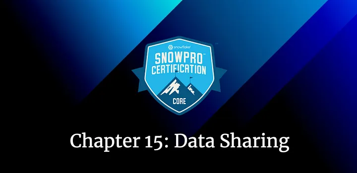
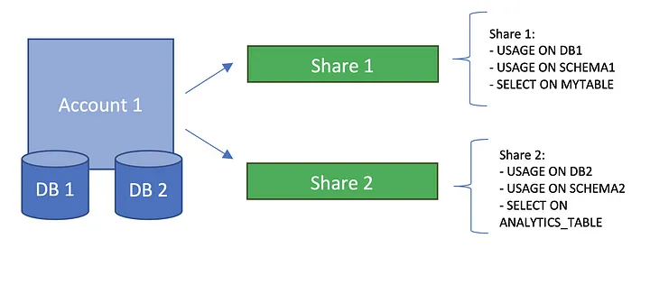
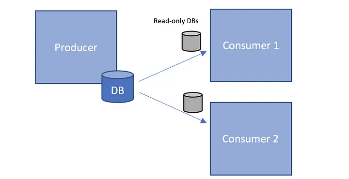
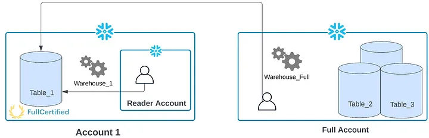
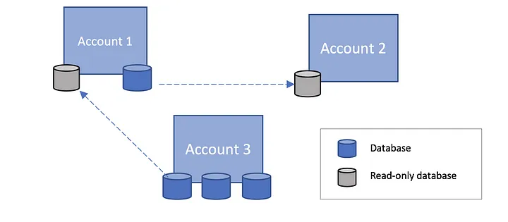

# Secure Data Sharing for the Snowflake SnowPro Core Certification

## Fifteenth Chapter: Data Sharing

Let’s imagine we want to share a small part of the data we have in Snowflake with another account, such as sharing just a table with another company. But of course, we only want to share a table since the rest is, for example, confidential information. This will no longer be a problem using Snowflake Secure Data Sharing! Let’s take a look at it in detail.

#### Table of Contents

1. [Introduction to Secure Data Sharing](#introduction-to-secure-data-sharing)
2. [Shares](#shares)
3. [Producers & Consumers](#producers--consumers)
4. [Inbound & Outbound Shares](#inbound--outbound-shares)
5. [Typical Exam Questions](#typical-exam-questions-about-data-sharing)

> _Remember that all the chapters from the course can be found [in the following link](./course-links.md)._

## INTRODUCTION TO SECURE DATA SHARING

Secure Data Sharing enables sharing selected objects in a database in your account with other Snowflake accounts. The account that receives the data cannot modify it, as <b>shared data is always read-only</b>. These are the Snowflake objects that we can share:

<ul>
<li>Tables</li>
<li>External tables</li>
<li>Secure views</li>
<li>Secure materialized views</li>
<li>Secure UDFs</li>
</ul>

But what is a share? Let’s get to it!

---

## SHARES

Shares are named <b>Snowflake objects that encapsulate all information required to share a database</b>. Each share consists of the following:

<ul>
<li>The privileges that grant access to the <b>database(s) and the schema</b> containing the objects to share.</li>
<li>The privileges grant access to the specific objects <b>we want to share</b>.</li>
<li>The <b>consumer accounts</b> with which the database and its objects are shared.</li>
</ul>

---

### Real examples & useful commands

Imagine that we want to share a table “<i>myTable</i>” contained in the “myDb” database. We should create a share and give the needed privileges to the share to access this table:

`CREATE SHARE myShare;`

`GRANT USAGE ON DATABASE myDb TO SHARE myShare;`

`GRANT USAGE ON SCHEMA myDb.public TO SHARE myShare;`

`GRANT SELECT ON TABLE myDb.public.myTable TO SHARE myShare;`

We can also set the exact privileges we want the share to have. In the last command, we gave the share the privilege to only perform “<i>SELECT</i>” queries on the table “<i>myTable</i>”.

Imagine that we share a database with ten tables with a consumer account, and we want to stop sharing one of them; it will be <b>as easy as removing the grant of the table</b> from the share. Other important commands include:

<ul>
<li><b>Show all the shares that we have in the system:</b></li>

`SHOW SHARES`

<li><b>See all the privileges that a share has:</b></li>

`SHOW GRANTS TO SHARE myShare`

<li><b>See the accounts (consumers) that are using the share:</b></li>

`SHOW GRANTS OF SHARE myShare`

</ul>

---

## PRODUCERS & CONSUMERS

In Snowflake, the account that shares a Share will be the producer, while the account that receives it will be the consumer (already mentioned before). Let’s take a closer look.

### Producers

Producers (or providers) are called to the <b>Snowflake account that creates shares and makes them available to other Snowflake accounts to consume</b>. For example, I would be the producer if I want to share the table “<i>myTable</i>” with another account. The producers will always pay for the storage of the data they share.

---

### Consumers

Accounts that receive the share/data. Shared data <b>is instantaneous for consumers as no actual data is copied or transferred between accounts</b>. For this reason, shared data is always up-to-date. <b>Also, consumers don’t pay for storage, as the producer account already pays for it</b>. There are several features that a consumer cannot do with a Shared Object, for example, create a clone or Time-Travel in tables.

Once the consumers receive the share, they have to create a database from this share, and at this point, all the shared objects will be accessible to users in the consumer account.

The consumer and producer accounts must be in the same region to share data. To avoid this restriction, <b>Snowflake uses database replication to allow data producers to securely share data with consumers across different regions and cloud platforms</b>.

")

We have two types of Consumers:

<ul>
<li><b>Full account →</b> When you share something with an existing Snowflake account. <b>The consumer account pays for the queries they make</b>, although the shared data storage is still paid for by the producer, as mentioned before.</li>
<li><b>Reader Account →</b> Imagine that you want to <b>share data with someone that doesn’t have a Snowflake account</b>. Thanks to Snowflake reader accounts, you can also do it, not needing them to become Snowflake customers! Each reader account belongs to the producer account that created it, and they can only consume data from this producer account. <b>The producer account pays all the compute credits that their warehouses use</b>.</li>
</ul>

You can see this behavior in the following diagram. As you can see, the Reader account will use the warehouse of Account1 to query Table_1. In the case of the FullAccount, it will use its warehouse to query the same table. The Provider will always pay for the storage, in this case, Account_1.

## INBOUND & OUTBOUND SHARES

We will have two types of shares:

<ul>
<li><b>Outbound shares →</b> Shares that you (as a producer) have created to share with other accounts (consumer accounts).</li>
<li><b>Inbound shares →</b> Shares that other accounts (as producers) have created and shared with you (as a consumer). These are the available shares for your account to consume.</li>
</ul>

Let’s classify the shares that we can see in the following example:

<ul>
<li><b>Account 1 →</b> This first account has an inbound share from the “<i>Account 3</i>”, and one outbound share to the “<i>Account 2</i>”.</li>
<li>Account 2 →</b> It just has one inbound share from the “<i>Account 1</i>”.</li>
<li>Account 3 →</b> Apart from having three different databases, it has one outbound share of one of them to the “<i>Account 1</i>”.</li>
</ul>

---

## TYPICAL EXAM QUESTIONS ABOUT DATA SHARING

<b>What is the minimum Snowflake edition needed for the Data Sharing capability?</b>

<ol>
<li>Standard</li>
<li>Enterprise</li>
<li>Business Critical</li>
</ol>

<b>Solution: 1, 2, 3.</b> All the data-sharing features are available for these three types of editions.

---

<b>Which database objects can be shared using Snowflake Secure Data Sharing?</b>

<ol>
<li>Tables</li>
<li>External tables</li>
<li>Secure views</li>
<li>Secure materialized views</li>
<li>Secure UDFs</li>
<li>Users</li>
</ol>

<b>Solution: 1, 2, 3, 4, 5.</b>

---

<b>How can a producer share a table with a consumer located in a different region?</b>

<ol>
<li>This is not a problem; producers and consumers can be in different regions</li>
<li>Replicate your account to another region and create a share from that region.</li>
<li>Create a script to replicate your data in the consumer account.</li>
</ol>

<b>Solution: 2.</b> Data sharing works within the same region; however, you can replicate your account to another region and then share data from that replicated account within that account’s region. This is also true across cloud platforms.

---

<b>Which Snowflake role can set up a Snowflake Share?</b>

<ol>
<li>SECURITYADMIN</li>
<li>SYSADMIN</li>
<li>DATASHARINGADMIN</li>
<li>ACCOUNTADMIN</li>
<li>PUBLIC</li>
</ol>

<b>Solution: 4.</b> Only AccountAdmins can create Shares.

---

<b>What are the two types of data consumer accounts available in Snowflake?</b>

<ol>
<li>Shared Account</li>
<li>Reader Account</li>
<li>Public Account</li>
<li>Full Account</li>
</ol>

<b>Solution: 2, 4</b>

---

<b>Is shared data always immediately available to Consumer Accounts?</b>

<ol>
<li>True</li>
<li>False</li>
</ol>

<b>Solution: 1</b>
