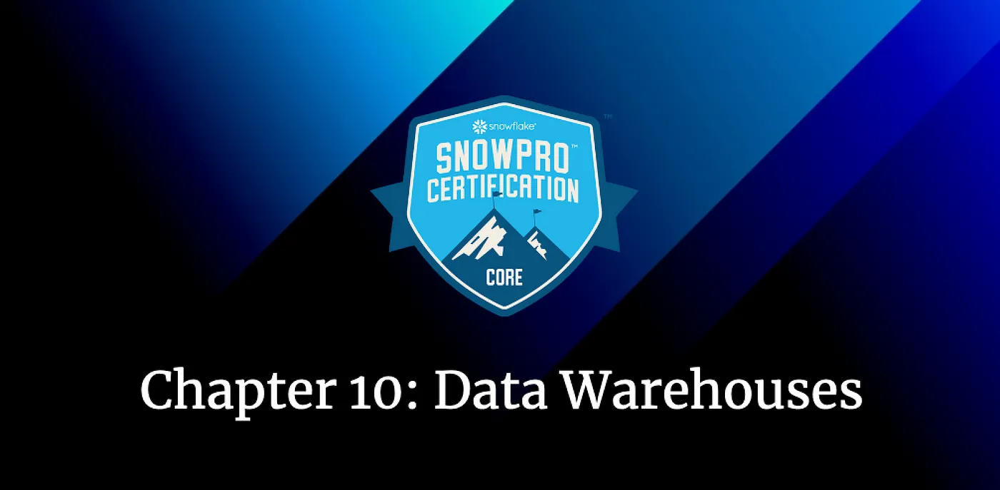

Data Warehouses for the Snowflake SnowPro Core Certification
Tenth Chapter: Data Warehouses

Data warehouses in Snowflake are one of the most important parts of this technology, and as we discussed in previous chapters, <b>they will allow us to compute</b>. In this chapter, we are going to see them in more detail:

#### Table of Contents

1. [Warehouses in Snowflake](#warehouses-in-snowflake)
2. [Properties from the warehouses](#properties-from-the-warehouses)
3. [Typical Exam Questions](#snowflake-snowpro-exam-questions)

> _Remember that all the chapters from the course can be found [in the following link](./course-links.md)._

## WAREHOUSES IN SNOWFLAKE

A Data Warehouse is a cluster of computing resources in Snowflake. It provides the required resources, such as CPU, memory, and temporary storage, to perform queries and DML operations (like loading data into tables). A warehouse must be running and in use for the session to perform these operations. <b>While a warehouse is running, it consumes Snowflake credits</b>.

<b>Snowflake utilizes per-second billing (with a 60-second minimum each time the warehouse starts)</b>, so warehouses are billed only for the credits they consume:

<ul>
<li>If we run the warehouse for 10 seconds, we will be billed for 60 seconds.</li>
<li>If we run the warehouse for 59 seconds, we will be billed for 60 seconds.</li>
<li>If we run the warehouse for 138 seconds, we will be billed for 138 seconds.</li>
</ul>

## PROPERTIES FROM THE WAREHOUSES

A Warehouse is defined by its size and other properties that we can set to help control and automate warehouse activity. Let’s take a look:

### Size

As we saw in the [chapter about pricing](./pricing.md), they might consume additional credits per hour depending on the warehouse size. <b>The size of a warehouse can impact the amount of time required to execute queries</b> submitted to the warehouse. So, a query will be executed faster in a Large warehouse than in a Small warehouse, but you will pay more credits per second. We can see some of the most common sizes in the following image:

### Multi-Cluster Warehouses

With multi-cluster warehouses, you can <b>scale compute resources to manage query concurrency</b> during, for example, peak hours. You can add additional warehouses to make a larger pool of computing resources available. <b>You need (at least) the Snowflake Enterprise Edition</b> (typical exam question) to activate this option. You can see how they look like in the following picture:

For a multi-cluster warehouse, the number of credits billed is calculated based on the size and the number of warehouses that run within the time period. If we run two “<i>S</i>” warehouses, we will be billed for two credits/hour \* 2 warehouses of “<i>S</i>” size, which is four credits/hour.

To create multi-cluster warehouses, you need to specify the following properties:

<ul>
<li>Maximum clusters (1–10)</li>
<li>Minimum clusters (≤ than the maximum)</li>
</ul>

> **_Scale Up vs Scale-Out_**

What is the difference between increasing the Warehouse size and multi-cluster warehouses? <b>Multi-cluster warehouses are best utilized for scaling resources to improve concurrency for users/queries</b>, also known as scale OUT/IN. <b>If we wanted to improve the performance of the queries, we should resize the warehouse</b>, also known as scale UP/DOWN the Data Warehouse.

> **_Multi-warehouse modes_**

Depending on the maximum and the minimum number of clusters, we have two different modes in which the warehouse can run:

<ul>
<li><b>Maximized →</b> We will enable this mode by specifying the <b>SAME value (larger than 1) for the maximum and the minimum number of clusters</b>. Snowflake will start all the warehouses so that the maximum resources are available while they run.</li>
<li><b>Auto-Scale →</b> We will enable this mode by specifying <b>DIFFERENT values for the maximum and the minimum number of clusters</b>. Snowflake will start and stop warehouses as needed. To control how the warehouse scales, we can define Scaling Policies.</li>
</ul>

> **_Scaling policy_**

When you create a multi-cluster warehouse, you need to specify a scaling policy, which will help you control the credits consumed by the multi-cluster warehouse.

<ul>
<li><b>Standard policy →</b> It prioritizes starting additional warehouses over conserving credits.</li>
<li><b>Economy policy →</b> A more restrictive policy that prioritizes conserving credits over starting additional warehouses.</li>
</ul>

### Auto Suspend & Auto Resume

Snowflake can suspend the warehouse if it’s inactive for a specific period of time. <b>By default, the auto-suspend option is enabled</b>. For example, if we don’t use the warehouse for 10 minutes, it will automatically be suspended.

Auto Resume allows Snowflake to <b>automatically resume the warehouse when any statement requires the use of the warehouse</b>, like any query or DML command. By default, it’s also enabled.

---

## WHAT IS A WAREHOUSE IN SNOWFLAKE

Defining "Warehouse" in Snowflake:

- People who have been working with data for awhile might think of the term "Data Warehouse" as referring to a special collection of data structures, but in Snowflake, warehouses don't store data.
- In Snowflake, Warehouses are "workforces" -- they are used to perform the processing of data.
- When you create a Warehouse in Snowflake, you are defining a "workforce."

Teams are Clusters, Team Members are Servers:

- In the video, the workforce of each warehouse is a team. A small warehouse has a small team, but just one team. An extra-large warehouse has a large team, but just one team.
- Snowflake Warehouse Sizes like eXtra-Small, Small, Medium, etc. all have one cluster. A small warehouse has one cluster made up of just a few servers. A larger warehouse has one cluster, made up of more servers.

Scaling Up and Down:

- Changing the size of warehouse changes the number of servers in the cluster.
- Changing the size of an existing warehouse is called scaling up or scaling down.

Scaling In and Out:

- If multi-cluster/elastic warehousing is available (Enterprise edition or above) a warehouse is capable of scaling out in times of increased demand. (Adding temporary teams, made up of a collection of temporary workers).
- If multi-cluster scaling out takes place, clusters are added for the period of demand and then clusters are removed (snap back) when demand decreases. (Removing temporary teams).
- The number of servers in the original cluster dictates the number of servers in each cluster during periods where the warehouse scales out by adding clusters.

## SNOWFLAKE SNOWPRO EXAM QUESTIONS

<b>How is query processing done in Snowflake?</b>

<ol>
<li>AWS EMR with Spark</li>
<li>AWS EC2 with Spark</li>
<li>Virtual Warehouses</li>
</ol>

<b>Solution: 3</b>

---

<b>You have two virtual warehouses in your Snowflake account. If one of them updates the data in the storage layer, when will the other one see it?</b>

<ol>
<li>Immediately</li>
<li>After an average time of 5 seconds</li>
<li>After the sync process</li>
</ol>

<b>Solution: 1.</b> All the warehouses of your account share the storage layer, so if the data is updated, all the warehouses will be able to see it.

---

<b>Can you resize the warehouse once you have selected the size?</b>

<ol>
<li>True</li>
<li>False</li>
</ol>

<b>Solution: 1.</b> You can always change the size of the warehouse depending on your needs.

---

<b>If you want a dedicated virtual warehouse, which is the lowest Snowflake edition you should opt for?</b>

<ol>
<li>Standard</li>
<li>Enterprise</li>
<li>Business Critical</li>
<li>Virtual Private Snowflake</li>
</ol>

<b>Solution: 1.</b> In Snowflake, all the Virtual Warehouses are dedicated to the users. If you create a virtual warehouse, you will only be the one using it.

---

<b>If you want a multi-cluster warehouse, which is the lowest Snowflake edition you should opt for?</b>

<ol>
<li>Standard</li>
<li>Enterprise</li>
<li>Business Critical</li>
<li>Virtual Private Snowflake</li>
</ol>

<b>Solution: 2.</b>

---

<b>Queries in Snowflake are getting queued in the warehouses and delaying the ETL processes of the company. What are the possible solution options you can think of, considering we have the Snowflake Enterprise addition?</b>

<ol>
<li>Resize the warehouse</li>
<li>Use multi-cluster warehouse</li>
<li>Set auto-resize parameter to TRUE</li>
<li>Contact Snowflake support to increase the size of the warehouse</li>
</ol>

<b>Solution: 1, 2. By resizing</b> the warehouse, your company will scale up, reducing the time to execute big queries. Using multi-cluster warehouses, you will have more queries running simultaneously and a high concurrency when they execute.

---

<b>A warehouse ran for 62 seconds, and it was suspended. After some time, it ran for another 20 seconds. For how many seconds will you be billed?</b>

<ol>
<li>20 seconds</li>
<li>62 seconds</li>
<li>92 seconds</li>
<li>122 seconds</li>
</ol>

<b>Solution: 4.</b> 62 seconds + 60 seconds because warehouses are billed for a minimum of one minute. The price would be different if the warehouse wasn’t suspended before executing the second query.

---

<b>Can two different virtual warehouses from the same account access the same data simultaneously without any contention issues?</b>

<ol>
<li>True</li>
<li>False</li>
</ol>

<b>Solution: 1</b>

---

<b>Can virtual warehouses be resized while they are running?</b>

<ol>
<li>True</li>
<li>False</li>
</ol>

<b>Solution: 1</b>

---

<b>A medium (M) warehouse has auto-suspend configured after 15 minutes. You have noticed that all of the queries that run on this warehouse finish within a minute. What will you do to optimize compute costs?</b>

<ol>
<li>Delete the warehouse after a minute</li>
<li>Reduce the auto-suspend time to 1 minute</li>
<li>Use another data-warehouse</li>
</ol>

<b>Solution: 2</b>

---

<b>What happens to incoming queries when a warehouse does not have enough resources to process them?</b>

<ol>
<li>Queries are aborted</li>
<li>Queries are queued and executed when the warehouse has resources</li>
<li>Snowflake resizes the warehouse</li>
</ol>

<b>Solution: 2</b>

---

<b>Which function returns the name of the warehouse of the current session?</b>

<ol>
<li>ACTIVE_WAREHOUSE()</li>
<li>RUNNING_WAREHOUSE()</li>
<li>CURRENT_WAREHOUSE()</li>
<li>WAREHOUSE()</li>
</ol>

<b>Solution: 3.</b> I’m not a big fan of learning commands by heart, and they are unlikely to appear on the exam, but this one may be useful.
