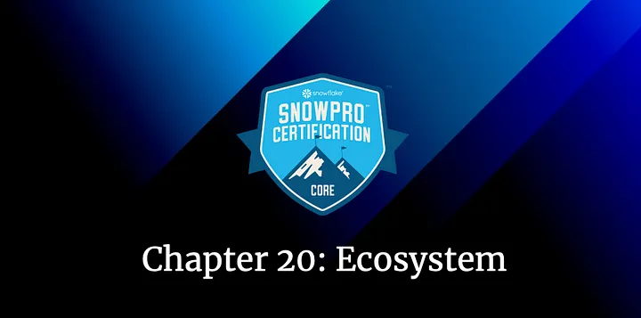
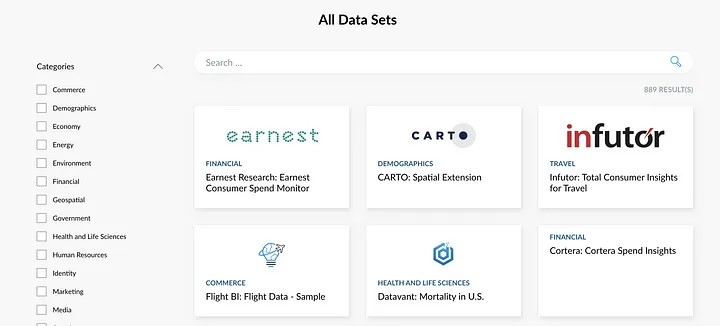
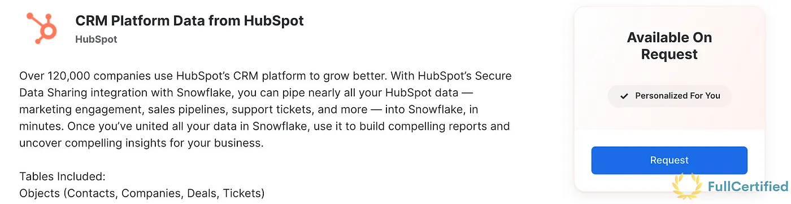
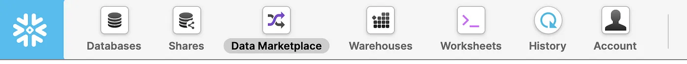
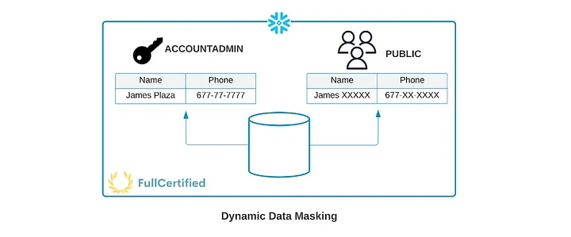

# Snowflake Ecosystem for the SnowPro Core Certification

## Chapter 20: Snowflake Ecosystem, Compliance, Data Marketplace & Security

We are arriving at the end of the Snowflake SnowPro Core Certification course. This is going to be the last theoretical chapter of the course, where we are going to study the following concepts:

#### Table of Contents

1. [Snowflake Ecosystem](#snowflake-ecosystem)
2. [Snowflake Compliance](#snowflake-compliance)
3. [Snowflake Data Marketplace](#snowflake-data-marketplace)
4. [Snowflake Column Level Security](#column-level-security)
5. [Typical Exam Questions](#typical-exam-questions)

> _Remember that all the chapters from the course can be found [in the following link](./course-links.md)._

---

## SNOWFLAKE ECOSYSTEM

Partner Connect → Lets you easily create trial accounts with selected Snowflake business partners and integrate them with Snowflake to try various 3rd-party tools and services. There are two types of partners:

<ul>
<li><b>Technology partners →</b> They integrate their solutions with Snowflake to get data quickly into Snowflake. They offer Software, driver, interfaces…</li>
<li><b>Solution partners →</b> Trusted and validated experts and services. They are like consulting partners.</li>
</ul>

.")

These partners are classified into six different categories, as shown in the previous image:

<ul>
<li>Data Integration</li>
<li>ML & Data Science</li>
<li>Security & Governance</li>
<li>Business Intelligence</li>
<li>SQL Editors</li>
<li>Programming Interfaces</li>
</ul>

## SNOWFLAKE COMPLIANCE

This is the list of reports available on Snowflake. You can get more information about them at the following link. I’ve pointed out the most important ones, although I don’t think you will be asked in-depth questions about them in the exam. <b>Just remember the names</b>.

<ul>
<li>HITRUST / <b>HIPAA</b></li>
<li><b>ISO/IEC 27001</b></li>
<li><b>FedRAMP</b> Moderate</li>
<li><b>PCI-DSS</b></li>
<li>SOC 2 Type II</li>
<li>SOC 1 Type II</li>
<li><b>GxP</b></li>
</ul>

---

## SNOWFLAKE DATA MARKETPLACE

In the data marketplace, you can buy or sell data provided by providers who share their datasets.

There are three types of listings available in the Snowflake Data Marketplace:

<ul>
<li><b>Free Listing →</b> Also known as Standard Listing. It’s the best for providing generic, aggregated, or non-customer-specific data.</li>
<li><b>Personalized Listing →</b> Premium data. You can request specific datasets from providers.</li>
<li><b>Paid Listing →</b> As a provider, you can charge consumers to access or use your listing.</li>
</ul>

There is also another type of listing, the <b>Private Listing</b>. However, it’s not available in the Data Marketplace. With them, you can use listings to share data and other information directly with another Snowflake account.

Let’s make an example. Imagine you want to use a dataset about the weather, and there is a company providing that. The standard option could be to download this dataset once a day. The personalized option might be to ask for the New York weather every 5 minutes. This is a request you have to make to the provider.

As we mentioned, we can also upload our datasets to the Snowflake Marketplace. To do that, our dataset must meet these conditions:

<ul>
<li>Fresh data</li>
<li>Non-static data</li>
<li>Real data</li>
<li>Compliant data</li>
<li>Legally Distributable data</li>
</ul>

---

## COLUMN LEVEL SECURITY

Snowflake provides the following column-level security features for users with at least Enterprise Edition:

<ul>
<li><b>Dynamic Data Masking →</b> Column-level Security feature that uses masking policies to mask data at query time. You can hide some columns for users with a lower role.</li>
</ul>

<ul>
<li><b>External Tokenization →</b> You can tokenize sensitive data before loading it into Snowflake. You can also detokenize it using masking policies. It’s useful for data like passwords or any sensitive data.</li>
</ul>

---

## TYPICAL EXAM QUESTIONS

<b>Which certifications are compliant with Snowflake?</b>

<ol>
<li>HIPAA</li>
<li>PCI-DSS</li>
<li>FedRAMP</li>
</ol>

<b>Solution: 1, 2, 3.</b>

---

<b>Can Snowflake perform transformations after loading files staged by partner software (ELT)?</b>

<ol>
<li>True</li>
<li>False</li>
</ol>

<b>Solution: 1.</b>

---

<b>Column-level security in Snowflake allows the application of a masking policy to a column within a table or view. Which two features are related to column-level security?</b>

<ol>
<li>Dynamic Data Masking</li>
<li>Lock Databases</li>
<li>External Tokenization</li>
</ol>

<b>Solution: 1, 3.</b>

---

<b>What is common between Fivetran, Informatica, Stitch, and Talend?</b>

<ol>
<li>They are Snowflake programming interfaces partners</li>
<li>They are Snowflake data integration partners</li></li>
<li>They are Snowflake security partners</li>
</ol>

<b>Solution: 2.</b>
