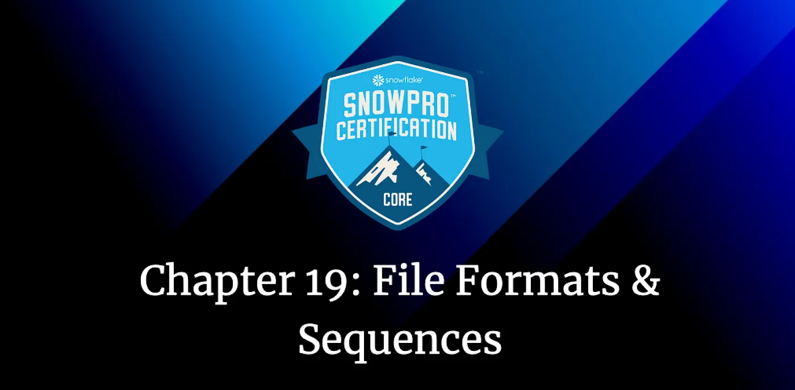
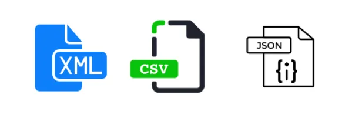
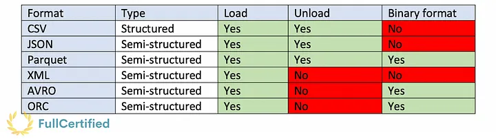
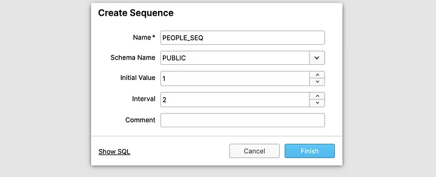

bRoad to Snowflake SnowPro Core Certification: File Formats & Sequences
Chapter 19: Other Snowflake Objects. File Formats & Sequences



As we saw in the chapter on Snowflake architecture, there were several types of objects in Snowflake. Tables, views, stages, pipes, stored procedures, UDFs… We have seen all of them during this course, although we missed two file formats and sequences. In this chapter, we will see these two new objects!

#### Table of Contents

1. [File Formats](#file-formats)
2. [Sequences](#sequences)
3. [Typical Exam Questions](#typical-exam-questions)

> _Remember that all the chapters from the course can be found [in the following link](./course-links.md)._

---

## FILE FORMATS

A named file format object describes and stores the format information required to load data into Snowflake tables. You can specify different parameters, for example, the file’s delimiter, if you want to skip the header or not, etc.



Snowflake supports both Structured and Semi-Structured Data, so just as an example, you can store JSON files in tables. Let’s see the differences between them:

> **_Structured Data_**

<ul>
<li><b>CSV →</b> You can Load and Unload files in CSV format. It’s the fastest file format to load data.</li>
</ul>

> **_Semi-structured Data_**

<b>Semi-structured data is saved as Variant type in Snowflake tables, with a maximum limit size of 16MB, and it can be queried using JSON notation.</b> You can store arrays, objects… Non-native values, such as dates and timestamps, are stored as strings when loaded into a VARIANT column.

<ul>
<li><b>JSON →</b> It’s used for both loading & unloading data.</li>
<li><b>Parquet →</b> Binary format used for both loading & unloading data.</li>
<li><b>XML →</b> You can only load data in Snowflake using the XML format.</li>
<li><b>Avro →</b> Binary format used to load data.</li>
<li><b>ORC →</b> Binary format used to load data.</li>
</ul>



You can use <b>FLATTEN</b> to convert semi-structured data to a relational representation. It takes a Variant, Object, or Array column and produces a lateral view.

---

## SEQUENCES

We use sequences to generate unique numbers across sessions and statements, including concurrent statements. You can use them to <b>generate values for a primary key or any column that requires a unique value.</b> They have an initial value and an interval.



You can access sequences in queries as expressions. The function “nextval”, will generate a set of distinct values. I don’t think the syntax will appear in the Snowflake SnowPro Core exam, but let’s make an example. Having the previous sequence “PEOPLE_SEQ” this is how we can increase it:You can access sequences in queries as expressions. The function “nextval”, will generate a set of distinct values. I don’t think the syntax will appear in the Snowflake SnowPro Core exam, but let’s make an example. Having the previous sequence “PEOPLE_SEQ” this is how we can increase it:

`INSERT INTO PEOPLE (ID, NAME) VALUES`

`(PEOPLE_SEQ.nextval, "Gonzalo"),`

`(PEOPLE_SEQ.nextval, "Nacho"),`

`(PEOPLE_SEQ.nextval, "Megan"),`

`(PEOPLE_SEQ.nextval, "Angel")`

We created a sequence with an initial value of 1 and an interval of 2. So the first value will be 1, and the second one will be 3. The result is shown in the next table:

      +--------+---------+
      | ID | NAME |
      +--------+---------+
      | 1 | Gonzalo |
      +--------+---------+
      | 3 | Nacho |
      +--------+---------+
      | 5 | Megan |
      +--------+---------+
      | 7 | Angel |
      +--------+---------+

We can also use the “Default” statement when creating the tables, increasing the sequence automatically.

      CREATE OR REPLACE TABLE PEOPLE
      (
      ID NUMBER DEFAULT PEOPLE_SEQ.nextval,
      NAME VARCHAR(50)
      )

      -------------

      INSERT INTO PEOPLE (NAME) VALUES
      ("Gonzalo"),
      ("Nacho"),
      ("Megan"),
      ("Angel")

This will generate the same result as before.

```

## TYPICAL EXAM QUESTIONS

<b>Does Snowflake allow only the load of structure data?</b>

<ol>
<li>True</li>
<li>False</li>
</ol>

<b>Solution: 2.</b>

---

<b>Which of the following file formats are supported by Snowflake?</b>

<ol>
<li>CSV</li>
<li>XML</li>
<li>TXT</li>
<li>Avro</li>
</ol>

<b>Solution: 1, 2, 4.</b>

---

<b>How will you store JSON data in Snowflake?</b>

<ol>
<li>Using a column of the JSON type</li>
<li>Using a column of the VARCHAR type</li>
<li>Using a column of the VARIANT type</li>
<li>Using a column of the NULL type</li>
</ol>

<b>Solution: 3.</b>

---

<b>Which of the following object types are stored within a schema?</b>

<ol>
<li>Tables</li>
<li>Views</li>
<li>File Formats</li>
<li>UDFs</li>
<li>Roles</li>
<li>Users</li>
<li>Sequences</li>
</ol>

<b>Solution: 1, 2, 3, 4, 7.</b>

---

<b>You have the following data in a variant column from the table “myTable”. How can you query the favorite technology that Gonzalo uses?</b>

        {
        "name": "Gonzalo",
        "country": "Spain",
        "favouriteTechnology": Snowflake,
        "hobbies": [
        {
        "name": "soccer",
        "since": "2000",
        },{
        "name": "music",
        "since": "2005",
        },{
        "name": "technology",
        "since": "1996",
        }
        ]
        }

<ol>
<li>SELECT favouriteTechnology FROM myTable;</li>
<li>SELECT src:favouriteTechnology FROM myTable;</li>
<li>SELECT src:$favouriteTechnology FROM myTable;</li>
<li>SELECT CONVERT_JSON(src:favouriteTechnology) FROM myTable;</li>
</ol>

<b>Solution: 2.</b> In the Snowflake SnowPro Core exam, they won’t probably ask you about syntax; that’s why I didn’t explain it before. But it’s really useful to know this command.

---

<b>Which table function allows you to convert semi-structured data to a relational representation?</b>

<ol>
<li>FLATTEN</li>
<li>CHECK_JSON</li>
<li>PARSE_JSON</li>
</ol>

<b>Solution: 1.</b>

---

<b>What file format provides the fastest load performance?</b>

<ol>
<li>Parquet</li>
<li>JSON</li>
<li>Avro</li>
<li>CSV</li>
</ol>

<b>Solution: 4.</b>
```
