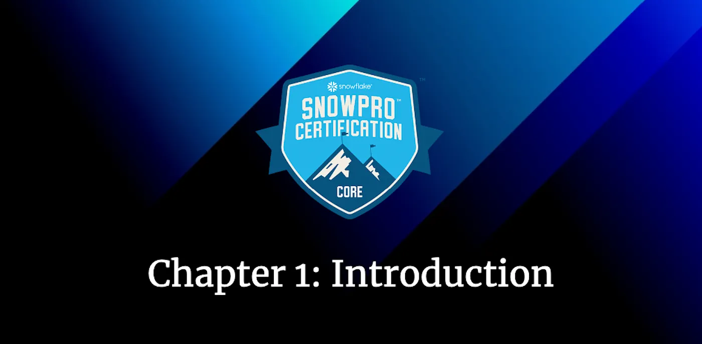
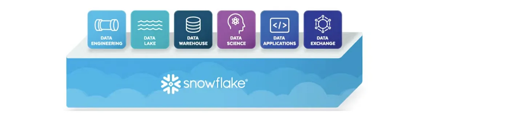
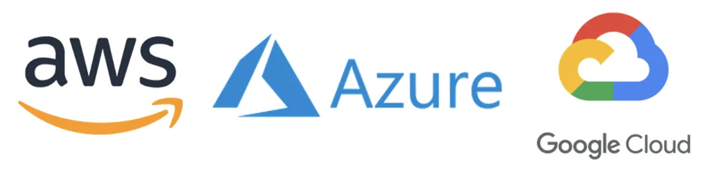

# Road to Snowflake SnowPro Core Certification: Introduction

## First chapter: Introduction to Snowflake.

Hello everyone. In this first chapter, we will look at the Snowflake basics, apart from the typical exam questions they usually ask in the Snowflake SnowPro Core Certification Exam. These are the concepts that we are going to study in this chapter:

<ol>
<li><a href="#snowflake-as-saas">Snowflake as SaaS</a></li>
<li><a href="#snowflake-editions">Snowflake Editions</a></li>
<li><a href="#cloud-providers">Cloud Providers</a></li>
<li><a href="#connecting-to-snowflake">Connecting to Snowflake</a></li>
<li><a href="#typical-exam-questions-from-this-topic">Typical Exam Questions from this topic</a></li>
</ol>

> _Remember that all the chapters from the course can be found [in the following link](./course-links.md)._

## SNOWFLAKE AS SAAS

Snowflake is a Data Solution provided as **Software-as-a-Service (SaaS)**. Snowflake enables data storage, processing, and analytic solutions that are faster, easier to use, and far more flexible than traditional offerings. It combines a new **SQL query** engine with an innovative architecture natively designed for the cloud. **Snowflake releases new features weekly**.

Thanks to this, Snowflake is optimal for:

<ul>
<li>Data Warehouse</li>
<li>Data Lake</li>
<li>Data Exchange</li>
<li>Data Apps</li>
<li>Data Science</li>
<li>Data Engineering</li>
</ul>

<figure>
  
  <figcaption align = "center">Snowflake is optimal for different purposes.
</figcaption>
</figure>

## SNOWFLAKE EDITIONS

The first question that we can have is how we can try Snowflake. You can apply for a **30-day free trial** at the following link https://signup.snowflake.com/ where you can select between different editions, the standard, enterprise, or business-critical edition. I would advise you to go for the enterprise one to discover the full potential of Snowflake. Let’s see the differences between them:

<ul>
<li><b>Standard</b> → Introductory level offering, providing full, unlimited access to all of Snowflake’s standard features. All of the standard edition features are included in the following versions.</li>
<li><b>Enterprise</b> → All the features and services of Standard Edition, with additional features designed specifically for the needs of large-scale enterprises and organizations.</li>
<li><b>Business Critical</b> → Formerly known as Enterprise for Sensitive Data (ESD), it offers even higher levels of data protection to support the needs of organizations with extremely sensitive data.</li>
<li><b>Virtual Private Snowflake</b> → Includes all the features and services of Business Critical Edition but in a completely different Snowflake environment, isolated from all other Snowflake accounts.</li>
</ul>

In the following images, we compare the main features provided by each Snowflake edition. We will study these features in the upcoming chapters:

<figure>
  
  <figcaption align = "center">Summary of the Snowflake features by edition.</figcaption>
</figure>

## CLOUD PROVIDERS

Once we have decided which edition of Snowflake we will use, we must choose which Cloud Provider we want. These are the cloud providers that Snowflake supports:

<ul>
<li>Amazon Web Services</li>
<li>Azure</li>
<li>Google Cloud Platform</li>
</ul>

<figure>
  
  <figcaption align = "center">Cloud Providers that Snowflake Supports.
</figcaption>
</figure>

It’s crucial to remember the three different Cloud Providers that Snowflake supports, as **this question typically appears in the exam**.

You can have data in Azure and load it into Snowflake on AWS with no problem. For government agencies that require compliance with US federal privacy and security standards, such as FIPS 140–2 and FedRAMP, **Snowflake only supports Amazon Web Services and Azure**. **These government regions are only supported on Business-Critical Edition or higher**.

## CONNECTING TO SNOWFLAKE

We have different ways to connect to Snowflake:

<ul>
<li>Web Interface or Console</li>
<li><b>SnowSQL → The CLI client</b>. This is important to remember.</li>
<li>ODBC</li>
<li>JDBC</li>
<li>SDK (Node, Python, Kafka, Spark, Go…)</li>
</ul>
Both for the ODBC and JDBC clients, we need to install the drivers from Snowflake.

---

## TYPICAL EXAM QUESTIONS FROM THIS TOPIC

As I mentioned in the introduction to the course, each chapter will contain the typical questions we are asked in the exam, with the answers below. Let’s go with it.

**Is Snowflake available on-premise?**

<ol>
<li>True</li>
<li>False</li>
</ol>

**Solution: 2**. Snowflake is 100% SaaS.

---

**What are the three Snowflake editions offered when you sign up for a Snowflake trial account?**

<ol>
<li>Standard</li>
<li>Enterprise</li>
<li>Premier</li>
<li>Enterprise for Business Intelligence</li>
<li>Business Critical</li>
</ol>

**Solution: 1, 2, 5.**

---

**Which Snowflake edition supports private communication between Snowflake and your other VPCs through AWS PrivateLink?**

<ol>
<li>Standard</li>
<li>Enterprise</li>
<li>Business Critical</li>
</ol>

**Solution: 3**

---

**Which cloud provider is not supported by Snowflake?**

<ol>
<li>AWS</li>
<li>Azure</li>
<li>IBM</li>
<li>Google Cloud Platform</li>
</ol>

**Solution: 3**

---

**Does Snowflake automatically stores data in encrypted form in all editions?**

<ol>
<li>True</li>
<li>False</li>
</ol>

**Solution: 1.** Snowflake encrypts all customer data by default at no additional cost.

---

**In which Snowflake edition is Tri-Secret Secure option available?
**

<ol>
<li>Standard or higher.</li>
<li>Enterprise or higher.</li>
<li>Business Critical or higher.</li>
</ol>

**Solution: 3.** The minimum edition to have Tri-Secret is the Business Critical one.

---

**Can we use Multi-factor Authentication to connect to Snowflake via the Snowflake JDBC driver?**

<ol>
<li>True</li>
<li>False</li>
</ol>

**Solution: 1.**

---

**A client has ODBC or JDBC available in their systems, but they do not have the Snowflake drivers. Is the client able to connect to Snowflake?**

<ol>
<li>True</li>
<li>False</li>
</ol>

**Solution: 2.** You will need the Snowflake ODBC or JDBC driver to connect to Snowflake; just having JDBC and ODBC will not solve the problem. You can download it through the UI Interface.

---

**What is the name of Snowflake’s Command Line Interface tool?**

<ol>
<li>SnowCLI</li>
<li>SnowSQL</li>
<li>SnowTerminal</li>
<li>SnowCMD</li>
</ol>

**Solution: 2**
