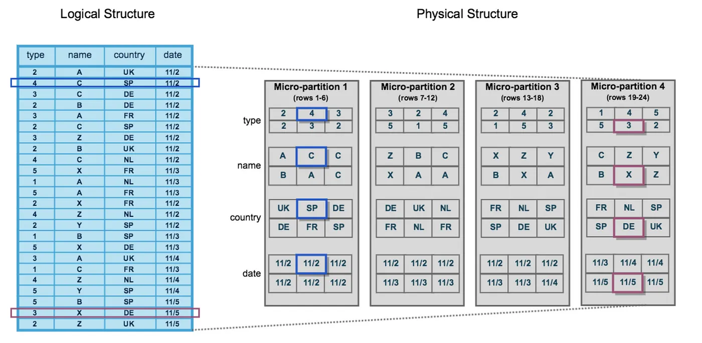
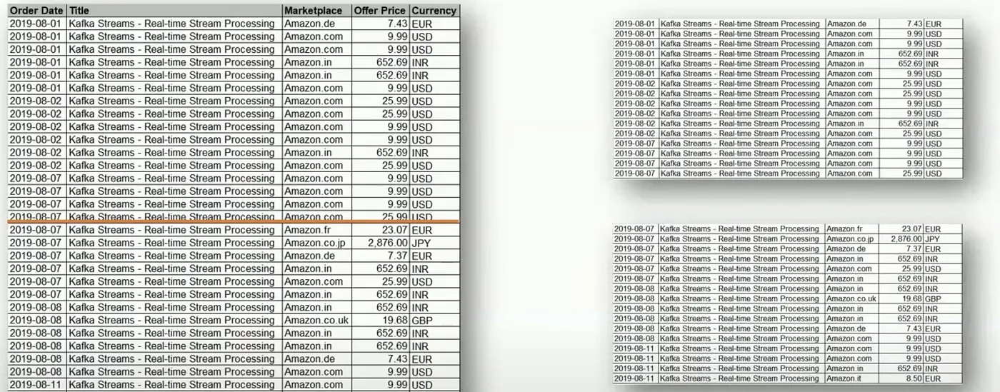
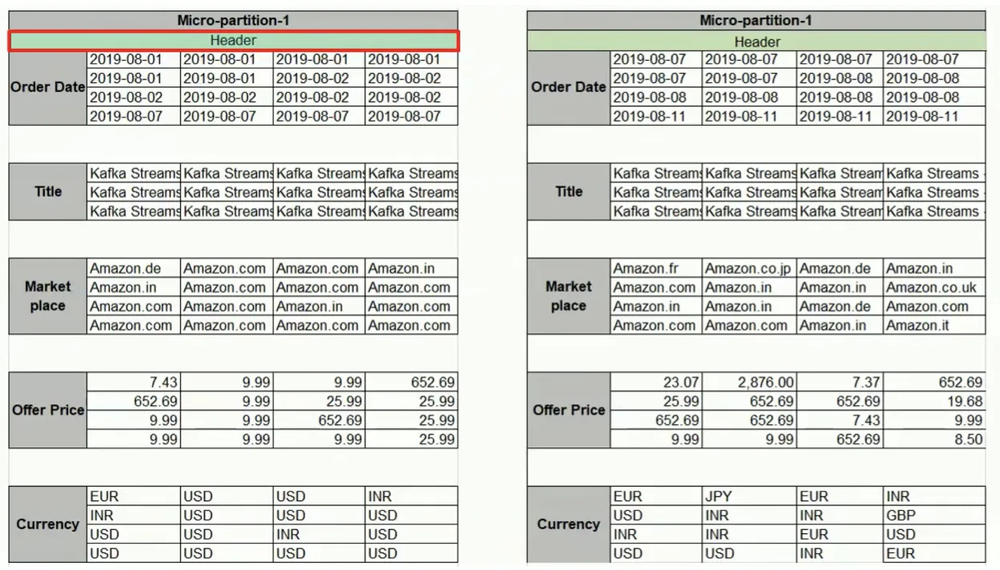
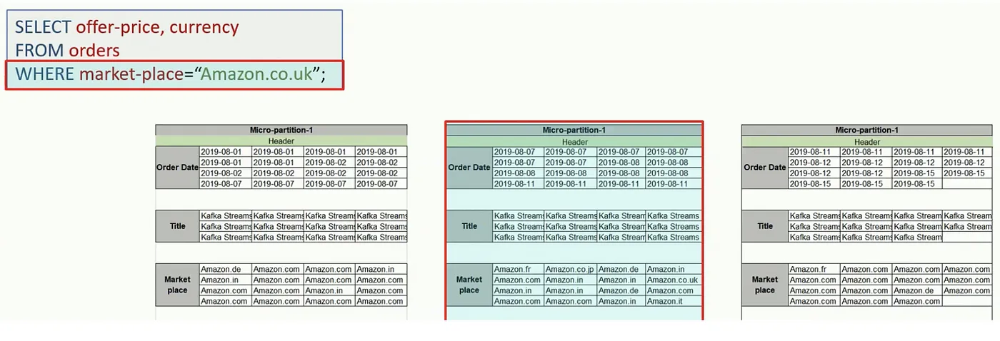
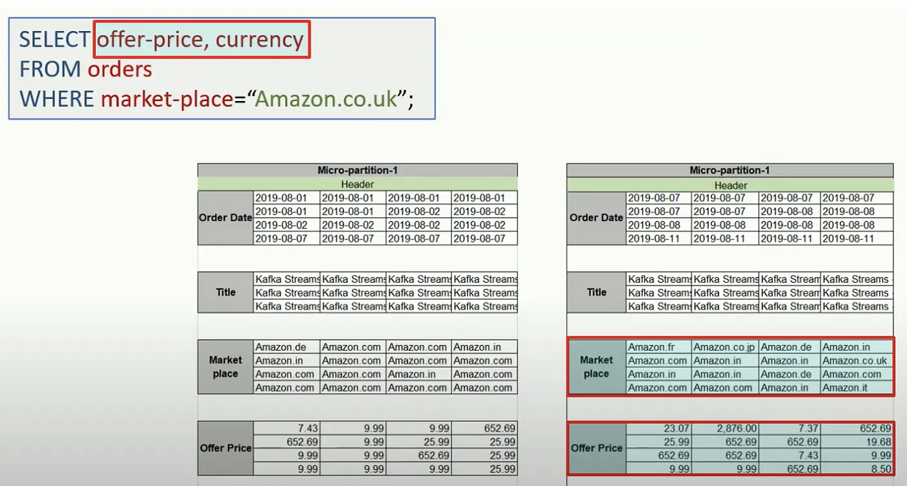

Road to Snowflake SnowPro Core Certification: Micro-partitions
Fourth Chapter: Micro-partitions

This chapter will study how Snowflake stores data internally using micro-partitions. These are the key concepts that we are going to review:

<ol>
<li><a href="#snowflake-micro-partitions">Micro-partitions in Snowflake</a></li>
<li><a href="#snowflake-pruning-process">Snowflake Pruning Process</a></li>
<li><a href="#typical-snowpro-exam-questions-regarding-micro-partitions">Typical SnowPro exam questions regarding micro-partitions</a></li>
</ol>

> _Remember that all the chapters from the course can be found [in the following link](./course-links.md)._

---

## SNOWFLAKE MICRO-PARTITIONS

All data in Snowflake tables are <b>automatically divided into micro-partitions, contiguous units of storage between 50 and 500MB of uncompressed data, organized in a columnar way</b>. They are the physical structure of the tables. This is important, as they usually ask this question in the Snowflake SnowPro Core exam.

<figure>
  
  <figcaption align = "center">A table is organized into Micro Partitions in Snowflake (via docs.snowflake.com).
A table is organized into Micro Partitions in Snowflake (via docs.snowflake.com).
</figcaption>
</figure>

---

Micro partitions are <b>immutable, meaning they cannot be changed once created</b>. If a row is updated, the micro-partition holding the row is copied into a new micro-partition, where the updated row will be inserted.

The older micro-partition is then marked for deletion. This is important to understand.

---

## SNOWFLAKE PRUNING PROCESS

Snowflake uses micro-partitions for the <b>query pruning process</b>, which consists of analyzing the smallest number of micro-partitions to solve a query. <b>This technique retrieves all the necessary data to give a solution without looking at all the micro-partitions, saving a lot of time to return the result</b>. For example, if we have a micro-partition for each day of the year, the most efficient way to give a result would be to scan just 1/365 micro-partitions.

Let’s try to understand this topic with an example (via [Learning Journal](https://www.youtube.com/channel/UC8OU1Tc1kxiI37uXBAbTX7A)):

1. The data that we logically see as a table is physically organized in Micro-partitions:

<figure>
  
  <figcaption align = "center">How a Snowflake table (left) is divided into Micro-partitions (right).
</figcaption>
</figure>

2. Snowflake automatically sorts the data in a columnar way, adds the header to the Micro-partition (with offsets), and compresses data by columns:

<figure>
  
  <figcaption align = "center">Headers in Snowflake micro-partitions.
</figcaption>
</figure>

3. When we query the table, Snowflake will know which micro-partition to access just by looking at the metadata. This is the pruning process mentioned above. In the following picture, we can see how filtering by “<i>Amazon.co.uk</i>” would only access the second one:

<figure>
  
  <figcaption align = "center">Pruning process in Snowflake.
</figcaption>
</figure>

4. Snowflake also has column pruning, only reading the columns that we need:

<figure>
  
  <figcaption align = "center">Column Pruning in Snowflake.
</figcaption>
</figure>

Due to this process, we’ve saved a lot of time returning the result. <b>Snowflake stores metadata about all rows stored in a micro-partition, including</b>:

<ul>
<li>The range of values for each of the columns in the micro-partition.</li>
<li>The number of distinct values.</li>
<li>Additional properties are used for both optimization and efficient query processing.</li>
</ul>

---

## TYPICAL SNOWPRO EXAM QUESTIONS REGARDING MICRO-PARTITIONS

<b>What technique does Snowflake use to limit the number of micro-partitions retrieved as part of a query?</b>

<ol>
<li>Pruning</li>
<li>Clustering</li>
<li>Indexing</li>
<li>Computing</li>
</ol>

<b>Solution: 1.</b>

---

<b>Which statements are correct about micro-partitions in Snowflake?</b>

<ol>
<li>Contiguous units of storage</li>
<li>Non-contiguous units of storage</li>
<li>50 and 500MB of compressed data</li>
<li>50 and 500MB of uncompressed data</li>
<li>Organized in a columnar way</li>
</ol>

<b>Solution: 1, 4, 5</b>. This definition is a must, and we need to know it perfectly “<i>All data in Snowflake tables are automatically divided into micro-partitions, which are contiguous units of storage between 50 and 500MB of uncompressed data, organized in a columnar way</i>”.

---

<b>Which options are correct regarding the data that is stored in micro-partition metadata?</b>

<ol>
<li>The range of values for each of the columns in the micro-partition.</li>
<li>The number of distinct values.</li>
<li>Additional properties are used for both optimization and efficient query processing.</li>
</ol>

<b>Solution: 1, 2, 3</b>. All of them are true.

---

This chapter doesn’t contain many questions as it is necessary to understand the cluster keys process before continuing with more questions. We will see it in the next chapter. See you soon!
