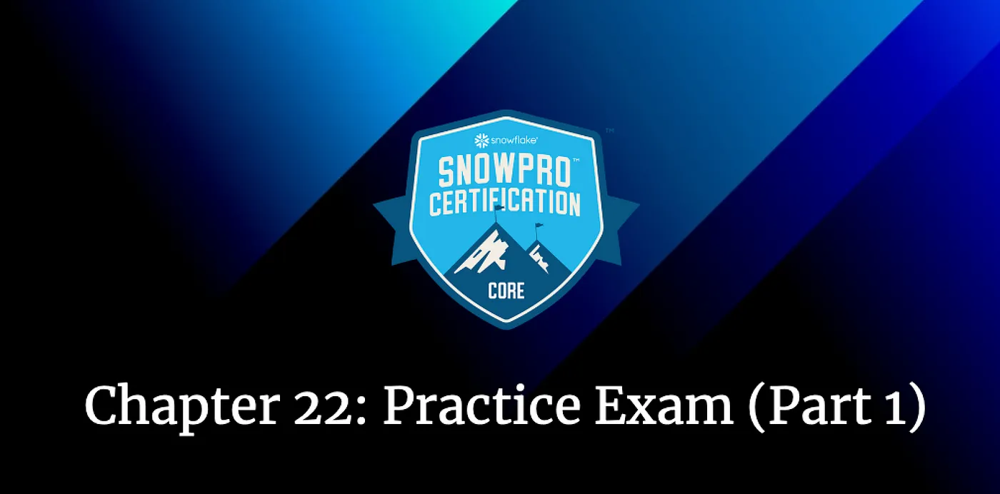
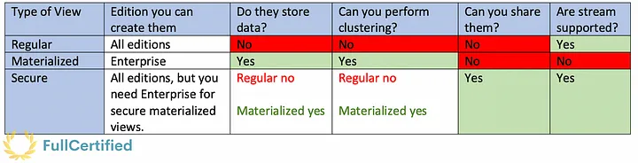
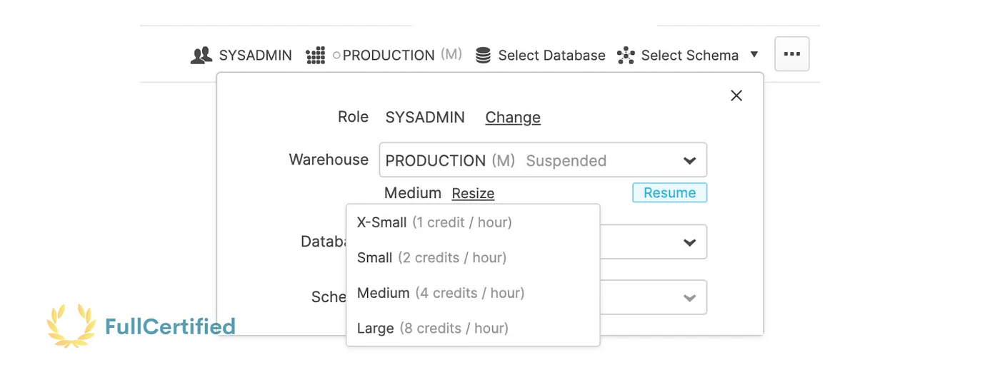
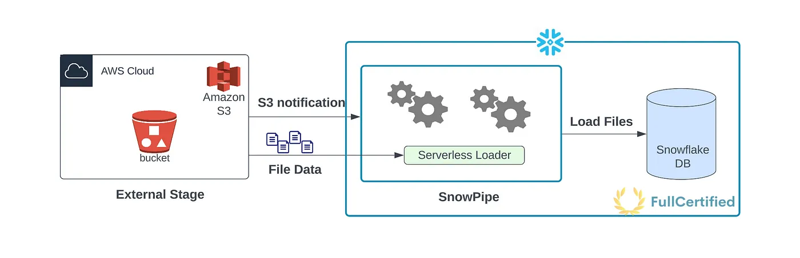
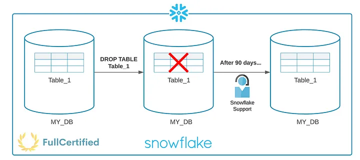
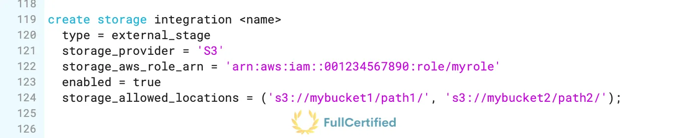
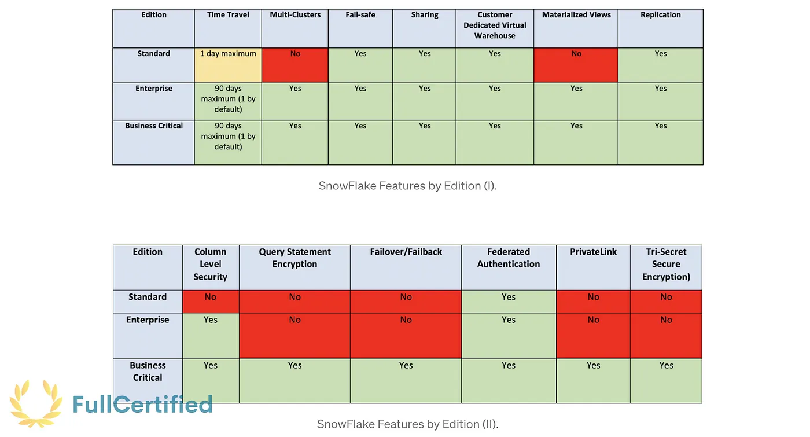
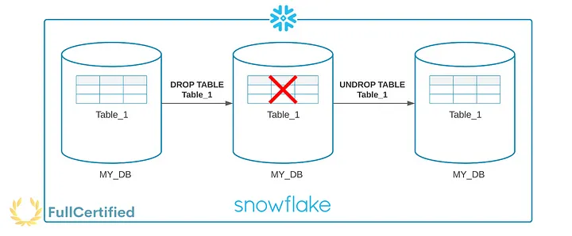
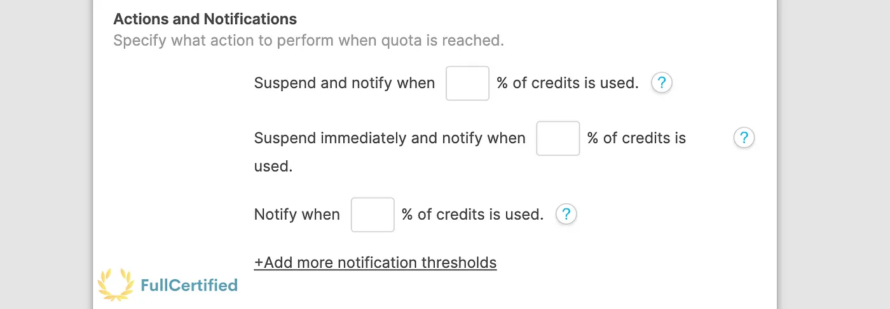

# Snowflake SnowPro Core Certification Practice Exam

## Snowflake SnowPro Core Practice Exam with Solutions Part 1

During these last months, we have studied how Snowflake works in detail, along with some questions to prepare for the Snowflake SnowPro Core Certification. Apart from that, after each chapter, we solved exercises to see if we understood everything.
We will take random questions from each chapter to practice for the official exam in this chapter. Remember, we need 80 points to pass it! If we don’t reach this number, I recommend you reread the chapters in which we missed some questions and try the test again. Good luck, and go for it!

> _Remember that all the chapters from the course can be found [in the following link](./course-links.md)._

---

## QUESTIONS WITH SOLUTIONS

<b>1: What types of views are available in Snowflake?</b>

<ol>
<li>Regular</li>
<li>Secure View</li>
<li>Table View</li>
<li>Materialized View</li>
<li>External View</li>
</ol>

<b>Solution: 1, 2, 4.</b> You can see the differences between them in the following image:

---

<b>2: Which character identifies a table stage?</b>

<ol>
<li>“@”</li>
<li>“%”</li>
<li>“/@”</li>
<li>“@%”</li>
</ol>

<b>Solution: 4.</b> The following example shows how we can upload files from our local disk to a Table stage. As you can see, you need to specify the previous character while indicating the table:

`PUT file://c:/myData/myCSV.csv @%myTable`

---

<b>3: Select two limitations with materialized views:</b>

<ol>
<li>Time Travel is not supported.</li>
<li>We cannot define Cluster Keys.</li>
<li>Streams cannot track changes.</li>
</ol>

<b>Solution: 1, 3</b>

---

<b>4: Can you resize the warehouse once you have selected the size?</b>

<ol>
<li>True</li>
<li>False</li>
</ol>

<b>Solution: 1.</b> You can always change the warehouse size depending on your needs, even when it’s running.

---

<b>5: Which of the below APIs are SnowPipe REST APIs?</b>

<ol>
<li>insertFiles</li>
<li>insertReport</li>
<li>insertHistoryScan</li>
<li>loadFiles</li>
<li>loadHistoryScan</li>
</ol>

<b>Solution: 1, 2, 5.</b> You can make calls to REST endpoints to get information. For example, by calling the following insertReport endpoint, you can get a report of files submitted via insertFiles:

`GET https://<account_id>.snowflakecomputing.com/v1/data/pipes/<pipe_name>/insertReport`

---

<b>6: What happens to the incoming queries when a warehouse does not have enough resources to process them?</b>

<ol>
<li>Queries are aborted</li>
<li>Queries are queued and executed when the warehouse has resources</li>
<li>Snowflake resizes the warehouse</li>
</ol>

<b>Solution: 2.</b> If the warehouse does not have enough remaining resources to process a query, the query is queued, pending resources that become available as other running queries complete.

---

<b>7: Which are the additional columns that the streams create?</b>

<ol>
<li>METADATA$ACTION</li>
<li>METADATA$ISREAD</li>
<li>METADATA$ISUPDATE</li>
<li>METADATA$ROW_ID</li>
<li>METADATA$COLUMN_ID</li>
</ol>

<b>Solution: 1, 3, 4.</b> METADATA$ACTION Indicates the DML operation (INSERT, DELETE) recorded. METADATA$ISUPDATE indicates whether the operation was part of an UPDATE statement. METADATA$ROW_ID is a unique and immutable ID for the row.

---

<b>8: Can two different virtual warehouses from the same account access the same data simultaneously without any contention issue?</b>

<ol>
<li>True</li>
<li>False</li>
</ol>

<b>Solution: 1.</b> All the warehouses of your account share the storage layer, so they can access the same data simultaneously.

---

<b>9:What technique does Snowflake use to limit the number of micro-partitions retrieved as part of a query?</b>

<ol>
<li>Pruning</li>
<li>Clustering</li>
<li>Indexing</li>
<li>Computing</li>
</ol>

<b>Solution: 1.</b> Query pruning consists of analyzing the smallest number of micro-partitions to solve a query. This technique retrieves all the necessary data to give a solution without looking at all the micro-partitions, saving a lot of time to return for the result.

---

<b>10: Which command will we use to download the files from the stage/location loaded through the COPY INTO <LOCATION> command?</b>

<ol>
<li>GET</li>
<li>PUT</li>
<li>UNLOAD</li>
<li>INSERT INTO</li>
</ol>

<b>Solution. 1.</b> We will use the GET command to DOWNLOAD files from a Snowflake internal stage (named internal stage, user stage, or table stage) into a directory/folder on a client machine. You need to use SnowSQL to use this command.

---

<b>11: Can virtual warehouses be resized while they are running?</b>

<ol>
<li>True</li>
<li>False</li>
</ol>

<b>Solution: 1.</b> A warehouse can be resized up or down (through the web interface or using SQL) at any time, including while it is running and processing statements. In the following image, you can see how to resize them using the web interface:

---

<b>12: Which of the following roles are the default ones in Snowflake?</b>

<ol>
<li>ACCOUNTADMIN</li>
<li>SECURITYADMIN</li>
<li>VIEWER</li>
<li>USERADMIN</li>
<li>SYSADMIN</li>
<li>NETWORKADMIN</li>
</ol>

<b>Solution: 1, 2, 4, 5</b>

---

<b>13: Does Snowflake automatically stores data in encrypted form in all editions?</b>

<ol>
<li>True</li>
<li>False</li>
</ol>

<b>Solution: 1.</b> Snowflake encrypts all customer data by default at no additional cost.

---

<b>14: What different types of streams exist in Snowflake?</b>

<ol>
<li>Standard</li>
<li>Append-only</li>
<li>Update-only</li>
<li>Insert-only</li>
</ol>

<b>Solution: 1, 2, 4.</b> Standard and Append-only streams are supported on tables, directory tables, and views. The Standard one tracks all DML changes to the source table, including inserts, updates, and deletes, whereas the Append-only one Tracks row inserts only. The Insert-only stream also tracks row inserts only. The difference with the previous one is that this one is only supported on EXTERNAL TABLES.

---

<b>15: In which of the below scenarios will you use an external table?</b>

<ol>
<li>You have data on the cloud providers, but the data cannot be copied or moved to any other location due to compliance regulations.</li>
<li>You have a high volume of data on the cloud providers, but we only need a part of the data in Snowflake.</li>
<li>You have data on the cloud providers that need to be updated by Snowflake.</li>
<li>You have XML data on the cloud provider.</li>
</ol>

<b>Solution: 1, 2.</b> The third answer is incorrect, as external tables can only read data. The fourth option is also wrong, as external tables don’t support XML.

---

<b>16: Is SnowPipe Serverless?</b>

<ol>
<li>True</li>
<li>False</li>
</ol>

<b>Solution: 1.</b> Snowpipe enables loading data when the files are available in any (internal/external) stage. You use it when you have a small volume of frequent data, and you load it continuously (micro-batches). Snowpipe is serverless, which means that it doesn’t use Virtual Warehouses. You can see how Snowpipe works in the following diagram:

---

<b>17: Does data stored in a temporary table not contribute to Snowflake’s storage cost?</b>

<ol>
<li>True</li>
<li>False</li>
</ol>

<b>Solution: 2.</b> With temporary tables, you can optimize storage costs, as when the Snowflake session ends, data stored in the table is entirely purged from the system. But they also require storage costs while the session is active. A temporary table is purged once the session ends, so the retention period is for 24 hours or the remainder of the session.

---

<b>18: Which data-loading method requires a user-specified warehouse to execute COPY statements?</b>

<ol>
<li>Bulk Data Load</li>
<li>SnowPipe</li>
<li>Both</li>
</ol>

<b>Solution: 1.</b> Snowpipe is serverless, meaning it doesn’t need a running warehouse to load data into Snowflake.

---

<b>19: Is Snowflake available on-premise?</b>

<ol>
<li>True</li>
<li>TFalse</li>
</ol>

<b>Solution: 2.</b> Snowflake is 100% SaaS.

---

<b>20: Which character identifies a user stage?</b>

<ol>
<li>“@~”</li>
<li>T“~”</li>
<li>T“@”</li>
</ol>

<b>Solution: 1.</b> Each user has a Snowflake personal stage allocated to them by default for storing files, and no one can access them except the user it belongs to. It’s represented with the “@~” character. In the following example, we are uploading the file “myfile.csv” to the stage from the current user:

`PUT file://C:\data\myfile.csv @~`

---

<b>21: Which table function allows you to convert semi-structured data to a relational representation?</b>

<ol>
<li>FLATTEN</li>
<li>CHECK_JSON</li>
<li>PARSE_JSON</li>
</ol>

<b>Solution: 1.</b> FLATTEN is a table function that allows us to convert semi-structured data to a relational representation, taking a VARIANT, OBJECT, or ARRAY column and producing a lateral view.

---

<b>22: How is the data storage cost computed for Snowflake?</b>

<ol>
<li>Based on the average daily amount of uncompressed data stored.</li>
<li>Based on the average daily amount of compressed data stored.</li>
<li>Based on the amount of uncompressed data stored on the last day of the month.</li>
<li>Based on the amount of compressed data stored on the last day of the month.</li>
</ol>

<b>Solution: 2.</b> Storage costs benefit from the automatic compression of all data stored, and the total compressed file size is used to calculate the storage bill for an account.

---

<b>23: Can two Virtual Warehouses access the same data simultaneously without any contention issues?</b>

<ol>
<li>True</li>
<li>False</li>
</ol>

<b>Solution: 1.</b> Cloud services tie together all of the different components of Snowflake to process user requests, from login to query dispatch.

---

<b>24: In which layer of Snowflake architecture is stored all security-related information?</b>

<ol>
<li>Storage</li>
<li>Compute</li>
<li>Cloud Services</li>
<li>All of the above.</li>
</ol>

<b>Solution: 3.</b> The Cloud Services layer is a collection of services coordinating activities across Snowflake. It’s in charge of Authentication, Infrastructure management, Metadata management, Query parsing and optimization, and Access control.

---

<b>25: While loading data through the COPY command, you can transform the data. Which of the below transformations are allowed?</b>

<ol>
<li>Truncate columns</li>
<li>Omit columns</li>
<li>Filters</li>
<li>Reorder columns</li>
<li>Cast</li>
<li>Aggregate</li>
</ol>

<b>Solution: 1, 2, 4, 5</b>

---

<b>26: Is clustering generally more cost-effective for tables that are queried frequently and do not change often?</b>

<ol>
<li>True</li>
<li>False</li>
</ol>

<b>Solution: 1.</b> The more frequently a table changes, the more expensive it will be to keep it clustered.

---

<b>27: Do tables with Fail-Safe turned on incur additional storage costs compared to tables with Fail-Safe turned off?</b>

<ol>
<li>True</li>
<li>False</li>
</ol>

<b>Solution: 1.</b> Fail-safe ensures historical data is protected in the event of a system failure or other catastrophic event, providing a (NON-CONFIGURABLE) 7-day period during which Snowflake support may recover historical data. It requires additional storage (as other functionalities like Time Travel), that’s why it incurs additional storage costs. You can see an example of how Fail-Safe works in the following image:

---

<b>28:Which of the following clustering metadata for the micro-partitions is maintained by Snowflake in a table?</b>

<ol>
<li>The number of micro-partitions that comprise the table.</li>
<li>The number of micro-partitions containing values that overlap with each other.</li>
<li>The depth of the overlapping micro-partitions.</li>
None of the above.</li>
</ol>

<b>Solution: 1, 2, 3.</b>

---

<b>29: For which activities does Snowflake have administration settings to help with resource consumption?</b>

<ol>
<li>Help control costs associated with unexpected warehouse credit usage</li>
<li>Manage access to Snowflake for specific users</li>
<li>Manage the availability of the product</li>
</ol>

<b>Solution: 1.</b> Snowflake provides resource monitors to help control costs and avoid unexpected credit usage caused by running warehouses. You can impose limits on the number of credits that warehouses consume.

---

<b>30: After how many days does the load history of SnowPipe expire?</b>

<ol>
<li>One day</li>
<li>14 days</li>
<li>90 days</li>
<li>180 days</li>
</ol>

<b>Solution: 2.</b> The load history is stored in the metadata of the pipe for 14 days. Must be requested from Snowflake via a REST endpoint, SQL table function, or ACCOUNT_USAGE view.

---

<b>31: The three main layers of SnowFlare are…</b>

<ol>
<li>Extraction, Ingestion, Load</li>
<li>Database Storage, Compute & Cloud Services</li>
<li>Database, Virtual Warehouse, Data Experience</li>
</ol>

<b>Solution: 2.</b>

---

<b>32: Which Snowflake object stores a generated identity and access management (IAM) entity for your external cloud storage, along with an optional set of allowed or blocked storage locations (Amazon S3, Google Cloud Storage, or Microsoft Azure)?</b>

<ol>
<li>Storage Schema</li>
<li>Storage Integration</li>
<li>User Stage</li>
</ol>

<b>Solution: 2.</b> A storage integration is a Snowflake object that stores a generated identity and access management (IAM) entity for your external cloud storage. This option will enable users to avoid supplying credentials when creating stages or when loading or unloading data.

---

<b>33: Does SnowPipe guarantee that files are loaded in the same order they are staged?</b>

<ol>
<li>True</li>
<li>False</li>
</ol>

<b>Solution: 2.</b> Snowpipe generally loads older files first, but there is no guarantee that files are loaded in the same order they are staged.

---

<b>34: What statement is true about Snowflake’s unique architecture?</b>

<ol>
<li>One Node Shared Data</li>
<li>Multi-Cluster Shared Data</li>
<li>One Node Private Data</li>
</ol>

<b>Solution: 2.</b> Snowflake’s architecture is a hybrid of traditional shared-disk and shared-nothing database architectures. Snowflake uses a central data repository for persisted data accessible from all compute nodes in the platform. At the same time, it processes queries using virtual warehouses where each node in the cluster stores a portion of the entire data set locally.

---

<b>35: What will happen to the child task if you remove its predecessor?</b>

<ol>
<li>The child task is removed from the system
<li>The child task may become the root task
<li>The child task may become a standalone task</li>
</ol>

<b>Solution: 2, 3</b> Also, if the owner role of a task is deleted, the Task Ownership is reassigned to the role that dropped this role. This is a typical exam question.

---

<b>36: Select the statements that are true about Fail-Safe:</b>

<ol>
<li>There is no difference between Time-Travel and Fail-Safe</li>
<li>The data retention period for a permanent table with 30 days of Time-Travel is 37 days</li>
<li>Fail-Safe provides a non-configurable 7-day period</li>
<li>Fail-Safe provides a non-configurable 90-day period</li>
<li>Fail-Safe ensures that historical data is protected in the event of a system failure or other catastrophic events</li>
</ol>

<b>Solution: 2, 3, 5.</b> Regarding the second option, we have 30 days of Time-Travel, apart from 7 days of Fail-Safe. 37 days in total.

---

<b>37: Which cache runs for 24 hours?</b>

<ol>
<li>Metadata cache</li>
<li>Results cache</li>
<li>Warehouse cache</li>
</ol>

<b>Solution: 2.</b> Query Result cache is also known as Results Cache, which holds the results of every query executed in the past 24 hours.

---

<b>38:Which factors influence the unit cost of Snowflake credits and data storage?</b>

<ol>
<li>Snowflake Edition.</li>
<li>Region of the Snowflake account.</li>
<li>On-Demand or Pre-Paid account.</li>
<li>Users on Snowflake.</li>
</ol>

<b>Solution: 1, 2, 3.</b> You can create as many users as you want without additional cost.

---

<b>39: What can you easily check to see if a large table will benefit from explicitly defining a clustering key?</b>

<ol>
<li>Clustering depth</li>
<li>Clustering ratio</li>
<li>Values in a table</li>
</ol>

<b>Solution: 1.</b> The clustering depth measures the average depth of the overlapping micro-partitions for specified columns in a table (1 or greater). The smaller the cluster depth is, the better clustered the table is. You can get the clustering depth of a Snowflake table using this command:

`SELECT SYSTEM$CLUSTERING_DEPTH('MY_TABLE');`

---

<b>40: If you want a multi-cluster warehouse, which is the lowest Snowflake edition that you should opt for?</b>

<ol>
<li>Standard</li>
<li>Enterprise</li>
<li>Business Critical</li>
<li>Virtual Private Snowflake</li>
</ol>

<b>Solution: 2.</b> You can see some differences between the Snowflake editions in the following image:

---

<b>41: Which system functions are available in Snowflake to view/monitor the clustering metadata for a table?</b>

<ol>
<li>SYSTEM$CLUSTERING_DEPTH</li>
<li>SYSTEM$CLUSTERING_INFORMATION</li>
<li>SYSTEM$CLUSTERING_METADATA</li>
</ol>

<b>Solution: 1, 2.</b> The clustering depth measures the average depth of the overlapping micro-partitions for specified columns in a table (1 or greater). The smaller the cluster depth is, the better clustered the table is. You can use any previous commands to get the Cluster Depth of a table.

---

<b>42: A query executed a couple of hours ago, which took more than 5 minutes to run, is executed again, and it returned the results in less than a second. What might have happened?</b>

<ol>
<li>Snowflake used the persisted query results from the metadata cache</li>
<li>Snowflake used the persisted query results from the query result cache</li>
<li>Snowflake used the persisted query results from the warehouse cache</li>
<li>A new Snowflake version has been released in the last two hours, improving the speed of the service</li>
</ol>

<b>Solution: 2.</b> The query result cache stores the results of our queries for 24 hours, so as long as we perform the same query and the data hasn’t changed in the storage layer, it will return the same result without using the warehouse and without consuming credits.

---

<b>43: Do you need to contact Snowflake Support to retrieve data from Fail-Safe?</b>

<ol>
<li>True</li>
False</li>
</ol>

<b>Solution: 1.</b> Fail-Safe provides a (NON-CONFIGURABLE) 7-day period during which Snowflake support may recover historical data, but you cannot recover this data by yourself; you have to ask Snowflake support.

---

<b>44: Which type of data incurs Snowflake storage costs?</b>

<ol>
<li>Data Stored in permanent tables.</li>
<li>Data Stored in temporal tables.</li>
<li>Cache results.</li>
<li>Data retained for Fail-Safe & Time-Travel.</li>
</ol>

<b>Solution: 1, 2, 4.</b> Storage fees are incurred for maintaining historical data during both the Time Travel and Fail-safe periods. To help manage the storage costs, Snowflake provides temporary and transient tables, which do not incur the same fees as permanent tables but also incur charges. We can also include data stored in Snowflake locations (i.e., user and table stages or internal named stages).

---

<b>45: What should be the first option to restore data into a table?</b>

<ol>
<li>Time-Travel</li>
<li>Fail-Safe</li>
<li>Zero-Copy Cloning</li>
</ol>

<b>Solution: 1.</b> Time-Travel enables accessing historical data (i.e., data that has been changed or deleted) at any point within a defined period. If we drop a table, we can restore it with time travel. You can use it with Databases, Schemas & Tables. The following diagram explains how Time-Travel works:

---

<b>46: What statements are true about streams?</b>

<ol>
<li>A Stream itself does NOT contain any table data.</li>
<li>A stream only stores the offset for the source table</li>
<li>The hidden columns used by a stream consume storage</li>
</ol>

<b>Solution: 1, 2, 3.</b> Streams are Snowflake objects that record data manipulation language (DML) changes made to tables and views, including INSERTS, UPDATES, and DELETES, as well as metadata about each change. All of the previous options are correct about them.

---

<b>47: How is query processing done in Snowflake?</b>

<ol>
<li>AWS EMR with Spark</li>
<li>AWS EC2 with Spark</li>
<li>Virtual Warehouses</li>
</ol>

<b>Solution: 3.</b> A Virtual Warehouse is a cluster of computing resources in Snowflake. It provides the resources necessary to perform queries and DML operations, such as CPU, memory, and temporary storage. While a warehouse is running, it consumes Snowflake credits.

---

<b>48: What option will you specify to delete the stage files after a successful load into a Snowflake table with the COPY INTO command?</b>

<ol>
<li>DELETE = TRUE</li>
<li>REMOVE = TRUE</li>
<li>PURGE = TRUE</li>
<li>TRUNCATE = TRUE</li>
</ol>

<b>Solution: 3.</b> If the PURGE option is set to TRUE, Snowflake will try its best to remove successfully loaded data files from stages. If the purge operation fails for any reason, it won’t return any error for now:

`COPY INTO mytable PURGE = TRUE;`

---

<b>49: What actions can the resource monitor associated with a Warehouse take when it reaches (or is about to) hit the limit?</b>

<ol>
<li>Suspend the WareHouse</li>
<li>Send notification alert</li>
<li>Kill the query that is running</li>
<li>Delete the Snowflake account</li>
</ol>

<b>Solution: 1, 2, 3.</b> A resource monitor can Notify, Notify & Suspend, and Notify & Suspend Immediately. You can see these three actions in the following image:

---

<b>50: We need to temporarily store intermediate data, which an ETL process will only use. We don’t need the data outside the ETL process. If you want to optimize storage cost, what type of table will you create to store this data?</b>

<ol>
<li>Permanent</li>
<li>Temporary</li>
<li>Transient</li>
<li>External</li>
</ol>

<b>Solution: 2.</b> With temporary tables, you can optimize storage costs, as when the Snowflake session ends, data stored in the table is entirely purged from the system. But they also require storage costs while the session is active. A temporary table is purged once the session ends, so the retention period is for 24 hours or the remainder of the session.
