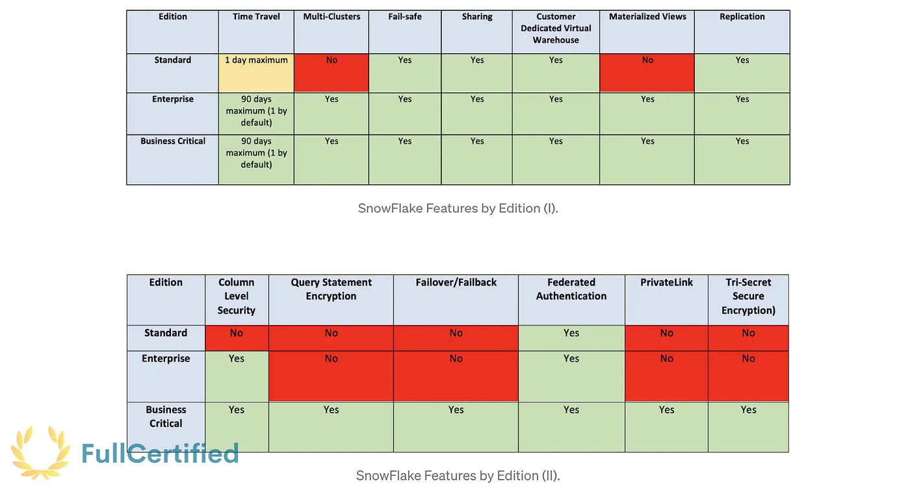

# Snowflake SnowPro Core Certification Practice Exam

## Snowflake SnowPro Core Practice Exam with Solutions Part 1

[In the first part, we saw the first 50 questions.](./practice-exam-p1.md) In this chapter, we’ll see the next 50, like in the certification exam. Best of luck both here and at the Snowflake SnowPro Core Certification test!

> _Remember that all the chapters from the course can be found [in the following link](./course-links.md)._

---

## QUESTIONS WITH SOLUTIONS

<b>51: Which commands cannot be executed from the Snowflake UI?</b>

<ol>
<li>SHOW</li>
<li>LIST <stages></li>
<li>GET</li>
<li>COPY INTO</li>
<li>PUT</li>
</ol>

<b>Solution: 3, 5.</b>
These two commands cannot be executed from the Snowflake web interface; instead, you should use the SnowSQL client to GET or PUT data files.

---

<b>52: Compute cost in Snowflake depends on…</b>

<ol>
<li>The query execution time.</li>
<li>The query execution time and the waiting query time.</li>
<li>The data warehouse size and for how long it runs.</li>
</ol>

<b>Solution: 3.</b>
The cost does not depend on how many queries you run in the warehouse. It depends on which warehouse size and how long it runs.

---

<b>53:What techniques would you consider to improve the performance of a query that takes a lot of time to return any result?</b>

<ol>
<li>Define partition keys</li>
<li>Create cluster keys & turn auto clustering on the table</li>
<li>Create an index on the search result</li>
</ol>

<b>Solution: 2.</b> Clustering keys are a subset of columns or expressions on a table designated to co-locate the data in the same micro-partitions. Data might become less clustered when we perform many DML operations on a table. To solve that, Snowflake also provides periodic & automatic re-clustering to maintain optimal clustering. These techniques improve the performance of queries that takes a lot of time, as Snowflake will analyze fewer micro-partitions.

---

<b>54: If a transaction disconnects and goes into a detached state, which cannot be committed or rolled back, how long will Snowflake take to abort the transaction?</b>

<ol>
<li>15 minutes</li>
<li>60 minutes</li>
<li>4 hours</li>
<li>12 hours</li>
</ol>

<b>Solution: 3.</b> If the transaction is left open or not aborted by the user, Snowflake automatically rolls back the transaction after being idle for four hours. You can still abort a running transaction with the system function: “SYSTEM$ABORT_TRANSACTION”

---

<b>55: Which of the following services are managed by the Cloud Services Layer?</b>

<ol>
<li>Metadata Management</li>
<li>Authentication</li>
<li>Storage</li>
<li>Infrastructure Management</li>
<li>Query Execution</li>
</ol>

<b>Solution: 1, 2, 4.</b> The Cloud Services layer is a collection of services coordinating activities across Snowflake. It’s in charge of Authentication, Infrastructure management, Metadata management, Query parsing and optimization, and Access control.

---

<b>56: What types of tables are available in Snowflake?</b>

<ol>
<li>Permanent</li>
<li>Temporary</li>
<li>Transient</li>
<li>Internal</li>
</ol>

<b>Solution: 1, 2, 3, 4.</b> You can see the differences between these tables in the following image:

---

<b>57: What is the property name from the Resource Monitors that lets you specify whether you want to control the credit usage of your entire account or a specific set of warehouses?</b>

<ol>
<li>Credit Quota</li>
<li>Monitor Level</li>
<li>Schedule</li>
<li>Notification</li>
</ol>

<b>Solution: 2.</b> The monitor level is a property that specifies whether the resource monitor is used to monitor the credit usage for your entire account or individual warehouses.

---

<b>58: A medium (M) warehouse has auto-suspend configured after 15 minutes. You have noticed that all of the queries on this warehouse finish within a minute. What will you do to optimize compute costs?</b>

<ol>
<li>Delete the warehouse after a minute</li>
<li>Reduce the auto-suspend time to 1 minute</li>
<li>Use another data-warehouse</li>
</ol>

<b>Solution: 2</b>

---

<b>59: Which command will you run to list all users and roles to which a role has been granted?</b>

<ol>
<li>SHOW GRANTS TO ROLE <ROLE></li>
<li>SHOW GRANTS OF ROLE <ROLE></li>
<li>SHOW GRANTS IN ROLE <ROLE></li>
</ol>

<b>Solution: 2.</b> “SHOW GRANTS OF ROLE” will list the users, whereas “SHOW GRANTS TO ROLE” will list the privileges to which this role has access. Here you can see an example of running the command in my Snowflake account:

---

<b>60: Which service does Snowflake use to provide the Zero-Copy cloning functionality?</b>

<ol>
<li>SSD Cache of the Virtual Warehouses</li>
<li>Cache</li>
<li>Metadata from the service layer</li>
</ol>

<b>Solution: 3.</b> Zero-Copy cloning does NOT duplicate data; it duplicates the metadata of the micro-partitions. For this reason, Zero-Copy cloning doesn’t consume storage. When you modify some cloned data, it will consume storage because Snowflake has to recreate the micro-partitions. You can see this behavior in the following image:

---

<b>61: Which cloud provider is not supported by Snowflake?</b>

<ol>
<li>AWS</li>
<li>Azure</li>
<li>IBM</li>
<li>Google Cloud Platform</li>
</ol>

<b>Solution: 3.</b> A Snowflake account can only be hosted on Amazon Web Services, Google Cloud Platforms, and Microsoft Azure for now.

---

<b>62:Which statements are correct about micro-partitions in Snowflake?</b>

<ol>
<li>Contiguous units of storage</li>
<li>Non-contiguous units of storage</li>
<li>50 and 500MB of compressed data</li>
<li>50 and 500MB of uncompressed data</li>
<li>Organized in a columnar way</li>
</ol>

<b>Solution: 1, 4, 5.</b> This definition is a must, and we need to know it perfectly “All data in Snowflake tables are automatically divided into micro-partitions, which are contiguous units of storage between 50 and 500MB of uncompressed data, organized in a columnar way”.

---

<b>63: Does GET support downloading files from external stages?</b>

<ol>
<li>True</li>
<li>TFalse</li>
</ol>

<b>Solution: 2.</b> If you want to download data from external stages, you need to use the cloud provider; for example, download them directly from AWS S3.

---

<b>64: What are the different caching mechanisms available in Snowflake?</b>

<ol>
<li>Metadata cache</li>
<li>TQuery result cache</li>
<li>TIndex cache</li>
<li>TTable cache</li>
<li>TWarehouse cache</li>
</ol>

<b>Solution: 1, 2, 5.</b> The Metadata cache is maintained in Global Service Layer and contains Objects Information & Statistics. For example, when you execute the command COUNT() on a table, the result comes from this cache; that’s why it returns the information quickly. The Query Result cache holds the results of every query executed in the past 24 hours. If you repeat a statement and the underlying data hasn’t changed, it will use this cache. The last one is the warehouse cache, attached to the SSD of each warehouse. In this case, the information is lost when the warehouse is suspended.

---

<b>65: Which Snowflake edition supports private communication between Snowflake and your other VPCs through AWS PrivateLink?</b>

<ol>
<li>Standard</li>
<li>Enterprise</li>
<li>Business Critical</li>
</ol>

<b>Solution: 3.</b> AWS PrivateLink is an AWS service for creating private VPC endpoints that allow direct, secure connectivity between your AWS VPCs and the Snowflake VPC without traversing the public Internet. This feature requires the Business Critical edition or higher. You can see the differences between the Snowflake editions in the following image:

---

<b>66: What are the different stages available in Snowflake?</b>

<ol>
<li>User</li>
<li>Table</li>
<li>Named internal</li>
<li>Named external</li>
<li>Account</li>
<li>Schema</li>
</ol>

<b>Solution: 1, 2, 3, 4.</b> Snowflake stages are a big topic in this exam. External stages reference data files stored outside Snowflake, and internal ones Stores data files internally within Snowflake. The User stage (represented with “@~”) is a personal stage for each user, whereas the table stage is the one that each table has by default. You can see the different stages in the following image:

---

<b>67: Is re-clustering in Snowflake only triggered if the table would benefit from the operation?</b>

<ol>
<li>True</li>
<li>False</li>
</ol>

<b>Solution: 1.</b> DML operations (INSERT, UPDATE, DELETE, MERGE, COPY) can make the data in the table become less clustered. To solve that, Snowflake provides periodic & automatic re-clustering to maintain optimal clustering. It only reclusters a clustered table if it benefits from the operation.

---

<b>68: When staging uncompressed files in a Snowflake stage, are the files automatically compressed using gzip unless compression is explicitly disabled?</b>

<ol>
<li>True</li>
<li>False</li>
</ol>

<b>Solution: 1.</b> If you have already-compressed files, Snowflake can automatically detect any of these compression methods (gzip, bzip2, deflate, and raw_deflate) or you can explicitly specify the method that was used to compress the files.

---

<b>69: In which of the below scenarios is SnowPipe recommended to load data?</b>

<ol>
<li>We have a small volume of frequent data.</li>
<li>We have a huge volume of data generated as part of a batch schedule</li>
<li>In both of the previous scenarios</li>
</ol>

<b>Solution: 1.</b> Snowpipe is a serverless service that enables loading data when the files are available in any (internal/external) stage. You use it when you have a small volume of frequent data, and you load it continuously (micro-batches).

---

<b>70: You have two types of named stages, one is an external stage, and the other one is an internal stage. Will external stages always require a cloud storage provider?</b>

<ol>
<li>True</li>
<li>False</li>
</ol>

<b>Solution: 1.</b> External stages reference data files stored in a location outside of Snowflake. Amazon S3 buckets, Google Cloud Storage buckets, and Microsoft Azure containers are the currently supported cloud storage services. You can see an example of it in the following diagram:

---

<b>71: What influences Snowflake pricing? (SELECT ONLY ONE)</b>

<ol>
<li>Amount of data queried from Snowflake.</li>
<li>Amount of data scanned from Snowflake.</li>
<li>Snowflake pricing is based on usage & storage.</li>
</ol>

<b>Solution: 3.</b> Snowflake’s pricing model is primarily based on two consumption-based metrics: compute and data storage, and you can pay for them independently. The computing cost is based on the number of credits used to run queries or perform a service. The storage charge is based on the number of bytes stored per month and the cost of moving data.

---

<b>72: What is the name of Snowflake’s Command Line Interface tool?</b>

<ol>
<li>SnowCLI</li>
<li>SnowSQL</li>
<li>SnowTerminal</li>
<li>SnowCMD</li>
</ol>

<b>Solution: 2.</b> SnowSQL is the command line client for connecting to Snowflake to execute SQL queries and perform all DDL and DML operations, including loading data into and unloading data out of database tables.

---

<b>73: After how many days does the COPY INTO load metadata expire?</b>

<ol>
<li>One day</li>
<li>14 days</li>
<li>64 days</li>
<li>180 days</li>
</ol>

<b>Solution: 3.</b> The information about the loaded files is stored in Snowflake metadata. It means that you cannot COPY the same file again in the next 64 days unless you specify it (with the “FORCE=True” option in the COPY command). You can see this behavior in the following image:

---

<b>74: Select the term that is associated with the compute layer:</b>

<ol>
<li>Query optimization</li>
<li>Query planning</li>
<li>Query processing</li>
</ol>

<b>Solution: 3.</b> You can find the name of the layers in different ways, like Query Processing for the Compute Layer.

---

<b>75: Which are the two metadata columns for staged files?</b>

<ol>
<li>METADATA$FILENAME</li>
<li>METADATA$FILEFORMAT</li>
<li>METADATA$FILE_ROW_NUMBER</li>
</ol>

<b>Solution: 1, 3.</b> The METADATA$FILENAME column is the name of the staged data file that the current row belongs to. The METADATA$FILE_ROW_NUMBER is the row number for each record in the container staged data file. This is a way of query the stage metadata:

`SELECT metadata$filename, metadata$file_row_number from @MY_STAGE`

---

<b>76: A warehouse ran for 62 seconds, and it was suspended. After some time, it ran for another 20 seconds. For how many seconds will you be billed?</b>

<ol>
<li>20 seconds</li>
<li>62 seconds</li>
<li>92 seconds</li>
<li>122 seconds</li>
</ol>

<b>Solution: 4.</b> You will be billed for 122 seconds (62 + 60 seconds) because warehouses are billed for a minimum of one minute. The price would be different if the warehouse wasn’t suspended before executing the second query.
For example, if we had only run a query, and it had only run for 62 seconds, you would be billed for these 62 seconds. If it had only run for 20 seconds, you would’ve been billed for 60 seconds.

---

<b>77: Which type of data incurs Snowflake storage cost?</b>

<ol>
<li>Data Stored in permanent tables.</li>
<li>Data Stored in temporal tables.</li>
<li>Cache results.</li>
<li>Data retained for Fail-Safe & Time-Travel.</li>
</ol>

<b>Solution: 1, 2, 4.</b> It also includes data stored in Snowflake locations (i.e., user and table stages or internal named stages). Cache results do NOT incur Storage costs.

---

<b>78: How will you store JSON data in Snowflake?</b>

<ol>
<li>Using a column of the JSON type</li>
<li>Using a column of the VARCHAR type</li>
<li>Using a column of the VARIANT type</li>
<li>Using a column of the NULL type</li>
</ol>

<b>Solution: 3.</b> Semi-structured data is saved as Variant type in Snowflake tables, with a maximum limit size of 16MB, and it can be queried using JSON notation. You can store arrays, objects, etc.

---

<b>79: Are Snowflake caches automatically invalidated if the underlying data changes?</b>

<ol>
<li>True</li>
<li>False</li>
</ol>

<b>Solution: 1.</b> If the data in the Storage Layer changes, the caches are automatically invalidated.

---

<b>80: If you want a dedicated virtual warehouse, which is the lowest Snowflake edition you should opt for?</b>

<ol>
<li>Standard</li>
<li>Enterprise</li>
<li>Business Critical</li>
<li>Virtual Private Snowflake</li>
</ol>

<b>Solution: 1.</b> In Snowflake, all the Virtual Warehouses are dedicated to the users. If you create a virtual warehouse, you will only be the one using it.

---

<b>81: What are the usual data-loading steps in Snowflake?</b>

<ol>
<li>Source → Snowflake Stage → Snowflake table</li>
<li>Source → Snowflake Table → Snowflake Stage</li>
<li>Snowflake table → Source → Snowflake Stage</li>
</ol>

<b>Solution: 1.</b> A source system (like a web application) loads the data into a Snowflake Stage (for example, an external stage like Amazon S3). Then we can copy the data into a Snowflake table. You can see this behavior in the following image:

---

<b>82: What are the two types of data consumer accounts available in Snowflake?</b>

<ol>
<li>Shared Account</li>
<li>Reader Account</li>
<li>Public Account</li>
<li>Full Account</li>
</ol>

<b>Solution: 2, 4.</b> There are two types of data consumers. The first one is the Full Accounts, the consumers with existing Snowflake accounts. In this case, the consumer account pays for the queries they make. We also have the Reader Accounts, the consumers without Snowflake accounts. In this last case, the producer account pays all the compute credits that their warehouses use. You can see this behavior in the following diagram:

---

<b>83: Select the true statements about Snowflake tasks:</b>

<ol>
<li>A task can execute a single SQL Statement</li>
<li>A task can execute multiple SQL Statements</li>
<li>A task can execute a call to a Stored Procedure</li>
<li>A task can execute a function</li>
</ol>

<b>Solution: 1, 3.</b> Only one SQL statement is allowed to be executed through a task. If you need to execute multiple statements, build a procedure.

---

<b>84: Which of these certifications are compliant with Snowflake?</b>

<ol>
<li>HIPAA</li>
<li>PCI-DSS</li>
<li>FedRAMP</li>
</ol>

<b>Solution: 1, 2, 3.</b> They won’t ask you in-depth questions about this topic in the exam, but it’s important to remember some of the most important ones. You can see other certifications at the following link: https://www.snowflake.com/snowflakes-security-compliance-reports.

---

<b>85: Queries in Snowflake are getting queued in the warehouses and delaying the ETL processes of the company. What possible solution options can you think of considering we have the Snowflake Enterprise addition?</b>

<ol>
<li>Resize the warehouse</li>
<li>Use multi-cluster warehouse</li>
<li>Set auto-resize parameter to TRUE</li>
<li>Contact Snowflake support to increase the size of the warehouse</li>
</ol>

<b>Solution: 1, 2.</b> By resizing the warehouse, your company will scale up, reducing the time to execute big queries. Using multi-cluster warehouses, you will have more queries running simultaneously and a high concurrency when they execute, and this is the definition of scaling out. You can see the differences between the different ways to scale in the following picture:

---

<b>86: Which Snowflake edition (and above) allows until 90 days of Time Travel?</b>

<ol>
<li>Standard</li>
<li>Enterprise</li>
<li>Business Critical</li>
</ol>

<b>Solution: 2.</b> By default, Time travel is enabled with a 1-day retention period. However, we can increase it to 90 days if we have (at least) the Snowflake Enterprise Edition. It requires additional storage, which will be reflected in your monthly storage charges.

---

<b>87: You have two virtual warehouses in your Snowflake account. If one of them updates the data in the storage layer, when will the other one see it?</b>

<ol>
<li>Immediately</li>
<li>After an average time of 5 seconds</li>
<li>After the sync process</li>
</ol>

<b>Solution: 1.</b> All the warehouses of your account share the storage layer, so if the data is updated, all the warehouses will be able to see it. You can see this behavior in the following image:

---

<b>88: Which properties of a Resource Monitor can be modified?</b>

<ol>
<li>Credit Quota</li>
<li>Monitor Level</li>
<li>Schedule</li>
<li>Actions</li>
</ol>

<b>Solution: 1, 2, 3, 4.</b> The Credit Quota specifies the number of Snowflake credits allocated to the monitor for the specified frequency interval. The Monitor Level specifies whether the resource monitor is used to monitor the credit usage for your entire account or individual warehouses. The Schedule indicates when the monitor will start monitoring and when the credits will reset to 0. Each action specifies a threshold and the action to perform when the threshold is reached within the specified interval.

---

<b>89: Which database objects can be shared using Snowflake Secure Data Sharing?</b>

<ol>
<li>Tables</li>
<li>External tables</li>
<li>Secure views</li>
<li>Secure materialized views</li>
<li>Secure UDFs</li>
<li>Users</li>
</ol>

<b>Solution: 1, 2, 3, 4, 5.</b> Secure Data Sharing lets you share selected objects in a database in your account with other Snowflake accounts. You can share all the previous database objects.

---

<b>90: Does Snowflake support Nested Transactions?</b>

<ol>
<li>True</li>
<li>False</li>
</ol>

Solution: 2</b>

---

<b>91: What actions can a Resource Monitor perform when it hits the limit?</b>

<ol>
<li>Notify & Suspend</li>
<li>Notify & Suspend Immediately</li>
<li>Notify</li>
<li>Notify & Increase the limit</li>
</ol>

<b>Solution: 1, 2, 3.</b> Notify performs no action but sends an alert notification (email/web UI). Notify & Suspend sends a notification and suspends all assigned warehouses after all statements being executed by the warehouse (s) have been completed. Notify & Suspend Immediately sends a notification and suspends all assigned warehouses immediately.

---

<b>92: Is shared data always immediately available to Consumer Accounts?</b>

<ol>
<li>True</li>
<li>False</li>
</ol>

<b>Solution: 1.</b> New objects added to a share become immediately available to all consumers, providing real-time access to shared data, which is always up-to-date. Also, consumers don’t pay for storage, as the producer account already pays for it.

---

<b>93: Which of the following options are true about roles in Snowflake?</b>

<ol>
<li>Snowflake users have a limit on the number of roles that they can assume</li>
<li>Snowflake users can have one or more roles</li>
<li>Only a role can be active for a particular session</li>
<li>Privileges can be directly assigned to users</li>
</ol>

<b>Solution: 2, 3.</b> Each user can be assigned multiple roles (and vice versa) but can assume only one role simultaneously. Privileges are assigned to roles; that’s why the last option is false.

---

<b>94: Can you load data using the PUT command through worksheets in the Snowflake UI?</b>

<ol>
<li>True</li>
<li>False</li>
</ol>

<b>Solution: 2.</b> We can use the PUT command to UPLOAD files from a local directory/folder on a client machine into INTERNAL STAGES. It does NOT work with external stages, and we cannot use it from the Snowflake Web UI.

---

<b>95: Do UDFs support both SQL & JavaScript in Snowflake?</b>

<ol>
<li>True</li>
<li>False</li>
</ol>

<b>Solution: 1.</b> User-defined functions (UDFs) let you extend the system to perform operations that are not available through Snowflake’s built-in, system-defined functions. They support SQL, JavaScript, Java, and Python (these last two are new features).

---

<b>96: Which function returns the name of the warehouse of the current session?</b>

<ol>
<li>ACTIVE_WAREHOUSE()</li>
<li>RUNNING_WAREHOUSE()</li>
<li>CURRENT_WAREHOUSE()</li>
<li>WAREHOUSE()</li>
</ol>

<b>Solution: 3.</b> I’m not a big fan of learning commands by heart, and they are unlikely to appear on the exam, but this one may be useful. You have other commands to show the current database and schema, as you can see by executing the following command:

`SELECT CURRENT_WAREHOUSE(), CURRENT_DATABASE(), CURRENT_SCHEMA();`

---

<b>97: Can a Warehouse be assigned to more than one Resource Monitor?</b>

<ol>
<li>True</li>
<li>False</li>
</ol>

<b>Solution: 2.</b> A monitor can be assigned to one or more warehouses. However, a warehouse can be assigned to only a single resource monitor below the account level.

---

<b>98: Which roles can create shares and resource monitors?</b>

<ol>
<li>ACCOUNTADMIN</li>
<li>SECURITYADMIN</li>
<li>SYSADMIN</li>
<li>USERADMIN</li>
</ol>

<b>Solution: 1.</b> ACCOUNTADMIN is the only role that is able to create Shares and Resource Monitors by default. However, account administrators can choose to enable users with other roles to view and modify resource monitors using SQL.

---

<b>99: Which Snowflake object returns a set of rows instead of a single, scalar value, and can be accessed in the FROM clause of a query?</b>

<ol>
<li>UDF</li>
<li>UDTF</li>
<li>Stored procedure</li>
</ol>

<b>Solution: 2.</b> User-defined functions (UDFs) let you extend the system to perform operations that are not available through Snowflake’s built-in, system-defined functions. UDTFs can return multiple rows for each input row; that’s the only difference with UDFs.

---

<b>100: To improve the performance, which of the below techniques can be used in Snowflake?</b>

<ol>
<li>Cluster Keys</li>
<li>Multi-Warehouses</li>
<li>Maximize the cache use</li>
<li>Increasing the Warehouse Size</li>
<li>Dedicated Warehouses</li>
</ol>

<b>Solution: 1, 2, 3, 4, 5</b>
