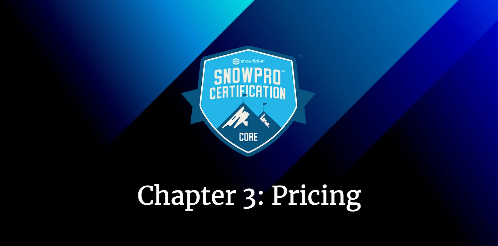
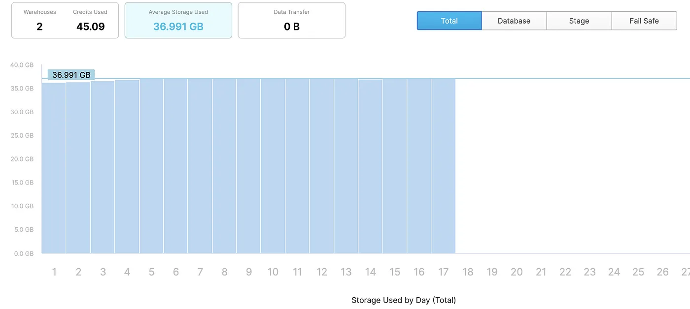
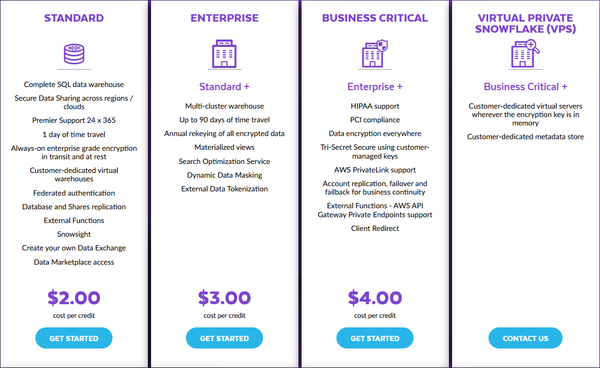
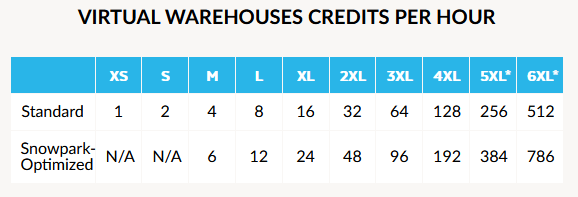
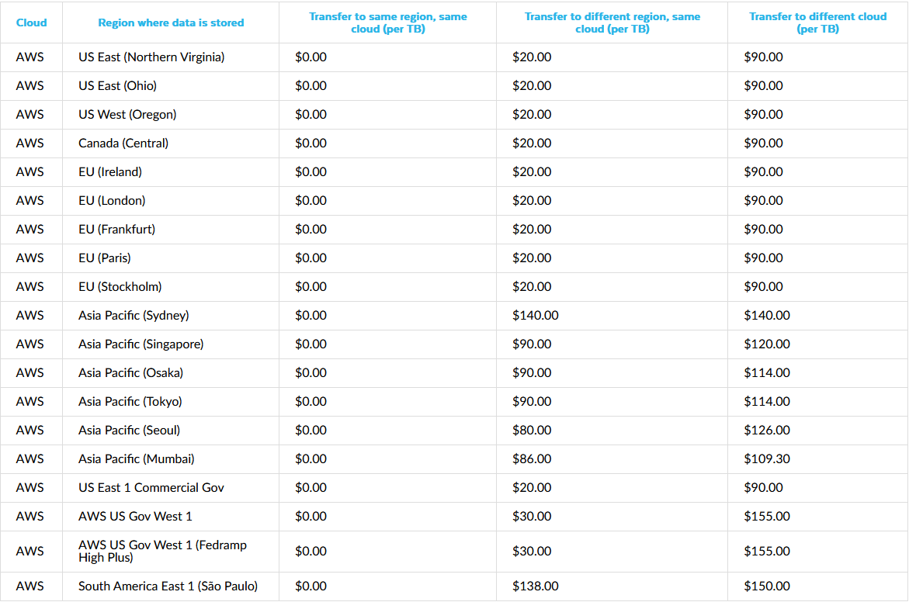
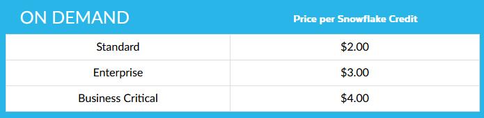

# Road to Snowflake SnowPro Core Certification: Pricing

## Third Chapter: Snowflake Pricing

In this chapter, we will study in detail Snowflake pricing, the different capacity options, and the exam preparation part with the typical questions that usually appear in the Snowflake SnowPro Core Certification about pricing:

<ol>
<li>Costs of each layer in Snowflake</li>
<li>Capacity Options</li>
<li>Typical Exam Questions about Pricing</li>
</ol>

> _Remember that all the chapters from the course can be found [in the following link](./course-links.md)._> _Remember that all the chapters from the course can be found [in the following link](./course-links.md)._

---

## COSTS IN SNOWFLAKE

> _What is a Snowflake credit?_

Snowflake credits are used to pay for the consumption of resources on Snowflake. A Snowflake credit is a unit of measure, and it is consumed only when a customer is using resources, such as when a virtual warehouse is running, the cloud services layer is performing work, or serverless features are used.

<b>Snowflake pricing and cost are based on the actual usage</b>. You pay for what you use and scale storage and compute independently. This is important; <b>we will be charged individually for the computing and storage</b>. Let’s see the price of each layer in detail.

> _Storage Costs_

All customers are charged a monthly fee for the data they store in Snowflake. Storage cost is measured using the <b>average amount of storage used per month, after compression</b>, for all customer data stored in Snowflake. <b>This question appears typically in the exam; remember</b> that it’s the average amount after compression.

<figure>
  
  <figcaption align = "center">Storage Costs of a Snowflake Account.
</figcaption>
</figure>

The storage includes:

<ul>
<li>Data stored in tables, including historical data for Time Travel.</li>
<li>Fail-Safe historical data.</li>
<li>Internal Stages</li>
</ul>

We will see Fail-Safe and Time Travel later in the course, but it’s essential to know that storage costs are not just the data from the tables.

> _Compute Costs_

Customers pay for virtual warehouses using Snowflake credits. The cost of these credits depends on the Snowflake edition that you are using, and the region of the Snowflake account. For example, these are the costs per credit for an account in US East (North Virginia) on AWS:

<figure>
  
  <figcaption align = "center">Cost per credit on a Snowflake account based on AWS North Virginia.
</figcaption>
</figure>

You can check the price in other regions and Cloud providers at the [following link](https://www.snowflake.com/pricing/). Apart from the Snowflake edition, the number of credits that a data warehouse consumes is determined by the following:

<ul>
<li><b>The warehouse size, as we will see in the following image.</b></li>
<li><b>The number of clusters (for multi-cluster warehouses).</b></li>
<li><b>The time each server in each cluster runs → They are billed by seconds with a one-minute minimum</b>. For example, if our warehouse runs for 20 seconds, it will be billed as 1 minute, whereas if it runs for 1.20 minutes, it will be billed for this exact time.</li>
</ul>

<figure>
  
  <figcaption align = "center">Credits consumed per hour by different sizes Warehouses.
</figcaption>
</figure>

> _Cloud Services Costs_

Cloud services resources are automatically assigned by Snowflake based on the requirements of the workload. The typical <b>utilization of cloud services (up to 10% of daily compute credits) is included for free</b>, meaning most customers will not see incremental charges for cloud service usage.

> _Data Transfer Costs_

Customers who wish to <b>move or copy their data between regions or cloud providers</b> will incur data transfer charges. Features such as External Tables, External Functions, and Data Lake Export may incur data transfer charges. Here we can see some examples for AWS:

If you want to examine a little more in-depth everything related to pricing (although it will not appear in the exam more than what is explained in this chapter), you can access the following guide: https://www.snowflake.com/pricing/pricing-guide/.

---

## CAPACITY OPTIONS

There are two ways to buy the Snowflake Service: <b>On-Demand or pre-paid Capacity.</b>

<ul>
<li><b>On-Demand</b> → Similar to Amazon AWS, customers are charged a fixed rate for the services that are consumed and are billed in arrears every month.

On Demand storage is charged at the fixed rate of:

<ul>
<li>$40 per Terabyte per month for customers deployed in AWS – US East (Northern Virginia) 
</li></ul>
</li>
</ul>

<figure>
  
  <figcaption align = "center">Snowflake On Demand in the AWS us-east-1 region.
</figcaption>
</figure>

<ul>
<li><b>Pre-paid</b> → Pre-purchase Capacity, which involves a <b>commitment to Snowflake</b>. The Capacity purchased is then consumed monthly, providing lower prices and a long-term price guarantee, among other advantages.

<ul><li>
Customers are notified when they have used 70% of their capacity balance. As customers approach the end of their capacity consumption, they are contacted by Snowflake.
</li></ul>
</li>
</ul>

<figure>
  
  <figcaption align = "center">Snowflake Capacity Options in the AWS us-east-1 region.
</figcaption>
</figure>

---

## TYPICAL EXAM QUESTIONS ABOUT PRICING

<b>What influences Snowflake pricing? (SELECT ONLY ONE)</b>

<ol>
<li>Amount of data queried from Snowflake.</li>
<li>Amount of data scanned from Snowflake.</li>
<li>Snowflake pricing is based on usage & storage.</li>
</ol>

<b>Solution: 3.</b>

---

<b>Compute cost in Snowflake depends on…</b>

<ol>
<li>The query execution time.</li>
<li>The query execution time and the waiting query time.</li>
<li>The warehouse size and how long the warehouse runs.</li>
</ol>

<b>Solution: 3.</b> The cost does not depend on how many queries you run in the warehouse. It depends on which warehouse size and how long the warehouse runs.

---

<b>What are the two major cost categories in Snowflake? (SELECT TWO)</b>

<ul>
<li>Storage.</li>
<li>Compute.</li>
<li>Cloud Service.</li>
<li>Data Transfers.</li>
</ul>

<b>Solution: 1, 2.</b> These are the main costs in Snowflake, and it’s always a good idea to build solutions trying to reduce these costs, like using caches, as we will see in the next chapters.

---

<b>How is the data storage cost computed for Snowflake?</b>

<ol>
<li>Based on the average daily amount of uncompressed data stored.</li>
<li>Based on the average daily amount of compressed data stored.</li>
<li>Based on the amount of uncompressed data stored on the last day of the month.</li>
<li>Based on the amount of compressed data stored on the last day of the month.</li>
</ol>

<b>Solution: 2.</b>

---

<b>Which type of data incur Snowflake storage cost?</b>

<ol>
<li>Data Stored in permanent tables.</li>
<li>Data Stored in temporal tables.</li>
<li>Cache results.</li>
<li>Data retained for Fail-Safe & Time-Travel.</li>
</ol>

<b>Solution: 1, 2, 4.</b> It also includes data stored in Snowflake locations (i.e., user and table stages or internal named stages).

---

<b>Do tables with Fail-Safe turned on incur additional storage costs compared to tables where Fail-Safe is turned off?</b>

<ol>
<li>True</li>
<li>False</li>
</ol>

<b>Solution: 1.</b>

---

<b>Does data stored in a temporary table not contribute to Snowflake’s storage cost?</b>

<ol>
<li>True</li>
<li>False</li>
</ol>

<b>Solution: 2.</b>

---

<b>Which factors influence the unit cost of Snowflake credits and data storage?</b>

<ol>
<li>Snowflake Edition.</li>
<li>Region of the Snowflake account.</li>
<li>On-Demand or Pre-Paid account.</li>
<li>Users on Snowflake.</li>
</ol>
<b>Solution: 1, 2, 3.</b>
