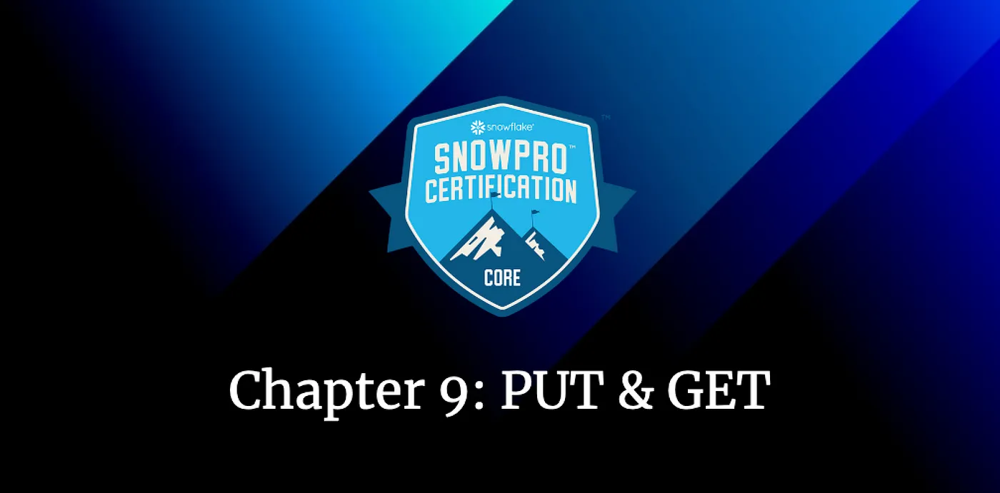
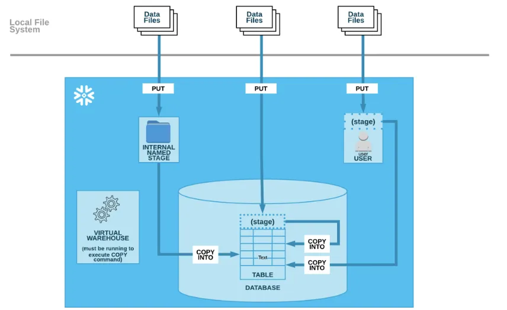
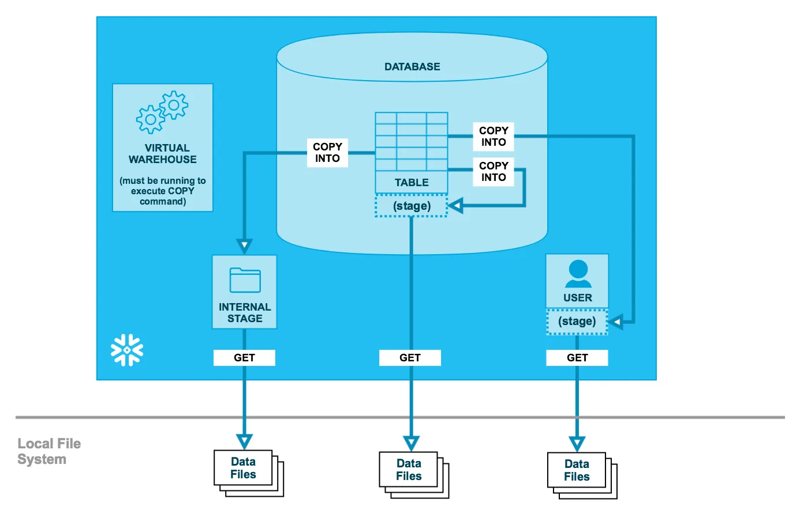

# Road to Snowflake SnowPro Core Certification: PUT & GET commands

## Ninth Chapter: PUT and GET commands

The first step to load data into Snowflake tables is to send it to the Stages. In this chapter, we are going to understand how to do that. Once there, we will copy the data into the tables using either the COPY INTO command for batch files or SnowPipe for continuous data, <a href="./data-loading.md">as we saw in the previous chapter</a>.

#### Table of Contents

1. [PUT Command](#put-command)
2. [GET Command](#get-command)
3. [Typical Exam Questions](#typical-exam-questions)

> _Remember that all the chapters from the course can be found [in the following link](./course-links.md)._

---

## PUT COMMAND

We will use the PUT command to <b>UPLOAD files from a local directory/folder on a client machine into INTERNAL STAGES</b> (named internal stage, user stage, or table stage). <b>It does NOT work with external stages</b>. It doesn’t copy the files in the tables; it copies them into the internal stages. After this command, if you want to move the data into tables, you need to use the COPY INTO command. <b>You cannot use the PUT command from the Snowflake Web UI</b> (and this is a typical exam question).

As we can see in the following diagram, the files are in the Local File System from the user. Using the PUT command <b>using SnowSQL</b>, the files are moved to the internal stages, but they are not in the tables yet. We can move them from the internal stages into the tables using the COPY INTO command.

<figure>
  
  <figcaption align = "center">PUT Command diagram (via docs.snowflake.com).
</figcaption>
</figure>

The code from this command is straightforward. We are moving the file called “<i>mydata.csv</i>” into the internal stage called “<i>my_int_stage</i>”.

<code>PUT file:///tmp/data/mydata.csv @my_int_stage;</code>

---

## GET COMMAND

We will use the GET command to <b>DOWNLOAD files from a Snowflake internal stage</b> (named internal stage, user stage, or table stage) <b>into a directory/folder on a client machine</b>. It doesn’t download the data from the table; it downloads the data from the stage, so first of all, you need to unload the data from the table using the COPY INTO command to the internal stage. As with the PUT command, you cannot use it with the Snowflake Web UI; <b>you need to use SnowSQL</b>.

In the following diagram, we can see that the files are in a Snowflake table. You cannot use the command GET yet; they need to be sent to a Snowflake internal stage first using the COPY INTO command (I remark it because it’s really important). Once they are in the internal stages, we can download them into the user’s Local File System with the GET command.

<figure>
  
</figure>

The code is straightforward; in this case, we are downloading the files from the internal stage called “<i>my_int_stage</i>” into the “<i>data</i>” folder.

<code>GET @my_int_stage file:///tmp/data/;</code>

---

## TYPICAL EXAM QUESTIONS

<b>Which of the following commands cannot be executed from the Snowflake UI?</b>

<ol>
<li>SHOW</li>
<li>LIST <'stages'></li>
<li>GET</li>
<li>COPY INTO</li>
<li>PUT</li>
</ol>

<b>Solution: 3, 5.</b>

---

<b>Which command will we use to download the files from the stage/location loaded through the COPY INTO <LOCATION> command?</b>

<ol>
<li>GET</li>
<li>PUT</li>
<li>UNLOAD</li>
<li>INSERT INTO</li>
</ol>

<b>Solution. 1</b>

---

<b>Does GET support downloading files from external stages?</b>

<ol>
<li>True</li>
<li>False</li>
</ol>

<b>Solution: 2.</b> If you want to download data from external stages, you need to use the cloud provider; for example, download them directly from AWS S3.

---

<b>Can you load data using the PUT command through worksheets in the Snowflake UI?</b>

<ol>
<li>True</li>
<li>False</li>
</ol>

<b>Solution: 2.</b>

---

<b>When data is staged to a Snowflake internal staging area using the PUT command, is the data automatically encrypted?</b>

<ol>
<li>True</li>
<li>False</li>
</ol>

<b>Solution: 1.</b> Uploaded files are automatically encrypted with 128-bit or 256-bit keys.
