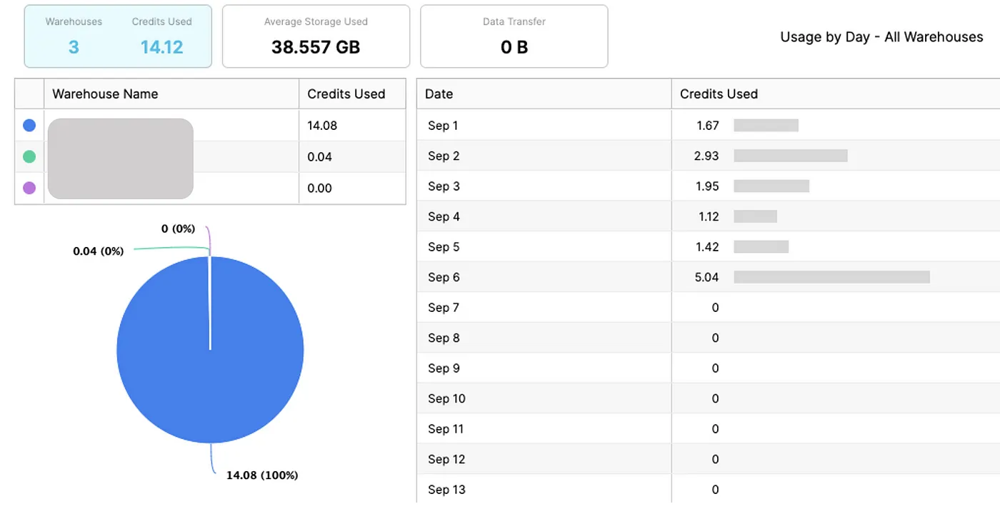
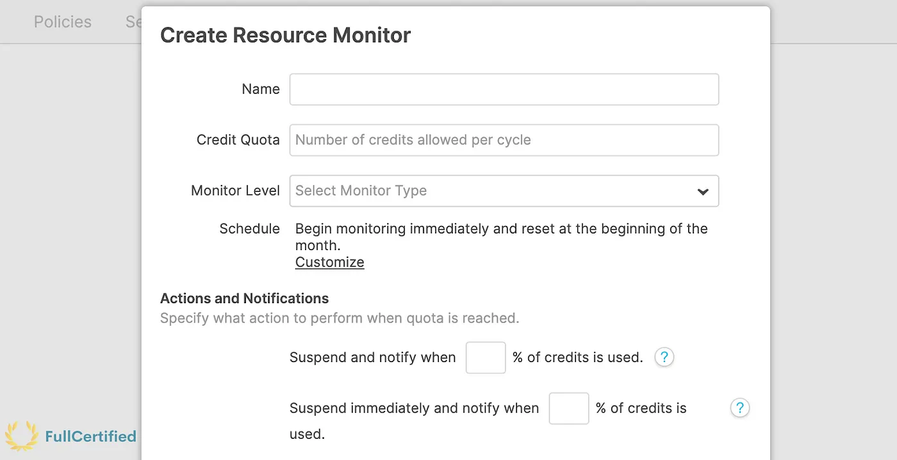

# Road to Snowflake SnowPro Core Certification: Resource Monitors

## Eleventh Chapter: Resource Monitors

In all the cloud services, there must be something to control the price we spend. In Snowflake, this is controlled by Resource Monitors. Let’s study them in depth to be prepared for the SnowPro Core certification!

#### Table of Contents

1. [Intro to Resource Monitors](#resource-monitors)
2. [Resource Monitors Assignment](#resource-monitors-assignment)
3. [Resource Monitors Parameters](#typical-exam-questions)
4. [Typical Exam Questions on Resource Monitors](#typical-exam-questions)

> _Remember that all the chapters from the course can be found [in the following link](./course-links.md)._

## RESOURCE MONITORS

We use Resource monitors to help control costs and avoid unexpected credit usage caused by running data warehouses. You can <b>impose limits on the number of credits that warehouses consume</b>. You can see the credits you’ve consumed in the Account section of the Snowflake UI (you must have an AccountAdmin role).

## Resource Monitors Assignment

Resource monitors can be assigned in the following scenarios:

<ul>
<li>You can set a single monitor at the account level to control credit usage for all warehouses in your account.</li>
<li>You can assign a monitor to one or more warehouses, controlling the credit usage for each warehouse.</li>
<li>You can assign a warehouse to only a single resource monitor below the account level — <b>this is a typical exam question</b>.</li>
</ul>

We can see these three cases in the following diagram:

")

## Resource Monitors Parameters

We need to specify several parameters when creating a Resource Monitor. Let’s take a look at them:

<ol>
<li><b>Credit Quota →</b> Specifies the <b>number of Snowflake credits allocated to the monitor for the specified frequency interval</b>. A credit quota of 1000 would mean that the warehouse can consume until 1000 credits. It works by interval, and it will be restarted. For example, we can set the credit quota for an entire month, and the following month the credit quota would reset to 0.</li>

<li><b>Monitor Level→</b> It specifies whether the resource monitor is used to <b>monitor the credit usage for your entire Account or individual WareHouses</b>.</li>

<li><b>Schedule →</b> When the monitor is going to start monitoring and when the credits reset back to 0. The credits are reset to 0 at the beginning of each calendar month.</li>

<li><b>Actions →</b> They are triggers. Each action specifies a threshold and the action to perform when the threshold is reached within the specified interval. To receive notifications, <b>each account administrator must explicitly enable notifications through the web interface</b>, specifying their email if they want to receive them by email. Resource monitors support the following actions:</li>
</ol>

<ul>
<li><b>Notify (send notification) →</b> Perform no action but send an alert notification (email/web UI).</li>
<li><b>Notify & Suspend (suspend warehouse) →</b> Send a notification and suspend all assigned warehouses after all statements being executed by the warehouse (s) have been completed.</li>
<li><b>Notify & Suspend Immediately (kill query) →</b> Send a notification and suspend all assigned warehouses immediately.</li>
</ul>

What happens if a monitor suspends a Warehouse, but we want to use it again in the same cycle? We have the following options to restart the warehouse again:

<ul>
<li>The credit quota for the monitor is increased.</li>
<li>The credit threshold for the suspension action is increased.</li>
<li>The warehouses are no longer assigned to the monitor.</li>
<li>The monitor is dropped.</li>
<li>The next interval, if any, starts as dictated by the start date for the monitor.</li>
</ul>

---

## TYPICAL EXAM QUESTIONS

<b>Can Resource Monitors be replicated?</b>

<ol>
<li>True</li>
<li>False</li>
</ol>

<b>Solution: 1.</b> Replication was only supported for Databases, and you couldn’t replicate other objects in your account, like Users or Resource monitors. But as a <b>preview feature in 2022</b>, account objects can finally be replicated! You can read more information at the following link: https://docs.snowflake.com/en/user-guide/account-replication-intro.html

---

<b>Can a Warehouse be assigned to more than one Resource Monitor?</b>

<ol>
<li>True</li>
<li>False</li>
</ol>

<b>Solution: 2.</b> You can assign a warehouse to only a single resource monitor below the account level.

---

<b>For which activities does Snowflake have administration settings to help with resource consumption?</b>

<ol>
<li>Help control costs associated with unexpected warehouse credit usage</li>
<li>Manage access to Snowflake for specific users</li>
<li>Manage the availability of the product</li>
</ol>

<b>Solution: 1</b>

---

<b>What can the resource monitor associated with a Warehouse do when it reaches (or is about to) hit the limit?</b>

<ol>
<li>Suspend the WareHouse</li>
<li>Send notification alert</li>
<li>Kill the query that is running</li>
<li>Delete the Snowflake account</li>
</ol>

<b>Solution: 1, 2, 3</b>

---

<b>What is the property name from the Resource Monitors that lets you specify whether you want to control the credit usage of your entire account or a specific set of warehouses?</b>

<ol>
<li>Credit Quota</li>
<li>Monitor Level</li>
<li>Schedule</li>
<li>Notification</li>
</ol>

Solution: 2</b>

---

<b>What actions can a Resource Monitor take when it hits the limit?</b>

<ol>
<li>Notify & Suspend</li>
<li>Notify & Suspend Immediately</li>
<li>Notify</li>
<li>Notify & Increase the limit</li>
</ol>

<b>Solution: 1, 2, 3</b>

---

<b>Which properties of a Resource Monitor can be modified?</b>

<ol>
<li>Credit Quota</li>
<li>Monitor Level</li>
<li>Schedule</li>
<li>Actions</li>
</ol>

<b>Solution: 1, 2, 3, 4</b>
