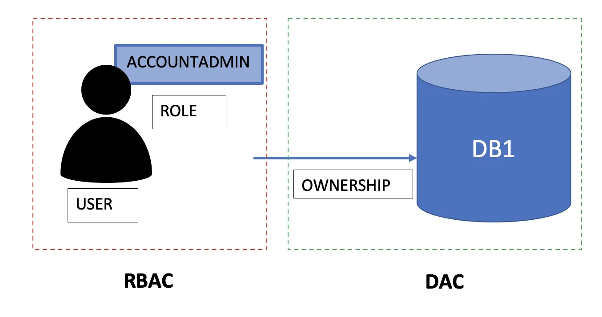
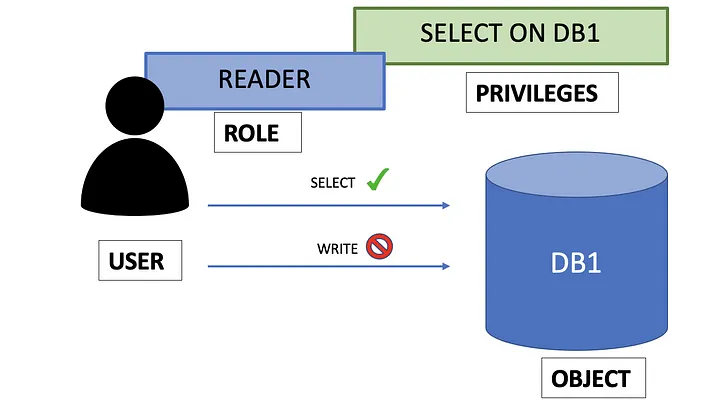
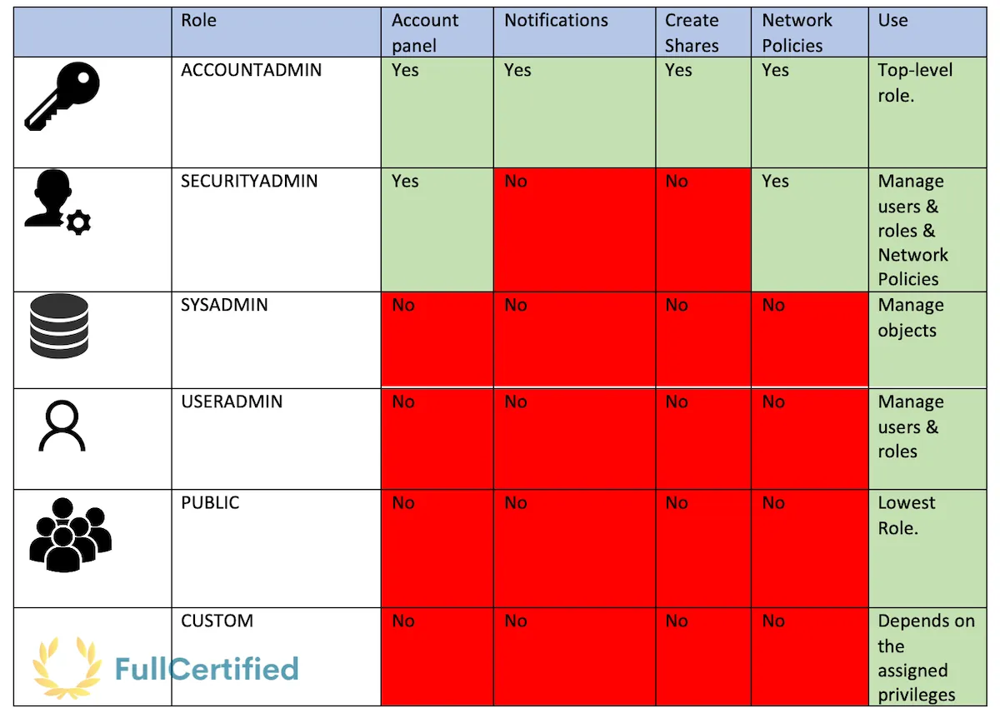
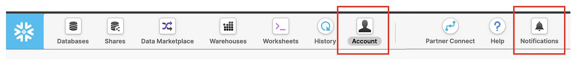
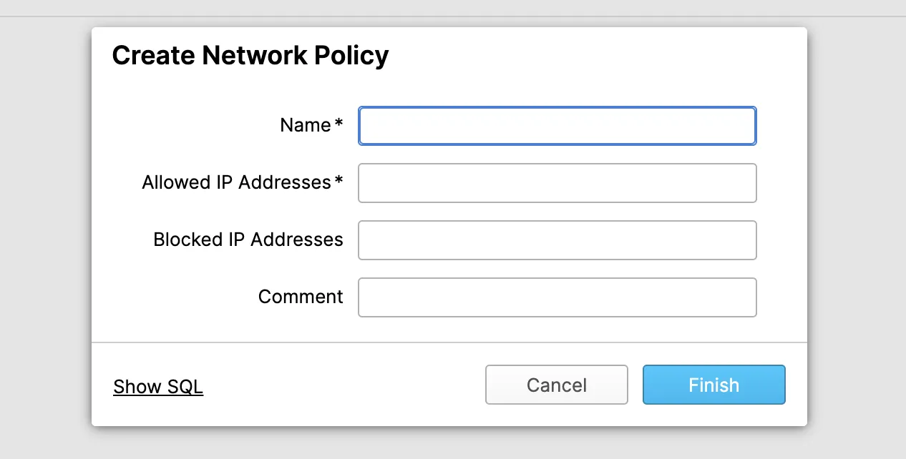
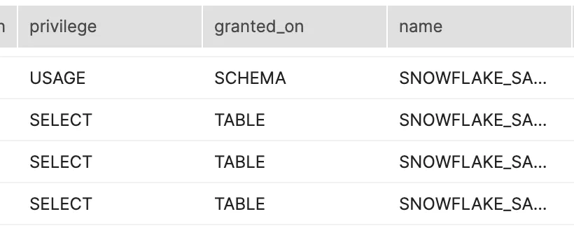
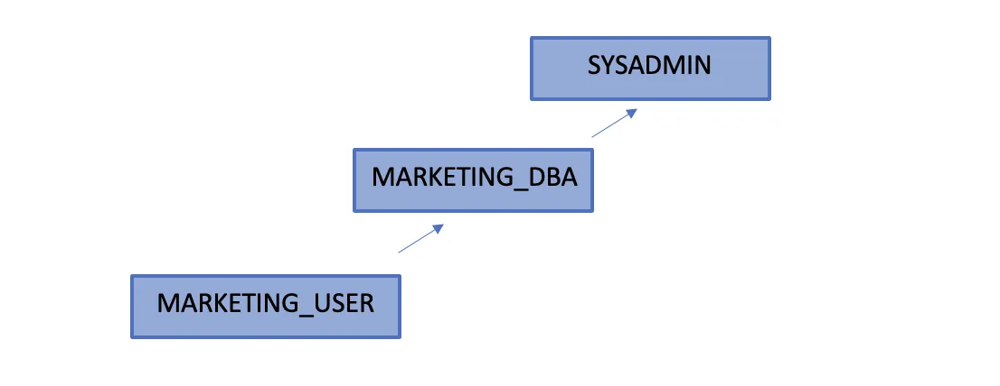

b# Road to Snowflake SnowPro Core Certification: Roles in Snowflake

## Fourteenth Chapter: Access Management. Roles in Snowflake

#### Table of Contents

1. [Access Management Key Concepts](#access-management-key-concepts)
2. [Default Roles](#default-roles)
3. [Roles Encapsulation](#roles-encapsulation)
4. [Roles Commands](#roles-commands)
5. [Typical Exam Questions](#typical-exam-questions)

> _Remember that all the chapters from the course can be found [in the following link](./course-links.md)._

## ACCESS MANAGEMENT KEY CONCEPTS

<ul>
<li><b>Access control privileges determine who can access and perform operations on specific objects in Snowflake</b>. The Snowflake approach combines aspects from the following models:</li>

<li><b>Discretionary Access Control (DAC) → Each object has an owner</b> who can, in turn, grant access to that object.
Role-Based Access Control (RBAC) → Access privileges are assigned to roles</b>, which are, in turn, given to users.</li>
</ul>

<b>The key concepts about Access Management in Snowflake are the following ones</b> (we need to have this part clear for the exam, my best advice is to practice a little bit with Snowflake to make sure we understand them):

<ul>
<li><b>User →</b> A person or a program. For example, Gonzalo, as a user.</li>
Role →</b> An entity to which we can grant privileges. We can grant roles to users. <li><b>Roles are account-level objects and can be granted to other roles, creating a hierarchy</b>. The privileges associated with a role are inherited by any roles above that role in the hierarchy. For example, Gonzalo will be associated with the AccountAdmin role.</li>

<li><b>Securable object →</b> An entity to which we can grant access. Unless allowed by a privilege, access will be denied. For example, a table, database, or schema are securable objects.</li>
<li><b>Privilege →</b> A defined level of access to an object. For example, the user Gonzalo, as AccountAdmin, will have the SELECT privilege on database “DB1”</b>.</li>
</ul>

As we can see in the previous picture, a user will have a role that will contain privileges. As the select privilege is assigned to the role, we can perform select queries on the database, but we cannot write it as this privilege is not assigned to the role.

It’s important to remember that privileges are assigned to Roles, which will be assigned to users. <b>USER <- ROLE <- PRIVILEGE</b>.

---

## DEFAULT ROLES

Snowflake gives <b>five different default roles plus the possibility to create custom ones</b>. In this table, we can see some differences between them, and below that, we will see all of them in detail:

<ul>
<li><b>ACCOUNTADMI (aka Account Administrator) →</b> It encapsulates the SYSADMIN and SECURITYADMIN system-defined roles. It’s the top-level role, and <b>you shouldn’t give it to many users</b>. AccountAdmin users can access the Account and Notification sections in the Snowflake UI. They can also <b>CREATE, ALTER, or DROP Network Policies and Shares</b> (we will see this concept soon).</li>
</ul>

<ul>
<li><b>SECURITYADMIN (aka Security Administrator) →</b> It can manage users and roles. SecurityAdmins can access the Account tab in the interface, but they cannot see the Usage & Billing part. They cannot either create Reader sharing accounts or see the Notifications section. Users with this role can also <b>CREATE, ALTER, or DROP Network Policies.</b>
<ul>
TLDR: This role is used to:
<ul>
<li>Monitor, manage, and modify any user, or session.</li>
<li>Modify any grants, including revoking it.</li>
</ul>
</li>
</ul>

<ul>
<li><b>SYSADMIN (aka System Administrator) →</b> User with the SysAdmin role can create warehouses and databases (and other objects) in an account.</li>
<li><b>USERADMIN (aka User and Role Administrator) →</b> This role is dedicated to user and role management only</b>. It’s like an admin role with fewer privileges than the SECURITYADMIN one.</li>
<li><b>PUBLIC (Assigned as Default to every user) →</b> This role is automatically granted to every user and every role in your account. It can own its objects, but they’ll be available for everybody as it is the lowest role in the Snowflake hierarchy.</li>
<li><b>CUSTOM ROLES →</b> They can be created by the USERADMIN (or a higher role) and by any role to which the CREATE ROLE privilege has been granted. You can assign the privileges that you want. We will see an example later.</li>
</ul>

---

## ROLES ENCAPSULATION

Let’s start looking at the Snowflake roles hierarchy:

")

What does it mean that <i>ACCOUNTADMIN</i> encapsulates <i>SYSADMIN</i> and <i>SECURITY</i>? It means that <b>it encapsulates their privileges</b>; let’s see it in another example:

")

In this example, <b>ROLE_2</b> inherits privilege C from the <b>ROLE_3</b>, and ROLE_1 inherits privilege B & C from <b>Role_2</b>. The same thing with the diagram above, <b>SECURITYADMIN</b> inherits privileges from <b>USERADMIN</b>, which inherits privileges from <b>PUBLIC</b>.

---

## ROLES COMMANDS

<ul>
<li><b>Create Role:</b></li>

`CREATE ROLE <NEW_ROLE>;`

<li><b>Encapsulate Role:</b></li>

`GRANT ROLE <CHILD_ROLE> TO ROLE <FATHER_ROLE>`

<li><b>Assign Role to User →</b> It’s essential to GRANT the ROLE to the user. Setting it as a DEFAULT_ROLE when creating the user won’t work.

`CREATE USER <NEW_USER> PASSWORD = <PASSWORD> 
    DEFAULT_ROLE = <ROLE> MUST_CHANGE_PASSWORD = TRUE;`

`GRANT ROLE <ROLE> TO USER <NEW_USER>;`

<li><b>See privileges of the role:</b></li>

`SHOW GRANTS TO ROLE <ROLE>`

<li><b>See to whom the role is assigned</b>: For instance, to three different users.</li>

`SHOW GRANTS OF ROLE <ROLE>`

<li><b>Real example:</b></li>
</ul>

Let’s see all these commands together with a real example. In this case, the role hierarchy that we want to create will be “<i>MARKETING_USER → MARKETING_DBA → SYSADMIN</i>”. This last role will have privileges from both <i>MARKETING_DBA & MARKETING_USER</i>. This is shown in the following diagram:

To create that hierarchy, we should execute the following commands:

`CREATE ROLE MARKETING_USER;`

`GRANT ROLE MARKETING_USER TO ROLE MARKETING_DBA;
GRANT ROLE MARKETING_DBA TO ROLE SYSADMIN;`

`CREATE USER plazagonzalo PASSWORD = 'Gonzalo123' DEFAULT_ROLE = MARKETING_USER 
    MUST_CHANGE_PASSWORD = TRUE;`

`GRANT ROLE MARKETING_USER TO USER plazagonzalo;`

This is an advanced exam question, but we could also make that SYSADMIN couldn’t see the databases from the Marketing users. This might be useful in case we want independent departments with sensitive information. In that case, <b>SYSADMIN should GRANT the OWNERSHIP of the DB to MARKETING_DBA</b>.

`CREATE DATABASE MARKETING_DB;`

`GRANT OWNERSHIP ON SCHEMA MARKETING_DB.PUBLIC TO ROLE MARKETING_DBA;`

`GRANT OWNERSHIP ON DATABASE MARKETING_DB TO ROLE MARKETING_DBA;`

---

## TYPICAL EXAM QUESTIONS

<b>Which answers are true about roles in Snowflake?</b>

<ol>
<li>Snowflake users have a limit on the number of roles that they can assume</li>
<li>Snowflake users can have one or more roles</li>
<li>Only a role can be active for a particular session</li>
<li>Privileges can be directly assigned to users</li>
</ol>

<b>Solution: 2, 3</b>

---

<b>Which of the following object types are stored within a schema?</b>

<ol>
<li>Tables</li>
<li>Views</li>
<li>File Formats</li>
<li>Roles</li>
</ol>

<b>Solution: 1, 2, 3.</b> Roles are account-level objects.

---

<b>Which of the following roles are the default ones in Snowflake?</b>

<ol>
<li>ACCOUNTADMIN</li>
<li>SECURITYADMIN</li>
<li>VIEWER</li>
<li>USERADMIN</li>
<li>SYSADMIN</li>
<li>NETWORKADMIN</li>
</ol>

<b>Solution: 1, 2, 4, 5</b>

---

<b>Which command will you run to list all users and roles to which a role has been granted?</b>

<ol>
<li>SHOW GRANTS TO ROLE <ROLE></li>
<li>SHOW GRANTS OF ROLE <ROLE></li>
<li>SHOW GRANTS IN ROLE <ROLE></li>
</ol>

<b>Solution: 2.</b> “SHOW GRANTS OF ROLE” will list the users, whereas “SHOW GRANTS TO ROLE” will list the privileges that this role has access.

<b>Which roles can create, alter or drop network policies?</b>

<ol>
<li>ACCOUNTADMIN</li>
<li>SECURITYADMIN</li>
<li>SYSADMIN</li>
<li>USERADMIN</li>
</ol>

<b>Solution: 1, 2</b>

---

<b>Which roles can create shares and resource monitors?</b>

<ol>
<li>ACCOUNTADMIN</li>
<li>SECURITYADMIN</li>
<li>SYSADMIN</li>
<li>USERADMIN</li>
</ol>

<b>Solution: 1.</b> AccountAdmins can only create Shares and Resource Monitors by default.

---

<b>Can worksheets of the Snowflake UI have a different role, warehouse, and database?</b>

<ol>
<li>True</li>
<li>False</li>
</ol>

<b>Solution: 1</b>
