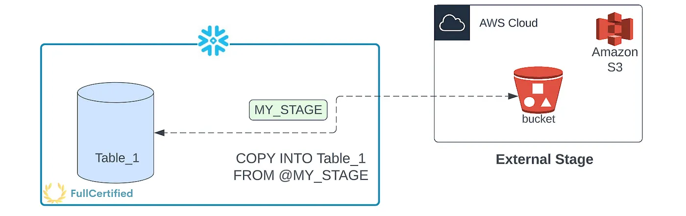
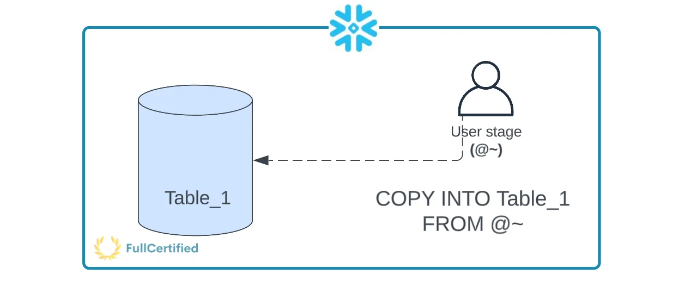
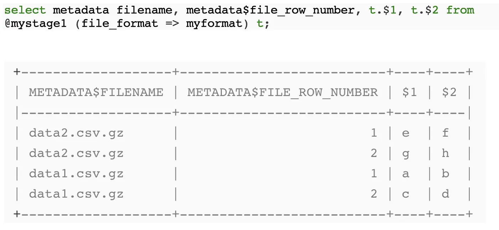
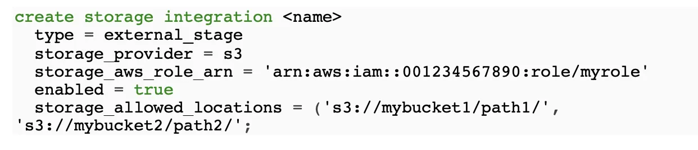

# Road to Snowflake SnowPro Core Certification: Stages & Storage Integration

## Seventh Chapter: Stages & Storage Integration

Stages in Snowflake specify where data files are stored (staged) so that we can load the data in the files into a table. It is where the files are before moving them to Snowflake tables. There are two types of stages, internal and external stages; let’s see them.

<ol>
<li><a href="#external-stages">External Stages</a></li>
<li><a href="#internal-stages">Internal Stages</a></li>
<li><a href="#stage-metadata">Stage Metadata</a></li>
<li><a href="#storage-integration">Storage Integration</a></li>
<li><a href="#typical-exam-questions">Typical Exam Questions
</a></li>
</ol>

> _Remember that all the chapters from the course can be found [in the following link](./course-links.md)._

---

## EXTERNAL STAGES

External Stages, or Named External Stages, <b>reference data files stored outside Snowflake</b>. Named Stages are Database Objects. The following Cloud Storage Services are supported (where the files to be copied to Snowflake tables will be located):

<ul>
<li>Amazon S3 Buckets for AWS.</li>
<li>Google Cloud Storage Buckets for Google Cloud.</li>
<li>Microsoft Azure Containers for Azure.</li>
<ul>

<figure>
  
  <figcaption align = "center">External Stage in Snowflake.
</figcaption>
</figure>

As we can see, the files are in AWS S3, and we’ll copy them into a Snowflake table using the COPY command that we will study in the next chapter.

---

## INTERNAL STAGES

<b>Stores data files internally within Snowflake</b>. There are the following internal stages:

<ul>
<li><b>User (Represented with “@~”)</b> → Each user has a Snowflake personal stage allocated to them by default for storing files, and no one can access them except the user it belongs to. <b>You can use it when a single user only accesses his files, but he will copy them into several tables</b>. You cannot either see them in the Snowflake interface or drop/alter them; <b>you can only access them using the CLI (SnowSQL)</b>. As we can see in the following picture, the data that we copy to the table remains in Snowflake; we don’t get it from a Cloud Provider.</li>
</ul>

<figure>
  
  <figcaption align = "center">User Internal Stage in Snowflake.
</figcaption>
</figure>

In the first example, we are copying the file “<i>myCSV.csv</i>” from the user’s local directory (we will see in the next chapter how to use the PUT command) to his user’s internal Snowflake stage. Using the second command, we are copying data from the User Internal Stage of the user to a table called “<i>mytable</i>”. It’s important to realize that we use two commands, one to move the data from local to Snowflake and another one to copy from the internal user stage to the Snowflake table, as we can see in the following example:

<code>PUT file://c:/myData/myCSV.csv @~;

COPY INTO MYTABLE FROM @~staged file_format=(format_name = 'my_csv_format');</code>

<ul>
<li><b>Table (Represented with “@%”)</b> → Each table has a Snowflake stage allocated to it by default for storing files. This stage is a <b>convenient option if your files must be accessible to multiple users and they only need to be in a single table</b>. You cannot see them in the Snowflake interface; only <b>access them using the CLI.</b> In the following example, you are copying a file from the user’s local directory to the table stage of a table called “<i>myTable</i>”:</li>
</ul>

<code>PUT file://c:/myData/myCSV.csv @%myTable</code>

<ul>
<li><b>Named Internal Stage</b> → Cloud Storage Location managed by Snowflake. Named stages are database objects, both external and internal ones. If you plan to stage data files that will be loaded only by you, or will be loaded only into a single table, then you may prefer to use your user stage or the table stage. Named Internal stages can be either <b>permanent or temporary.</b></li>
</ul>

---

## STAGE METADATA

Snowflake automatically generates metadata for files in internal or external stages. This metadata is “stored” in the following virtual columns:

<ul>
<li><b>METADATA$FILENAME</b> → Name of the staged data file the current row belongs to. It includes the path to the data file in the stage.</li>
<li><b>METADATA$FILE_ROW_NUMBER</b> → Row number for each record in the container staged data file.</li>
</ul>

In the following example, we can see how to query the metadata from the files in “<i>@mystage1”</i>:

<figure>
  
  <figcaption align = "center">Example of how to select the metadata from files in a Stage in Snowflake.
</figcaption>
</figure>

---

## STORAGE INTEGRATION

A storage integration is a Snowflake object that stores a generated <b>identity and access management (IAM) entity for your external cloud storage</b>, along with an optional set of allowed or blocked storage locations (Amazon S3, Google Cloud Storage, or Microsoft Azure). <b>This option will enable users to avoid supplying credentials when creating stages or when loading or unloading data.</b>

Storage integrations are <b>objects at the Account Level</b>, NO Database Level. They can support several stages. In the following example, we can see how to create it for Amazon S3:

<figure>
  
  <figcaption align = "center">How to create a Storage Integration.
</figcaption>
</figure>

---

## TYPICAL EXAM QUESTIONS

<b>What are the different stages available in Snowflake</b>

<ol>
<li>User</li>
<li>Table</li>
<li>Named internal</li>
<li>Named external</li>
<li>Account</li>
<li>Schema</li>
</ol>

<b>Solution: 1, 2, 3, 4</b>

---

<b>Which are the two metadata columns for staged files?</b>

<ol>
<li>METADATA$FILENAME</li>
<li>METADATA$FILEFORMAT</li>
<li>METADATA$FILE_ROW_NUMBER</li>
</ol>

<b>Solution: 1, 3</b>

---

<b>Which character identifies a table stage?</b>

<ol>
<li>“@”</li>
<li>“%”</li>
<li>“/@”</li>
<li>“@%”</li>
</ol>

<b>Solution: 4</b>

---

<b>Which character identifies a user stage?</b>

<ol>
<li>“@~”</li>
<li>“~”</li>
<li>“@”</li>
</ol>

<b>Solution: 1</b>

---

<b>When staging uncompressed files in a Snowflake stage, are the files automatically compressed using gzip unless compression is explicitly disabled?</b>

<ol>
<li>True</li>
<li>False</li>
</ol>

<b>Solution: 1.</b>

---

<b>Which Snowflake object stores a generated identity and access management (IAM) entity for your external cloud storage, along with an optional set of allowed or blocked storage locations (Amazon S3, Google Cloud Storage, or Microsoft Azure)?</b>

<ol>
<li>Storage Schema</li>
<li>Storage Integration</li>
<li>User Stage</li>
</ol>

<b>Solution: 2</b>

---

<b>Can a single storage integration support multiple external stages?</b>

<ol>
<li>True</li>
<li>False</li>
</ol>

<b>Solution: 1</b>

---

<b>You have two types of named stages, one is an external stage, and the other one is an internal stage. Will external stages always require a cloud storage provider?</b>

<ol>
<li>True</li>
<li>False</li>
</ol>

<b>Solution: 1</b>
