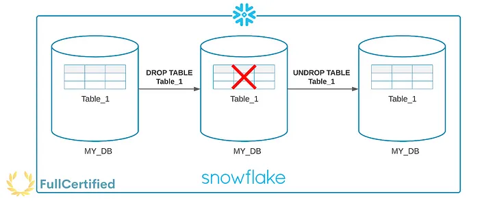
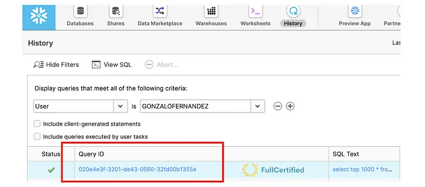
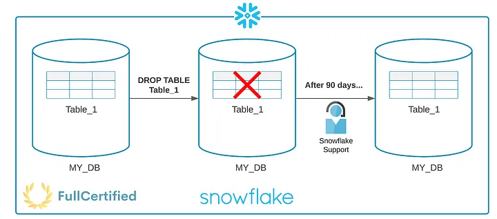
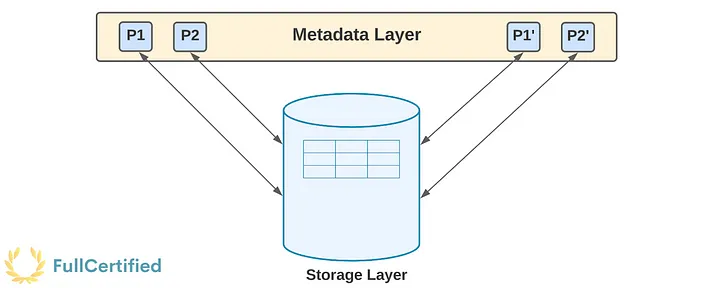
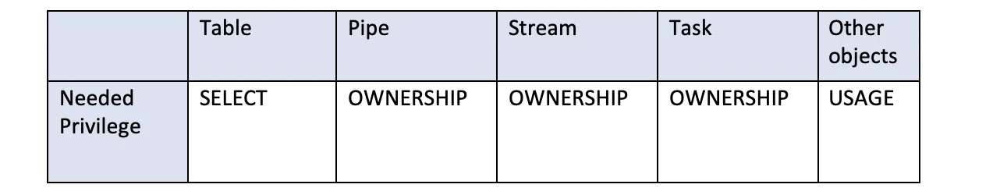

# Road to Snowflake SnowPro Core Certification: Time Travel, Fail-Safe & Zero-Copy Cloning

## Thirteenth Chapter: Time Travel, Fail-Safe & Zero-Copy Cloning

#### Table of Contents

1. [Introduction to Snowflake Storage Features](#introduction-to-snowflake-storage-features)
2. [Time Travel](#time-travel)
3. [Restore Objects using Time Travel](#restore-objects-using-time-travel)
4. [Querying over Historical Data using Time Travel](#querying-over-historical-data)
5. [Fail-Safe](#fail-safe)
6. [Zero-Copy Cloning](#zero-copy-cloning)
7. [Typical Exam Questions](#typical-exam-questions)

> _Remember that all the chapters from the course can be found [in the following link](./course-links.md)._

## INTRODUCTION TO SNOWFLAKE STORAGE FEATURES

[Have you ever seen the meme](https://twitter.com/cpanel/status/1150539222702579713) (I hope it hasn’t happened to you) where you start working at 9 a.m. on a Monday, and you delete a table in a production environment? Well, this will no longer be a problem, thanks to Snowflake!

In the following diagram, we can see different ways to recover data in Snowflake, first by ourselves using the <b>Time Travel</b> functionality, then by Snowflake support using the <b>Fail-Safe retention period</b>. Let’s study these concepts!

.")

---

## TIME TRAVEL

Time travel enables accessing historical data (i.e., data that has been changed or deleted) at any point within a defined period. <b>If we drop a table, we can restore it with time travel</b>. You can use it with Databases, Schemas & Tables.

Use cases of Time Travel:

<ul>
<li>Restoring data-related objects that we might have accidentally or intentionally deleted.</li>
<li>Duplicating and backing up data from key points in the past.</li>
<li>Query data from the past.</li>
</ul>

No tasks are required to enable Time Travel. By default, it’s enabled with a 1-day retention period. However, we can increase it to 90 days if we have (at least) the Snowflake Enterprise Edition. It requires additional storage, which will be reflected in your monthly storage charges.

---

## RESTORE OBJECTS USING TIME TRAVEL

To restore objects, we use the command “<i>UNDROP</i>”. As we mentioned, you can use it with Databases, Schema, or Tables. <b>If we try to restore an object with a name that already exists, Snowflake will give an error</b>.

`DROP TABLE mytable; -- We accidentally drop a table`

`UNDROP TABLE mytable; -- We restore it using Time Travel`

In this example, we try to UNDROP an object with the same name, producing an error.

`DROP TABLE mytable;`

`CREATE TABLE mytable (c1 varchar);`

`UNDROP TABLE mytable; -- It will trigger an error`

---

## QUERYING OVER HISTORICAL DATA

We can also query historical data. Imagine that a table has changed a lot during the last week, and <b>we want to query how it was seven days ago</b>. We can also do that thanks to Time Travel. There are different ways to do it:

<ul>
<li><b>By timestamp</b></li>
</ul>

`SELECT * 
FROM my_table 
AT(timestamp => 'Mon, 01 May 2021 08:00:00 -0700'::timestamp_tz);`

<ul>
<li><b>By offset →</b> In this example, we select the historical data from a table as of 15 minutes ago:</li>
</ul>

`SELECT * 
FROM my_table 
AT(offset => -60*15);`

<ul>
<li><b>By query statement ID →</b> We can see the Query Statement ID in the history of queries:</li>
</ul>

`SELECT * 
FROM my_table 
BEFORE(STATEMENT => '8e5d0ca9-005e-44e6-b858-a8f5b37c5726');`

---

## FAIL-SAFE

Fail-safe ensures historical data is protected in the event of a system failure or other catastrophic event, e.g., a hardware failure or security breach. It provides a (NON-CONFIGURABLE) 7-day period during which Snowflake support may recover historical data. This is important; you cannot recover this data alone; you must ask Snowflake support. This period starts immediately after the Time Travel retention period ends, and it also requires additional storage as Time Travel.

Imagine that we have 20 days Time Travel period. We would have all our data protected for 20 (Time Travel) + 7 (Fail Safe) days. If the Time Travel period is 90 days, Snowflake will protect the data for 97 days.

Only permanent tables have a Fail-Safe period, as we saw in its chapter.

---

## ZERO-COPY CLONING

Using Zero-Copy cloning, you can create a snapshot of any table, schema, or Database. The cloned object is independent and can be modified without modifying the original. Very good for development jobs.

Zero-Copy cloning does NOT duplicate data; it duplicates the metadata of the micro-partitions. For this reason, Zero-Copy cloning is FREE, as it doesn’t consume storage. When you modify some cloned data, it will consume storage because Snowflake has to recreate the micro-partitions, which will cost money. For example, if you are only going to perform read queries, there are no additional storage costs.

Some considerations that might appear in the exam:

<ul>
<li><b>Privileges are not cloned.</b></li>
<li>Named Internal Stages are not cloned, but external ones are cloned. Table Stages are also cloned.</li>
<li>Pipes that reference the internal stages are not cloned. If they reference an external stage, they are cloned.</li>
<li>Data History is not cloned.</li>
</ul>

Depending on the object you will clone, you need some privileges. They are shown in the following table:

---

## TYPICAL EXAM QUESTIONS

<b>What type of data incur in Snowflake Storage costs?</b>

<ol>
<li>Data stored in permanent tables</li>
<li>Fail-Safe data</li>
<li>Zero-copy cloning data</li>
<li>Time travel data</li>
<li>Data stored in cloud storage like AWS</li>
<li>Data stored in temporary tables</li>
</ol>

<b>Solution: 1, 2, 4, 6.</b> Remember that the zero-copy clone clones the metadata from the micro-partitions, not the real data. That’s why it doesn’t incur storage costs. Temporary tables also have a storage cost, as we saw in this chapter.

---

<b>What should be the first option to restore data into a table?</b>

<ol>
<li>Time-Travel</li>
<li>Fail-Safe</li>
<li>Zero-Copy Cloning</li>
</ol>

<b>Solution: 1.</b>

---

<b>Which Snowflake edition allows only one day of Time Travel?</b>

<ol>
<li>Standard</li>
<li>Enterprise</li>
<li>Business Critical</li>
</ol>

<b>Solution: 1</b>

---

<b>Which Snowflake edition (and above) allows until 90 days of Time Travel?</b>

<ol>
<li>Standard</li>
<li>Enterprise</li>
<li>Business Critical</li>
</ol>

<b>Solution: 2</b>

---

<b>Do you need to contact Snowflake Support to retrieve data from Fail-Safe?</b>

<ol>
<li>True</li>
False</li>
</ol>

<b>Solution: 1</b>

---

<b>Is the Fail-Safe period for temporary and transient tables 0?</b>

<ol>
<li>True</li>
<li>False</li>
</ol>

<b>Solution: 1.</b> Their Time Travel period is either 0 or 1 day, but they don’t have a Fail-Safe retention period.

---

<b>Select the statements that are true about Fail-Safe:</b>

<ol>
<li>There is no difference between <li>Time-Travel and Fail-Safe</li>
<li>The data retention period for a permanent table with 30 days of Time-Travel is 37 days</li>
<li>Fail-Safe provides a non-configurable 7-day period</li>
<li>Fail-Safe provides a non-configurable 90-day period</li>
<li>Fail-Safe ensures that historical data is protected in the event of a system failure or other catastrophic events</li>
</ol>

<b>Solution: 2, 3, 5.</b> Regarding the second option, we have 30 days of Time-Travel, apart from 7 days of Fail-Safe. 37 days in total.

---

<b>A point-in-time snapshot of data that users can update is called…</b>

<ol>
<li>Time-Travel</li>
<li>Fail-Safe</li>
<li>Zero-Copy Cloning</li>
</ol>

<b>Solution: 3.</b>

---

<b>Which service does Snowflake use to provide the Zero-Copy cloning functionality?</b>

<ol>
<li>SSD Cache of the Virtual Warehouses</li>
<li>Cache</li>
<li>Metadata from the service layer</li>
</ol>

<b>Solution: 3</b>

---

<b>What would happen if we executed the following command?</b>

`CREATE OR REPLACE TABLE newTable CLONE table1;`

CREATE OR REPLACE TABLE newTable CLONE table1;

<ol>
<li>“<i>newTable</i>” is created with all the data from “<i>table1</i>”
<li>“<i>newTable</i>” is created, and Snowflake internally executes a batch job to copy all the data from “<i>table1</i>”
<li>“<i>newTable</i>” is created, and Snowflake internally executes a pipe to copy all the data from “<i>table1</i>”
<li>Snowflake creates a new entry in the metadata store to keep track of the new clone. The existing micro-partitions of “<i>table1</i>” are mapped to the new table.</li>
</ol>

<b>Solution: 4.</b> This is how zero-copy cloning works.
