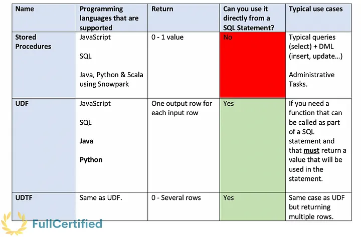

# Stored Procedures and User-Defined Functions in Snowflake

## Sixteenth Chapter: Stored Procedures & User-Defined Functions for the SnowPro Core Certification

Sometimes, we may want to perform operations that Snowflake does not allow us to do with the built-in, system-defined functions. This will not be a problem as we can use Stored Procedures and User-Defined Functions. Let’s see them and understand their differences in one of the shortest chapters of the course!

#### Table of Contents

1. [Introduction](#introduction)
2. [Stored Procedures](#store-procedures)
3. [User-Defined Functions (UDFs)](#user-defined-functions-udfs)
4. [User-Defined Table Functions (UDTFs)](#user-defined-table-functions-udtfs)
5. [Typical Exam Questions](#typical-exam-questions)

> _Remember that all the chapters from the course can be found [in the following link](./course-links.md)._

---

## INTRODUCTION

Store Procedures & User-Defined Functions (UDFs) are like functions in any other programming language. <b>You can use JavaScript, SQL, Java, and Python to extend Snowflake functionality</b>. The differences between them are shown in the following table, although let’s see them in detail in the following sections.

---

## STORE PROCEDURES

Stored procedures allow you to extend Snowflake SQL by combining it with JavaScript so that you can include programming constructs such as branching and looping. Using the Snowpark library, you can also write them in Python, Java or Scala. They return either a <b>SINGLE Value or nothing</b>. The returned values CANNOT be used directly in a SQL statement.

---

## USER-DEFINED FUNCTIONS (UDFs)

User-defined functions (UDFs) let you extend the system to perform operations that are not available through Snowflake’s built-in, system-defined functions. <b>You can use SQL, JavaScript, Java, and Python</b> (these last two are new features).

The difference with Store procedures is that:

<ul>
<li>It returns one output row for each input row. The returned row consists of a single column/value.</li>
<li>It must return something.</li>
<li>The returned values CAN be used directly in statement SQL</li>
</ul>

`---- Function definition ----`

`create or replace function add5 (n number)`

`returns number`

`as 'n + 5';`

`---- Calling the function ----`

`SELECT add5(1)`

`---- Result ----`

`+---------+`

`| ADD5(1) |`

`|---------|`

`| 6 |`

`+---------+`

---

## USER-DEFINED TABLE FUNCTIONS (UDTFs)

UDTFs can return multiple rows for each input row; that’s the only difference with UDFs.

`---- Function definition ----`

`create function t()`

`    returns table(msg varchar)`

`    as`

`    $$`

`        select 'Hello'`

`    $$;`

`---- Calling the function ----`

`select msg `

`    from table(t())`

`    order by msg;`

`---- Result ----`

`+-------+`

`| MSG   |`

`|-------|`

`| Hello |`

`| World |`

`+-------+`

---

## TYPICAL EXAM QUESTIONS

<b>Which Snowflake object returns a set of rows instead of a single, scalar value, and can be accessed in the FROM clause of a query?</b>

<ol>
<li>UDF</li>
<li>UDTF</li>
<li>Stored procedure</li>
</ol>

<b>Solution: 2.</b>

---

<b>Do UDFs support both SQL & JavaScript in Snowflake?</b>

<ol>
<li>True</li>
<li>False</li>
</ol>

<b>Solution: 1.</b> They also added Python and Java recently!

---

<b>Are UDFs, UDTFs, and Stored Procedures account or schema-level objects in Snowflake?</b>

<ol>
<li>Schema level</li>
<li>Account-level</li>
</ol>

<b>Solution: 1</b>
