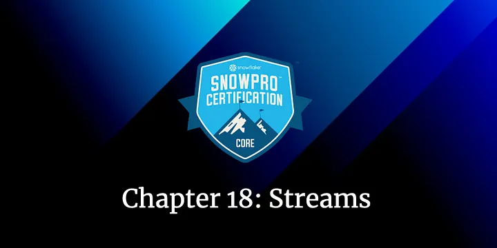
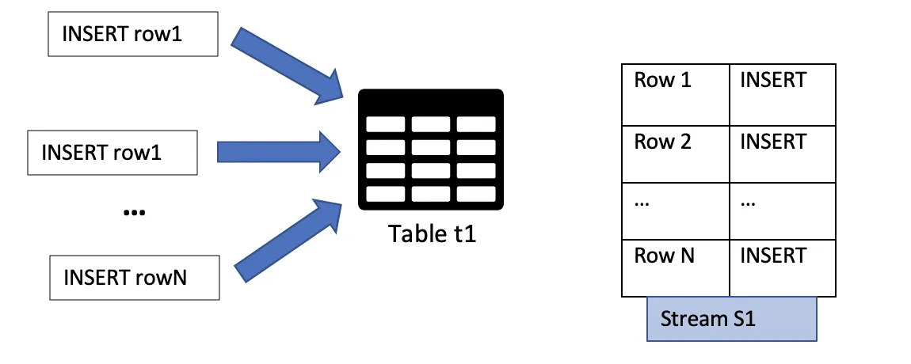
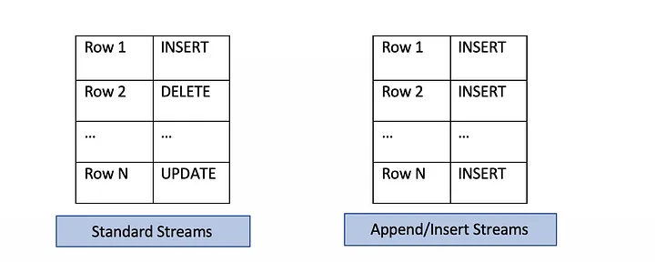
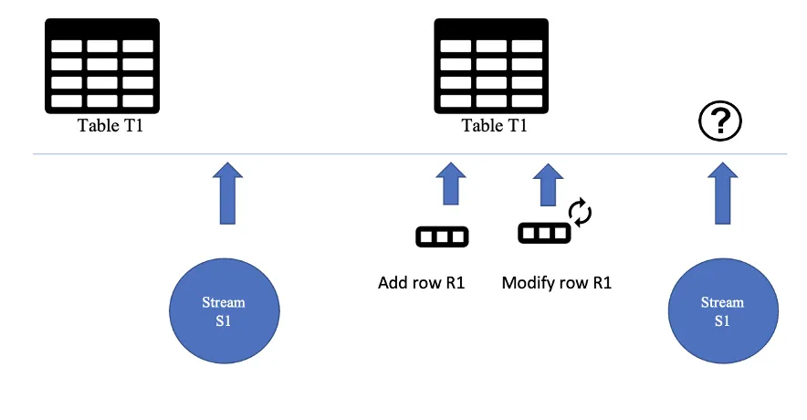
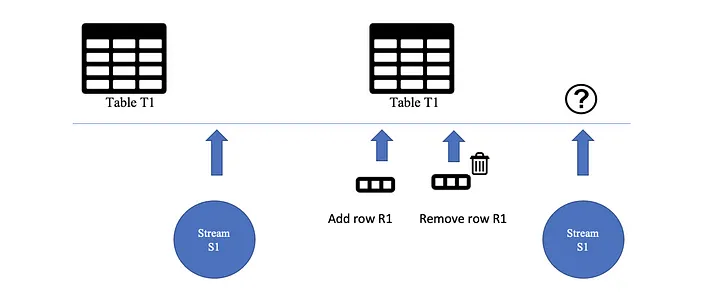
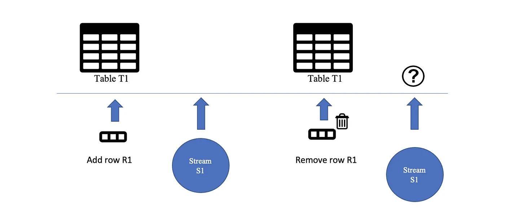

# How Streams work in Snowflake

## Eighteenth Chapter of the Snowflake SnowPro Core Course: Streams

Streams in Snowflake are perhaps one of the most complex topics of the Snowflake SnowPro Core certification, although once we understand them, all the questions will seem very simple. Let's go for it!

#### Table of Contents

1. [Introduction to Streams](#introduction-to-streams)
2. [Stream Examples](#stream-examples)
3. [Typical Exam Questions about Streams](#typical-exam-questions)

> _Remember that all the chapters from the course can be found [in the following link](./course-links.md)._

---

## INTRODUCTION TO STREAMS

Streams are Snowflake objects <b>that record data manipulation language (DML) changes made to tables*, including INSERTS, UPDATES, and DELETES</b>, as well as metadata about each change. Thanks to this, actions can be taken using the changed data.
<i>*Streams didn’t work with views; however, as a new feature of March 2022, Streams now support views and secure views!</i>

<b>Streams don't contain table data; they only store offsets</b>. When created, a table stream logically takes an initial snapshot of every row in the source table by initializing a point in time (called an offset) as the current transactional version of the table. The stream then records the DML changes <b>after this snapshot was taken</b>.

<b>We have three different types of Streams:</b>

<ul>
<li><b>Standard →</b> Tracks all DML changes to the source table, including inserts, updates, and deletes. Supported on tables, directory tables, and views.</li>
<li><b>Append Only →</b> Tracks row inserts only. Supported on tables, directory tables, and views.</li>
<li><b>Insert Only →</b> Tracks row inserts only. The difference with the previous one is that this one is only supported on <b>EXTERNAL TABLES</b>.</li>
</ul>

Apart from that, each stream contains the following columns:

<ul>
<li><b>METADATA$ACTION →</b> Indicates the DML operation (INSERT, DELETE) recorded.</li>
<li><b>METADATA$ISUPDATE →</b> Indicates whether the operation was part of an UPDATE statement.</li>
<li><b>METADATA$ROW_ID →</b> Unique and immutable ID for the row.</li>
</ul>

We will see these columns in the following examples.

Another function to remember is the <b>SYSTEM$STREAM_HAS_DATA</b>. Imagine you create a stream from a table, and you add information to the table. This function indicates whether a stream contains change data capture (CDC) records.

`1) CREATE STREAM MYSTREAM ON TABLE MYTABLE;`

`2) INSERT INTO MYTABLE VALUES (15);`

`3) SELECT SYSTEM$STREAM_HAS_DATA('MYSTREAM');`

`+--------+---------+-----------+----+`
`|SYSTEM$STREAM_HAS_DATA('MYSTREAM');|`

`+--------+---------+-----------+----+`

`| True                              |`

`+--------+---------+-----------+----+`

---

## Stream Examples

We will explain these examples step by step, showing the stream's state at every moment.

> **_First example: Create a stream from a table, add a new row and update the new row._**

1. <b>Create a Stream from a table →</b> The stream will be empty; it doesn't have any row.

`+--------+---------+-----------+--+`

`| ROW_ID | ACTION | ISUPDATE | |`

`+--------+---------+-----------+--+`

`| | | | |`

`+--------+---------+-----------+--+`

2. <b>Add a row in the table →</b> As a new DML operation (INSERT) is done, Snowflake will add a new entry in the stream. In this case, the action is "INSERT".

`+--------+---------+-----------+`

`| ROW_ID | ACTION | ISUPDATE |`

`+--------+---------+-----------+`

`| #1234 | INSERT | FALSE |`

`+--------+---------+-----------+`

3. <b>Update the row in the table →</b> The stream will remain like in the previous case. Why is ISUPDATE false if the row has been updated? We need to see how the stream was at the beginning. When we first created it, the row didn't exist, so <b>from the point of view of the stream, it's just a new row, not an updated one, since it didn't exist at the beginning</b>.

`+--------+---------+-----------+`

`| ROW_ID |  ACTION |  ISUPDATE |`

`+--------+---------+-----------+`

`| #1234  |  INSERT |  FALSE    |`

`+--------+---------+-----------+`

---

> **_Second example: Add a new row in the table, create a stream from a table, and then modify the stream._**

1. <b>Add a row in the table →</b> No stream has been created.

2. <b>Create the stream</b>

`+--------+---------+-----------+--+`

`| ROW_ID | ACTION | ISUPDATE | |`

`+--------+---------+-----------+--+`

`| | | | |`

`+--------+---------+-----------+--+`

3. <b>Update the row in the table →</b> In this case, the row already existed. If we modify it, it's not a new row; it's just a modification from the table before creating the stream, so ISUPDATE will be true in this case.

`+--------+---------+-----------+`

`| ROW_ID |  ACTION |  ISUPDATE |`

`+--------+---------+-----------+`

`| #1234  |  INSERT |  TRUE     |`

`+--------+---------+-----------+`

> **_Third example: Create a stream from a table, add a new row and delete the same row._**

1. <b>Create a Stream from a table →</b> The stream will be empty; it doesn't have any row.

`+--------+---------+-----------+--+`

`| ROW_ID | ACTION | ISUPDATE | |`

`+--------+---------+-----------+--+`

`| | | | |`

`+--------+---------+-----------+--+`

2. <b>Add a row in the table →</b> As a new DML operation is done, Snowflake will add a new entry in the stream. In this case, the action is "INSERT".

`+--------+---------+-----------+`

`| ROW_ID | ACTION | ISUPDATE |`

`+--------+---------+-----------+`

`| #1234 | INSERT | FALSE |`

`+--------+---------+-----------+`

3. <b>Delete the row in the table→</b> The stream won't contain any information. <b>Comparing this to the state of the table before creating the stream, it will be the same</b>. You just add a new row that you delete, so it will be exactly the same table state. So the stream will be empty. This is important to understand.

`+--------+---------+-----------+--+`

`| ROW_ID |  ACTION |  ISUPDATE |  |`

`+--------+---------+-----------+--+`

`|        |         |           |  |`

`+--------+---------+-----------+--+`

---

> **_Fourth example: Add a new row in the table, create the stream and delete the same row._**

1. <b>Add a row to the table →</b> The stream has not been created yet.

2. <b>Create a stream from the table.</b>

`+--------+---------+-----------+--+`

`| ROW_ID | ACTION | ISUPDATE | |`

`+--------+---------+-----------+--+`

`| | | | |`

`+--------+---------+-----------+--+`

3. <b>Delete the row in the table →</b> In this case, <b>there will be a difference between the moment you created the stream and this moment because the table will contain one less row</b>. That's why the stream will contain this information.

`+--------+---------+-----------+`

`| ROW_ID | ACTION | ISUPDATE |`

`+--------+---------+-----------+`

`| #1234 | DELETE | FALSE |`

`+--------+---------+-----------+`

<b>All the examples show that the stream only contains the last DML action on a row.</b>

---

## TYPICAL EXAM QUESTIONS

<b>Which object in Snowflake stores DML change made to tables and metadata about each change?</b>

<ol>
<li>Tables</li>
<li>Pipes</li>
<li>Table Streams</li>
<li>Account Streams</li>
</ol>

<b>Solution: 3.</b> This is the definition of streams, also known as Table Streams.

---

<b>What statements are true about streams?</b>

<ol>
<li>A Stream itself does NOT contain any table data.</li>
<li>A stream only stores the offset for the source table</li>
<li>The hidden columns used by a stream consume storage</li>
</ol>

<b>Solution: 1, 2, 3.</b>

---

<b>Which are the additional columns that the streams create?</b>

<ol>
<li>METADATA$ACTION</li>
<li>METADATA$ISREAD</li>
<li>METADATA$ISUPDATE</li>
<li>METADATA$ROW_ID</li>
<li>METADATA$COLUMN_ID</li>
</ol>

<b>Solution: 1, 3, 4.</b>

---

<b>What different types of streams exist in Snowflake?</b>

<ol>
<li>Standard</li>
<li>Append-only</li>
<li>Update-only</li>
<li>Insert-only</li>
</ol>

<b>Solution: 1, 2, 4.</b> Standard and Append-only are supported for streams on tables, directory tables, and views. External tables only support insert-only streams.

---

<b>Do streams ensure exactly-once semantics for new or changed data in a table?</b>

<ol>
<li>True</li>
<li>False</li>
</ol>

<b>Solution: 1.</b>

---

<b>Are Insert-only streams only supported on external tables?</b>

<ol>
<li>True</li>
<li>False</li>
</ol>

<b>Solution: 1.</b>

---

<b>A stream has been created on a table. A row is inserted in the table, and it's updated later. Will the stream capture both events?</b>

<ol>
<li>True</li>
<li>False</li>
</ol>

<b>Solution: 2.</b> This is the first example we've seen in this chapter.

---

<b>Can we use streams in materialized views?</b>

<ol>
<li>True</li>
<li>False</li>
</ol>

<b>Solution: 2.</b> As we explained in the chapter about tables and views, materialized views don't support streams at this moment. Since March 2022, views and secure views are supported, but no materialized views.

---

<b>Can multiple streams be created for the same table?</b>

<ol>
<li>True</li>
<li>False</li>
</ol>

<b>Solution: 1.</b> Multiple streams can be created for the same table and consumed by different tasks.
