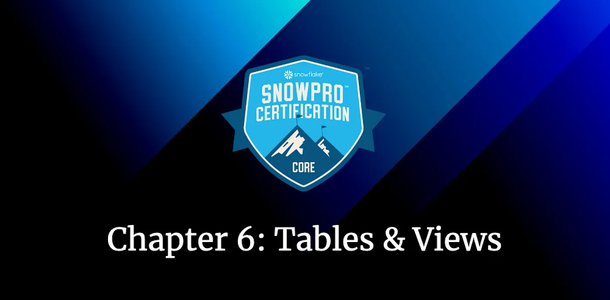
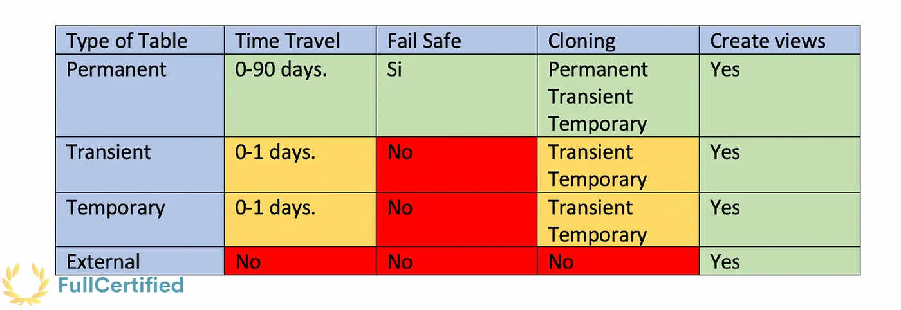
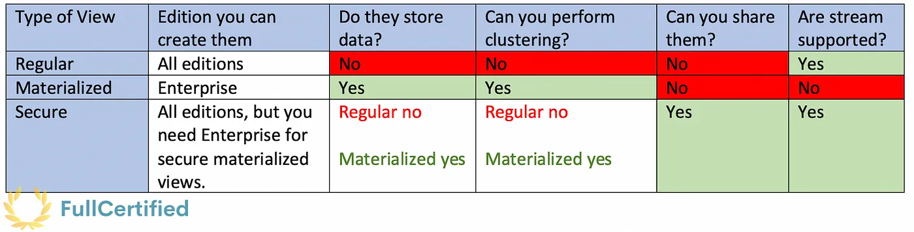

# Road to Snowflake SnowPro Core Certification: Tables & Views

## Sixth Chapter: Tables & Views

As we saw in the [chapter on Snowflake Architecture](https://plazagonzalo.medium.com/road-to-snowflake-snowpro-core-certification-snowflake-architecture-b5e590a8abee), a Database contains Schemas, which contain other objects. This chapter will discuss two of the most important ones in more detail: the tables and the views.

Tables
Views
Typical Exam Questions

<ol>
<li><a href="#tables">Tables</a></li>
<li><a href="#views">Views</a></li>
<li><a href="#typical-exam-questions">Typical Exam Questions
</a></li>
</ol>

> _Remember that all the chapters from the course can be found [in the following link](./course-links.md)._

## TABLES

Tables are database objects that contain all the data, like in any other SQL language. There are different types of tables, and there are some differences between them, which are shown in the following diagram:

<figure>
  
  <figcaption align = "center">Difference between Snowflake tables.
</figcaption>
</figure>

> **_Permanent tables_**

The tables that we can create on Snowflake by default. They have the following characteristics:

<ul>
<li>0–90 days of Time Travel (<b>Enterprise Edition necessary, 0–1 in Standard Edition</b>).</li>
<li><b>Seven days FAIL-SAFE.</b></li>
<li>You can create a temporary, transient, or permanent table as a clone from permanent tables. If you clone a table to Transient or Temporary, the old partitions will remain permanent, but the new partitions we add to this clone will be Transients/Temporary.</li>
</ul>

> **_Transient tables_**

Transient tables persist until explicitly dropped and are available to all users with the appropriate privileges. <b>They are similar to permanent tables, with the key difference being that they do not have Fail-safe, and they have a shorter Time Travel period</b>. For that reason, we use them for <b>transitory data that we need to maintain beyond each session</b>

<ul>
<li>0–1 day of Time Travel. <b>You cannot set 90 days.</b></li>
<li>No Fail-Safe</li>
<li>You can create a temporary or transient table as a clone, but you <b>cannot create a permanent table as a clone</b>.</li>
</ul>

> **_Temporary tables_**

They store non-permanent data and <b>only exist within the session they were created. They only persist for the remainder of the session</b>. As such, <b>they are not visible to other users or sessions</b>. Once the session ends, data stored in the table is entirely purged from the system.

<ul>
<li>0–1 day of Time Travel. <b>You cannot set 90 days</b>. A temporary table is purged once the session ends, so the actual retention period is for 24 hours or the remainder of the session.</li>
<li>No Fail-Safe.</li>
<li>You can create a temporary or transient table as a clone, but not a permanent table as a clone.</li>
</ul>

> **_External tables_**

In external tables, <b>the data is stored in an external stage</b>. They store file-level metadata about the data files, enabling querying data stored in files in an external stage as if it were inside a database. <b>You can only perform read operations on these tables</b>, for example, joins or select queries.

<ul>
<li>No Time Travel.</li>
<li>No Fail-Safe.</li>
<li>No Cloning.</li>
</ul>

External tables are helpful when you have objects in the Cloud Provider that <b>cannot be copied elsewhere by regulations</b>, or you have <b>lots of data in the Cloud Provider and only need a part of it in Snowflake</b>.

## VIEWS

<b>A view allows us to access the result of a query as a table</b>. An example of using a view could be when you have a BI tool that has to access a variant column (a column with non-structured data like JSON, which is also possible in Snowflake, as we will study later). You can use a view almost anywhere where a table can be used (joins, subqueries, etc.). <b>We have two types of views, Non-Materialized and Materialized views, which can be Secure or Not Secure</b>. In this diagram, we can see the differences, and we will see them below in more depth:

<figure>
  
  <figcaption align = "center">Different types of views in Snowflake.
</figcaption>
</figure>

The most common type of view. The results are <b>NOT stored for future</b> use, so the performance is slower than materialized views.

You don’t store the data.
No clustering as you don’t store the data
You can only share these views if they are secure
<i>As a new feature of March 2022</i>, Streams are supported in views and secure views!

> **_Materialized View_**

In many ways, it behaves more like a table. The results are stored to allow faster access but <b>require storage space and active maintenance, which incur additional costs</b>. You need an enterprise edition to be able to create them. <b>Changes to a base table</b> are not automatically propagated to materialized views based on that table (for example, if you add a column in the table, this column is not propagated here. If you delete a column or even the table, this view will give you an error). You can also <b>do clustering</b> in Materialized views.

<ul>
<li>You store the data</li>
<li>You can do clustering as you store the data</li>
<li>You can only share these views if they are secure</li>
<li>Currently, streams cannot track changes in materialized views</li>
</ul>

<b>This view incurs both storage and computing costs</b>. Storage because the information is stored as if it were a table, as we said before, and compute costs because they are automatically and transparently maintained by Snowflake (new data loaded into the table will be propagated here). When should we use materialized views?

<ul>
<li>Query results contain a <b>small number of rows and/or columns relative to the base table</b> (the table on which the view is defined).</li>
<li>Query results contain results that require <b>significant processing</b>, including the analysis of semi-structured data or aggregates that take a long time.</li>
<li>The <b>query is on an external table</b>, which might have slower performance.</li>
<li>The <b>view’s base table does not change frequently</b>.</li>
</ul>

> **_Secure View_**

You might not wish to expose the underlying tables or internal structural details for security or privacy reasons for a view. The <b>view definition and details are only visible to authorized users with secure views. You cannot see the syntax of how the view was created from the table. They are mandatory to share views (Sharing process that we will see later)</b>. Both Regular and Materialized views can also be at the same time Secure Views.

<ul>
<li>You store the data depending on if they are materialized or non-materialized.</li>
<li>You do clustering depending on whether they are materialized or non-materialized.</li>
<li>You can share these views</li>
<li><i>As a new feature of March 2022</i>, Streams are supported in views and secure views!</li>
</ul>

---

## TYPICAL EXAM QUESTIONS

<b>What types of tables are available in Snowflake?</b>

<ol>
<li>Permanent</li>
<li>Temporary</li>
<li>Transient</li>
<li>External</li>
<li>Internal</li>
<b>Solution: 1, 2, 3, 4</b>
</ol>

---

<b>What types of views are available in Snowflake?</b>

<ol>
<li>Regular</li>
<li>Secure View</li>
<li>Table View</li>
<li>Materialized View</li>
<li>External View</li>
<b>Solution: 1, 2, 4</b>
</ol>

---

<b>We need to temporarily store intermediate data, which an ETL process will only use. We don’t need the data outside the ETL process. If you want to optimize storage cost, what type of table will you create to store this data?</b>

<ol>
<li>Permanent</li>
<li>Temporary</li>
<li>Transient</li>
<li>External</li>
</ol>

<b>Solution: 2.</b>

---

<b>Can you use streams to track changes in materialized view?</b>

<ol>
<li>True</li>
<li>False</li>
</ol>

<b>Solution: 2</b>. This is a limitation of materialized views.

---

<b>In which of the below scenarios will you use an external table?</b>

<ol>
<li>You have data on the cloud providers, but the data cannot be copied or moved to any other location due to compliance regulations.</li>
<li>You have a high volume of data on the cloud providers, but we only need some of the data in Snowflake.</li>
<li>You have data on the cloud providers that need to be updated by Snowflake.</li>
<li>You have XML data on the cloud provider.</li>
</ol>

<b>Solution: 1, 2</b>. The third answer is incorrect, as external tables can only read data. They also don’t support XML.

---

<b>Select two limitations with materialized views:</b>

<ol>
<li>Time Travel is not supported.</li>
<li>We cannot define Cluster Keys.</li>
<li>Streams cannot track changes.</li>
</ol>

<b>Solution: 1, 3</b>

---

<b>Can temporary tables be created with a clustering key defined?</b>

<ol>
<li>True</li>
<li>False</li>
</ol>

<b>Solution: 1</b>
