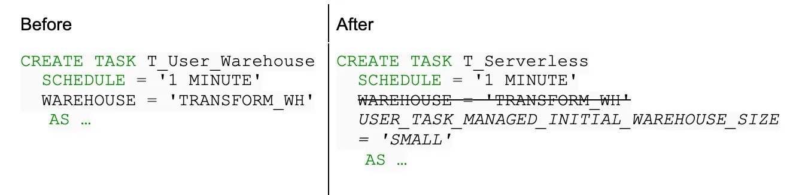

Tasks & Transactions: Snowflake SnowPro Core Certification
Seventeenth Chapter: Tasks & Transactions in Snowflake

We are coming to the end of the Snowflake SnowPro Core course, but we can’t forget about Tasks and Transactions in Snowflake, which will allow us to extend the functionality of our favorite Cloud Data Warehouse. Let’s get to it!

#### Table of Contents

1. [Introduction to tasks](#introduction-to-tasks)
2. [Tree of tasks](#tree-of-tasks)
3. [Task History](#task-history)
4. [Serverless Tasks](#serverless-tasks)
5. [Transactions](#transactions)
6. [Typical Exam Questions](#typical-exam-questions)

> _Remember that all the chapters from the course can be found [in the following link](./course-links.md)._

---

## INTRODUCTION TO TASKS

Snowflake tasks are <i>schedulable</i> scripts that are run inside your Snowflake environment. <b>No event source can trigger a task; instead, a task runs on a schedule</b>, which can be defined when creating a task, and they run with the privileges of the task owner. <b>A task can execute a single SQL statement, including a call to a Stored Procedure</b>. This last part is important and usually appears in the Snowflake SnowPro Core Exam.

<b>Snowflake ensures only one instance of a task with a schedule is executed at a given time</b>. If a task is still running when the next scheduled execution time occurs, that scheduled time is skipped. Imagine that we have a task that it’s executed every 5 minutes. If the first execution hasn’t finished by the time the second one should start, Snowflake will skip the second one. <b>Tasks also have a maximum duration of 60 minutes by default</b>. If they haven’t finished by then, they will be automatically terminated.

You can also specify a CRON expression and time zone for periodically running a scheduled task. <b>When you first create a task, it will be suspended by default</b>. You can activate it with the following command:

`ALTER TASK mytask RESUME;`

## TREE OF TASKS

Users can define a simple tree-like structure of tasks that starts with a root task and is linked together by task dependencies. <b>The Root task will be the only one to which the scheduler is set. The children’s tasks only run after the parent's task finishes.</b>

Considerations:

<ul>
<li><b>Each task can have a maximum of 100 children tasks.</b></li>
<li><b>A tree of tasks can have a maximum of 1000 tasks, including the root one.</b></li>
<li>A child task USED TO HAVE only a predecessor task. As a new feature of September 2022, Snowflake also supports DAG of tasks. In a DAG, each non-root task can have dependencies on multiple predecessor tasks, increasing the previous limit to <b>100 predecessors</b>.</li>
<li>You set the scheduler in the root task.</li>
</ul>

We can create child tasks with the following commands:

`CREATE TASK <newTask> AFTER <rootTask>;`

`ALTER TASK <newTask> ADD AFTER <rootTask>;`

In the following example of a tree of tasks, “<i>task A</i>” is executed, and when it finishes, tasks “<i>B</i>” and “<i>C</i>” are launched at the same time. When “<i>task B</i>” finishes, Snowflake will launch tasks “D”, “E”, and “F” at the same time. When “<i>task C</i>” finishes, the tasks “<i>G</i>” and “<i>H</i>”, the same thing will happen.

In this example of a tree of 3 tasks, you can see that there is only one task running at a time. The root task can have a queuing time in case something else is already in the warehouse. <b>Child tasks will always have a queuing time.</b>

A typical question in the exam is what would happen if we eliminated the predecessor tasks. In this case, there are two options:

<ul>
<li>Child task becomes a standalone task.</li>
<li>Child task becomes a root task.</li>
</ul>

And what if the owner role of a task is deleted? <b>Task Ownership is reassigned to the role that dropped this role</b>. This is also a typical exam question.

---

## TASK HISTORY

You can use this Snowflake function to query the history of task usage within a specified date range and find it in the information schema. You need one of these privileges to see the task history:

<ul>
<li>AccountAdmin role.</li>
<li>You are the owner of a task.</li>
<li>You have the global MONITOR_EXECUTION privilege.</li>
</ul>

`SELECT *`

`FROM table(information_schema.task_history())`

`ORDER BY scheduled_time;`

---

## SERVERLESS TASKS

Imagine that you have a task that runs every 5 minutes in a warehouse with auto-suspend mode enabled after 10 minutes. This would mean that the warehouse won’t EVER suspend! To solve this problem, Snowflake announced the addition of Serverless tasks in the public preview in September 2021.

The serverless compute model for tasks enables you to rely on compute resources managed by Snowflake instead of user-managed virtual warehouses, where compute resources automatically scale up or down by Snowflake as required for each workload.

You must specify this option when creating the task, as you can see in the example below:

## TRANSACTIONS

A transaction is a sequence of SQL statements that <b>are committed or rolled back as a unit. All statements in the transaction are either applied (i.e., committed) or undone (i.e., rolled back) together</b>. For this reason, transactions are ACID (Atomicity, Consistency, Isolation & Durability) Compliant. It provides a safe environment in which to operate your data. Once a transaction is complete, its data is consistent.

</b>Things to know about transactions:</b>

<ul>
<li>Snowflake takes <b>4 hours to abort it</b> if we do not abort it with the <b>SYSTEM$ABORT_TRANSACTION</b> function if the session is disconnected for whatever reason and the transaction remains in a detached state.</li>
<li>Each transaction has independent scope.</li>
<li></b>Snowflake does not support Nested Transactions</b>, although it supports Nested Procedure Calls.</li>
</ul>

---

## TYPICAL EXAM QUESTIONS

<b>What object will you use to schedule a merge statement in Snowflake so that it runs every hour?</b>

<ol>
<li>Task</li>
<li>Stream</li>
<li>Pipe</li>
<li>Table</li>
</ol>

<b>Solution: 1</b>

---

<b>Select the true statements about Snowflake tasks:</b>

<ol>
<li>A task can execute a single SQL Statement</li>
<li>A task can execute multiple SQL Statements</li>
<li>A task can execute a call to a Stored Procedure</li>
<li>A task can execute a function</li>
</ol>

<b>Solution: 1, 3</b>

---

<b>A task is still being executed before the next scheduled task. What is going to happen with the new scheduled task?</b>

<ol>
<li>Snowflake will abort it</li>
<li>Snowflake will skip it</li>
<li>Snowflake will wait for the previous task to complete</li>
</ol>

<b>Solution: 2</b>

---

<b>Which roles or privileges are required to view TASK_HISTORY?</b>

<ol>
<li>AccountAdmin</li>
<li>MONITOR EXECUTION privilege</li>
<li>SysAdmin</li>
<li>SecurityAdmin</li>
<li>Task owner (OWNERSHIP privilege)</li>
</ol>

<b>Solution: 1, 2, 5</b>

---

<b>What will happen to the child task if you remove ALL its predecessors?</b>

<ol>
<li>The child task is removed from the system</li>
<li>The child task may become the root task</li>
<li>The child task may become a standalone task</li>
</ol>

<b>Solution: 2, 3</b>

---

<b>A task went into a loop. How long will the task run before Snowflake finishes it?</b>

<ol>
<li>15 minutes</li>
<li>30 minutes</li>
<li>60 minutes</li>
<li>4 hours</li>
</ol>

<b>Solution: 3.</b> Tasks have a maximum duration of 60 minutes by default. If they haven’t finished by then, they will be automatically terminated.

---

<b>The owner of a task (the one with the OWNERSHIP privilege) is deleted. What will happen to the task?</b>

<ol>
<li>The task will belong to the role that dropped the owner’s role</li>
<li>The task is deleted</li>
<li>The task is suspended</li>
</ol>

<b>Solution: 1</b>

---

<b>If a transaction disconnects and goes into a detached state, which cannot be committed or rolled back, how long will Snowflake take to abort the transaction?</b>

<ol>
<li>15 minutes</li>
<li>60 minutes</li>
<li>4 hours</li>
<li>12 hours</li>
</ol>

<b>Solution: 3.</b> If the transaction is left open, Snowflake typically rolls back the transaction after being idle for four hours. You can abort a running transaction with the system function SYSTEM$ABORT_TRANSACTION.

---

<b>Does Snowflake support Nested Transactions?</b>

<ol>
<li>True</li>
<li>False</li>
</ol>

<b>Solution: 2</b>
